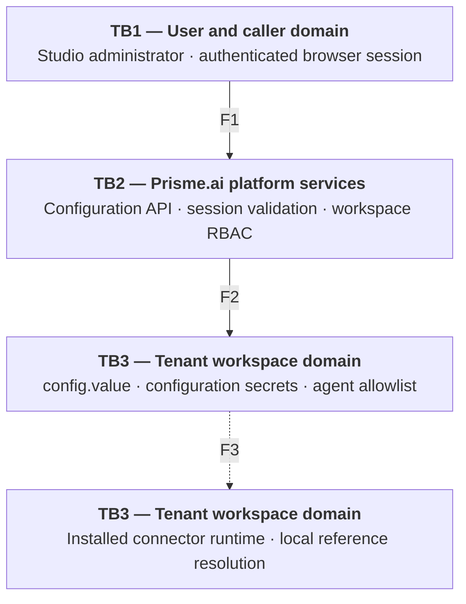
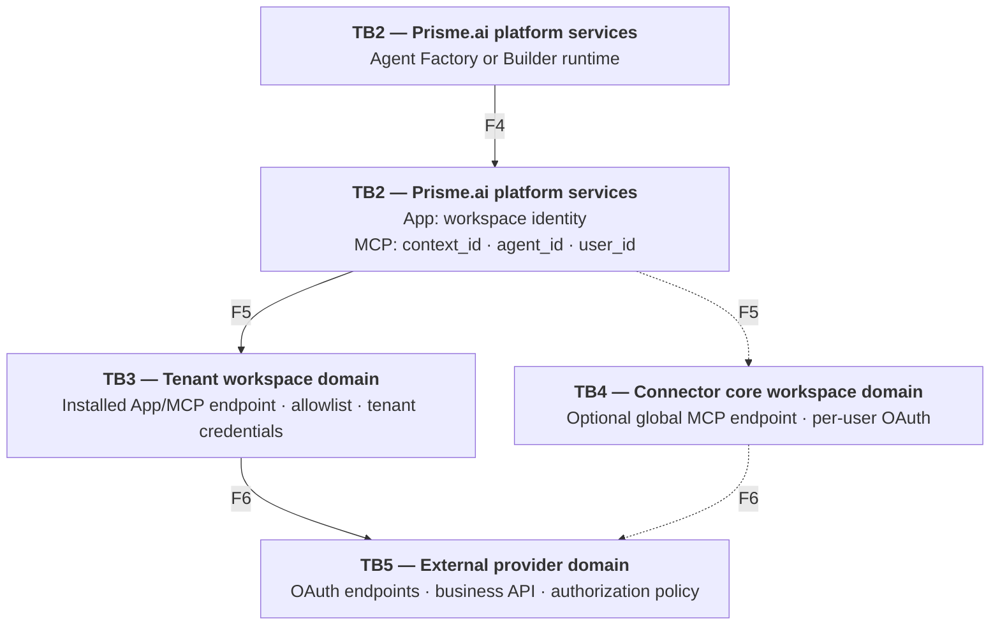
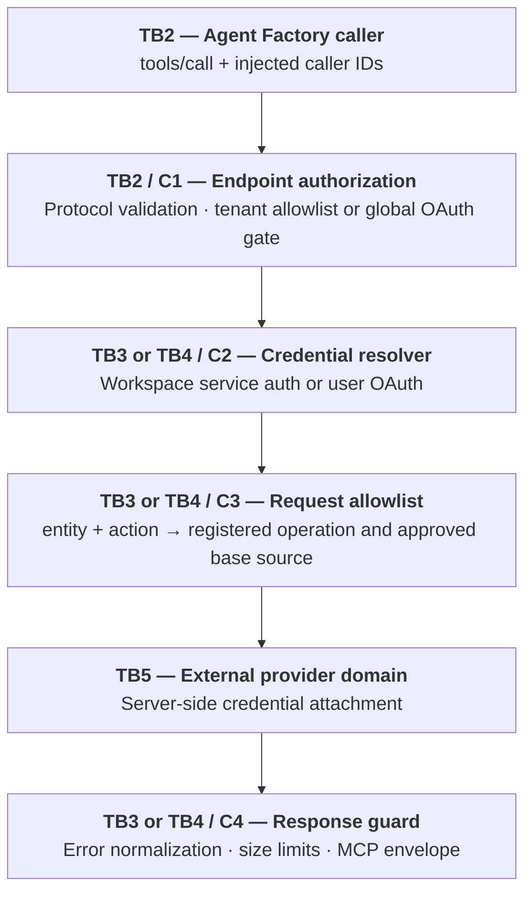
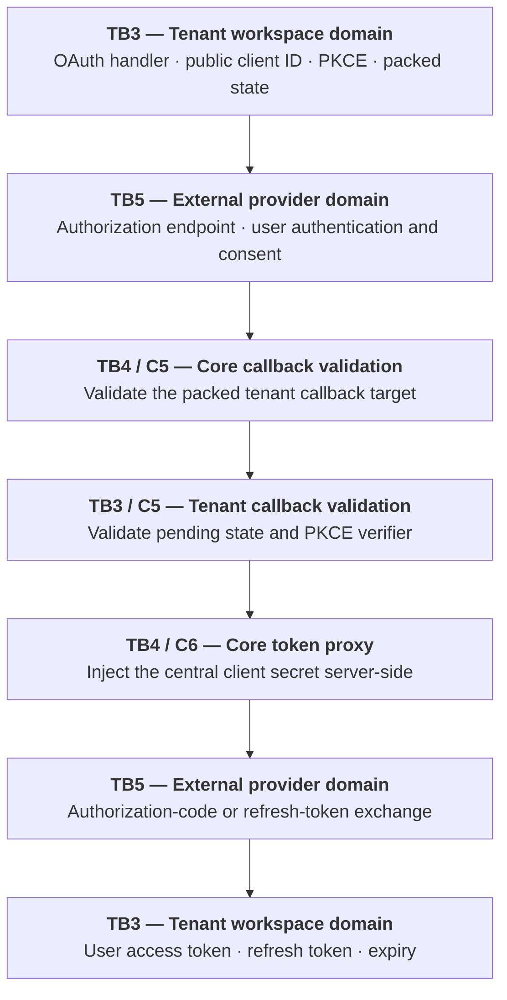

Prisme.ai connectors integrate workspaces and AI agents with third-party APIs. A connector is built as a Prisme.ai workspace, published as an app, and installed as an **app instance** in each workspace that uses it.

This page documents the **current reference architecture for App + MCP connectors**. It describes the implementation model used to build connectors, including tenant-context execution, an optional global MCP endpoint, authentication flows, trust domains, and security controls.

<Note>
  This document describes the current reference model. It is not a compatibility matrix or an inventory of every connector already deployed.
</Note>

## High-level architecture

The reference architecture supports two execution topologies:

- **Tenant endpoint — default**: App calls and workspace-specific MCP calls execute in the installed app instance. The connector resolves configuration, credentials, and the agent allowlist from that tenant workspace only.
- **Global core MCP endpoint — optional**: a connector using central per-user OAuth can expose one MCP endpoint from its core workspace for organization-wide catalog registration. This endpoint does not use a tenant workspace's configuration or agent allowlist. Its authorization gates are the end user's OAuth connection and the provider's scopes, roles, and policies.

The optional global MCP endpoint is distinct from the central OAuth token service. The token service can provide public OAuth metadata and proxy token exchanges without exposing the central `client_secret`, whether MCP calls use a tenant endpoint or the optional global endpoint.

A connector can expose two invocation modes:

- **App mode**: a Builder automation calls a connector operation directly in the installed app instance.
- **MCP mode**: an AI agent discovers and calls entity-grouped tools through a JSON-RPC 2.0 endpoint. Depending on the connector deployment, that endpoint is tenant-specific or the optional global core endpoint.

In the tenant topology, the connector calls the provider with configuration and credentials owned by the installed workspace and never retrieves credentials from another customer workspace. In the optional global topology, execution remains in the connector core and relies on per-user delegated OAuth rather than tenant-held service credentials.

**Diagram legend:** `TB` identifies a trust domain; every arrow between different `TB` domains crosses a trust boundary. `F` identifies a data or control flow, and `C` identifies a security control. Arrows carry only stable flow IDs; the flow inventory below describes their content.

### Control plane: configuration and secrets

### Runtime data plane: tenant and optional global MCP endpoints

Solid arrows show the default tenant path. Dashed arrows show the optional global MCP path; App mode always follows the tenant path.

### Flow inventory

| Flow | Source → destination | Security-relevant content |
| --- | --- | --- |
| `F1` | Studio administrator → configuration API | Authenticated session, CSRF protection, requested connector configuration |
| `F2` | Configuration API → workspace stores | RBAC-authorized configuration, secret values, and agent allowlist |
| `F3` | Tenant workspace stores → tenant connector runtime | Local secret references resolved within the same tenant trust domain while an automation executes |
| `F4` | Agent Factory or Builder runtime → execution context | MCP `tools/call` or explicit App instruction with business arguments |
| `F5` | Execution context → tenant endpoint or optional global endpoint | Workspace identity; for MCP, `context_id`, `agent_id`, and `user_id` |
| `F6` | Active connector endpoint ↔ external provider | HTTPS request with server-side credentials and the provider response |

### Trust domains and boundary crossings

| Trust domain | Responsibility | Security implication |
| --- | --- | --- |
| TB1 — User and caller domain | Submit configuration, App, or MCP requests | Business arguments are untrusted; provider credentials are never accepted from the LLM |
| TB2 — Prisme.ai platform services | Authenticate callers, enforce platform access, and attach execution identity | MCP scope injects `context_id,agent_id,user_id`; workspace RBAC protects configuration |
| TB3 — Tenant workspace domain | Store tenant configuration and execute the installed App or workspace-specific MCP endpoint | Tenant secrets resolve only in this workspace; the agent allowlist applies to its MCP endpoint |
| TB4 — Connector core workspace domain | Host central OAuth services and, optionally, a global MCP endpoint | The central `client_secret` stays in the core; a global endpoint uses per-user OAuth rather than a tenant allowlist |
| TB5 — External provider domain | Authenticate the external principal and authorize API operations | Provider scopes, roles, policies, and audit logs remain authoritative |

## Core security properties

<CardGroup cols={2}>
  <Card title="Tenant-endpoint isolation" icon="building-shield">
    App calls and tenant-specific MCP calls run in the installed app instance, so their configuration and secrets come from the workspace that owns that instance.
  </Card>
  <Card title="Credentials stay server-side" icon="key">
    The connector attaches credentials only when calling the provider. They are not included in MCP tool schemas or tool results.
  </Card>
  <Card title="Topology-specific authorization" icon="robot">
    Tenant MCP endpoints validate the injected `agent_id` against the workspace allowlist. Optional global endpoints rely on per-user OAuth and provider authorization instead.
  </Card>
  <Card title="Deterministic API surface" icon="route">
    Tools map to a generated registry of known methods and paths. The LLM does not construct an arbitrary outbound request.
  </Card>
</CardGroup>

## Low-level request processing

### MCP handshake and tool call

Both MCP endpoint variants serve `initialize` and `tools/list` through MCP Core and return HTTP `202` for notifications without an `id`. The following flow shows the controls applied to `tools/call` in either endpoint context:

On a tenant endpoint, an allowlist failure is returned as an MCP error result with an actionable reason. On either endpoint variant, authentication errors are passed through without replacing them with a generic configuration error, so a revoked OAuth grant can trigger reconnection rather than an administrator workflow.

### App-mode call

In App mode, a DSUL automation calls a public connector instruction such as `Connector.getRecord`. The instruction uses the same `buildAppAuth` and operation registry as MCP mode, but returns the provider's raw JSON data instead of the MCP `content` envelope.

This keeps authentication and request construction consistent across deterministic workflows and agent-driven calls.

## Operation registry and outbound request control

The connector's supported API surface originates from a versioned OpenAPI specification:

| Artifact | Security function |
| --- | --- |
| OpenAPI specification | Source of approved provider operations and stable operation IDs |
| `ENTITY_OPS` | Maps an MCP entity and action to one operation |
| `OPERATIONS` | Fixes the method, path, parameter positions, content type, and, when applicable, a per-operation provider base |
| App wrappers | Expose explicit Builder instructions and return raw API data |
| MCP schemas and guards | Restrict LLM arguments and return bounded MCP content |

MCP tools are grouped by business entity, for example `records`, `files`, or `messages`. Each tool accepts an `action` enum rather than exposing one LLM function for every provider endpoint. This reduces the exposed tool count and makes the permitted operation set explicit.

The runtime request builder accepts only registered operations. `OPERATIONS` fixes the method, path, parameter positions, and content type. It either fixes a per-operation provider base or selects a base returned by the authentication resolver. Depending on the provider, that base can be static, derived and normalized from a provider-issued instance URL, or supplied through administrator-managed connector configuration. Standard MCP arguments cannot override it.

Tool schemas follow additional LLM-safety constraints:

- no unresolved JSON Schema `$ref`;
- descriptions remain within provider limits;
- every array declares `items`;
- tool responses are bounded before entering the model context;
- binary responses are not transported inline through the DSUL fetch path.

## Authentication models

A tenant endpoint stores one authentication configuration object with a `mode` discriminator in the installed workspace. An optional global endpoint instead uses the connector core's central OAuth configuration and user-scoped token state. A connector exposes only the modes supported by its provider.

| Mode | Principal | Credential location | Typical use |
| --- | --- | --- | --- |
| `oauthCentral` | End user | User-scoped tokens in the active endpoint context (tenant or core); central client secret in the connector core | Preferred delegated OAuth with no customer-managed OAuth client |
| `oauth` | End user | User-scoped tokens and a workspace-managed OAuth client configuration | Delegated OAuth with a dedicated OAuth client |
| `clientCredentials` | Service identity | Installed workspace secret | Machine-to-machine provider access |
| `jwt` | Service account | Installed workspace secret, including the signing key | Signed service-account exchange |
| `apiKey` | Service identity | Installed workspace secret | APIs using a static key in a header or query parameter |
| `accessToken` | Configured identity | Installed workspace secret | Testing or externally managed token lifecycle |

### Per-user OAuth with PKCE

For delegated access, the connector uses the OAuth 2.0 authorization-code flow with PKCE and state validation:

1. `oauthConnect` generates a verifier, challenge, and state in the user's scope, then redirects the browser to the provider.
2. `oauthCallback` validates the pending state and exchanges the code using the original verifier.
3. The access and refresh tokens are stored in user scope in the active endpoint context. On a tenant endpoint, the refresh token is also copied best-effort to a workspace secure-secret entry keyed by user ID for trusted scheduled execution. This copy requires an Owner, Editor, or SuperAdmin; interactive OAuth remains usable if the copy is not permitted.
4. `oauthStatus` proactively checks expiry and refreshes when necessary. A non-transient refresh failure marks the connection as disconnected so the user is prompted to reconnect.
5. `oauthDisconnect` removes local state and, when supported, revokes the provider token.

The server-controlled `targetUserId` used by a scheduled automation must never come from MCP or LLM arguments.

### Central OAuth token service

For `oauthCentral`, a platform maintainer configures one provider OAuth client in the connector's core workspace. Installed connector instances can obtain the public client ID and scopes, but never the client secret.

The core workspace exposes two narrowly scoped functions:

- a public metadata endpoint that returns the client ID and default scopes;
- a token exchange proxy that injects the central client secret server-side for authorization-code and refresh-token grants.

The OAuth redirect is registered once against the core callback. For a tenant endpoint, the installed workspace callback is packed into the OAuth flow state and validated against the Prisme.ai API host before redirection, preventing the callback proxy from becoming an open redirect. The PKCE verifier and resulting user tokens remain attached to the user in the active endpoint context: the tenant workspace for a tenant endpoint, or the connector core for a global endpoint.

Token exchange requests disable automatic fetch-error event emission so a provider error cannot copy a `client_secret` into runtime failure events.

This diagram shows central OAuth used by a tenant endpoint. With the optional global core endpoint, OAuth pending state and user tokens also remain in TB4: there is no packed tenant callback and no TB3 agent allowlist. C5 becomes core-local state and PKCE validation, while C6 remains the only component allowed to use the central client secret.

## Credential and secret boundaries

### Workspace configuration binding

Installed app configuration uses a two-hop reference: `app instance config.auth → workspace config.value → workspace secret`.

| Security asset | Storage location | Runtime reader | Permitted exposure |
| --- | --- | --- | --- |
| Service credential or API key | Workspace configuration secret | `buildAppAuth` | Provider request only |
| User OAuth tokens | User-scoped state in the active endpoint context; optional tenant runtime secure refresh token | `buildAppAuth`, `oauthStatus` | Provider token/API endpoints only |
| Central OAuth `client_secret` | Connector core configuration secret | Central token proxy | Provider token endpoint only |
| Agent allowlist | Workspace configuration secret | `validateAgent` | Never sent to the provider |

The installation automation provisions the secret declarations, preserves the workspace's existing configuration, and writes both bindings idempotently. Secret references resolve only inside the workspace configuration context; they are not portable references to the connector core workspace.

### Two separate secret mechanisms

Prisme.ai connectors can use two distinct mechanisms:

- **Configuration secrets** back the installed app configuration through `config.value` bindings.
- **Runtime secure secrets** support scoped `set`, `get`, and `delete` operations, including per-user refresh-token lookup for trusted scheduled jobs.

Runtime secret reads return opaque references. DSUL expressions and Custom Code cannot inspect or decrypt them. A reference must be passed directly into a supported `fetch` field, where the runtime resolves it server-side.

<Warning>
  A webhook invoked anonymously by an external provider has no Prisme.ai principal and must not be assumed to read workspace or user secret stores. Push-driven connectors require a separate threat model, authenticated or signed webhook validation where available, and an explicit review of any alternative token storage. They are not covered by the standard interactive or scheduled-call assumptions on this page.
</Warning>

## Configuration application and administrative access

The connector configuration UI is a React application delivered by the published app and rendered inline in the workspace's Builder when `config.block` is supported. A direct configuration link remains available as a fallback.

The UI calls Prisme.ai APIs with the administrator's existing session, including bearer, CSRF, and cookie protections. Native workspace RBAC remains authoritative for reading or changing connector secrets. The UI does not receive a privileged connector-specific backend key.

Typical administrative actions include:

- selecting an authentication mode and minimum provider scopes;
- testing the provider connection;
- connecting or disconnecting delegated OAuth;
- selecting authorized agents, persisted immediately on each change;
- installing the MCP capability on an agent;
- registering the MCP server in the organization capability catalog.

Central OAuth credential management is protected server-side by workspace role checks. Catalog publication is different: the connector UI exposes it only to active-organization owners and administrators, but this client-side gate is not a security boundary. The current catalog write endpoint does not enforce the same role restriction server-side. Treat this as a known control gap until the authorization gate is implemented in the capabilities API.

## Authorization layers

Connector access is the intersection of several independent controls:

| Layer | What it controls |
| --- | --- |
| Prisme.ai organization and workspace RBAC | Who can install, configure, or use the app instance |
| MCP capability scope | Which identity attributes Agent Factory injects into the call |
| Connector agent allowlist | Which agents can use a workspace-specific MCP endpoint |
| User OAuth session or service credential | Which external principal the connector acts as |
| Provider scopes and roles | Which provider resources and operations that principal can access |
| Agent tool permissions | Whether the agent can invoke the MCP automatically or requires user approval |

The allowlist supports an explicit `*` option for workspaces that authorize every agent, including calls without an `agent_id`. This is a deliberate administrative choice and should be reviewed like any broad access grant.

For a connector's optional global core endpoint, the workspace-specific agent allowlist is not applicable. The security gate is the end user's OAuth connection and the provider's authorization policy. Security teams should review global and workspace-specific endpoints as different exposure models.

## Data flow and retention considerations

A normal tool call processes the following data:

1. The user's request and tool arguments enter Agent Factory.
2. The active endpoint in the tenant workspace or connector core receives the selected tool, business arguments, and execution identity.
3. The connector attaches credentials server-side and sends an HTTPS request to the provider.
4. The provider response passes through the Prisme.ai runtime and is returned to the workflow or model context.

Provider credentials do not need to enter the LLM context. Provider data does enter it when required to answer the user's request, so the model provider, Prisme.ai event/log retention, and the third-party system must all be included in the data-processing assessment.

The reference MCP path applies three response bounds: `pageSize` and `page_size` are clamped to 100; array responses are capped at 100 items and nested reference-like objects are collapsed to a compact representation; text bodies are truncated at approximately 20,000 characters on a complete line with guidance to use narrower filters. Operations listed by `isBinaryOperation` are rejected before the provider call and must be documented as unavailable inline. These MCP bounds do not apply to App-mode wrappers, which deliberately return raw provider JSON.

## Security review checklist

Use this checklist for each connector and environment:

- [ ] Identify every inbound endpoint: MCP, OAuth callbacks, configuration webhooks, and provider push webhooks.
- [ ] Inventory every outbound host and classify its source as a fixed OAuth endpoint, per-operation registry base, provider-issued instance URL, or administrator-managed base. Verify connector-specific normalization or allowlisting and confirm that MCP arguments cannot override the destination.
- [ ] Confirm all network traffic uses HTTPS and that provider certificates are validated.
- [ ] Identify whether MCP uses a tenant endpoint, the optional global core endpoint, or both.
- [ ] For tenant endpoints, confirm execution stays in the installed workspace and cannot fetch another customer workspace's configuration.
- [ ] For global endpoints, confirm the tenant allowlist is not presented as a control and verify the per-user OAuth and provider authorization gates.
- [ ] Verify the capability scope is exactly the required identity set and cannot accept a caller-supplied `targetUserId`.
- [ ] For tenant endpoints, test allowlisted, non-allowlisted, and missing-`agent_id` calls; review the `*` allow-all option separately.
- [ ] Review provider OAuth scopes or service-account permissions for least privilege.
- [ ] Confirm refresh-token revocation and self-invalidation behavior after provider `4xx` responses.
- [ ] Confirm central OAuth endpoints never return or log the `client_secret`.
- [ ] Validate OAuth state, PKCE, and callback target checks, including exact redirect URI matching.
- [ ] Review workspace and organization RBAC for connector configuration and catalog publication.
- [ ] Inspect live `tools/list` output for valid schemas and an intentionally limited tool surface.
- [ ] Verify pagination clamps and `trimToolResponse` against arrays and nested objects.
- [ ] Exercise raw text responses and confirm they bypass `formatToolOutput` before line-safe truncation.
- [ ] Compare `isBinaryOperation` with the OpenAPI surface and confirm binary rejection occurs before the provider call.
- [ ] Verify events and error paths do not contain authorization headers, tokens, private keys, or provider secrets.
- [ ] Document the model provider and platform retention controls for provider data returned to an agent.
- [ ] Perform a dedicated review for external anonymous webhooks, if the connector exposes any.

## Deployment and verification evidence

The connector is maintained as two versioned artifacts:

- `workspaces/<connector>/`: DSUL automations, imports, MCP Core configuration, security rules, and the OpenAPI source of truth;
- `pages/<connector>/`: the configuration UI source and deployable bundle.

The app is published before installation so installed instances receive a stable, reviewed snapshot. Frontend deployment updates both bundle pointers and republishes the app before obsolete bundles are removed.

For a security handoff, provide at least:

- the connector version and published app identifier;
- the workspace-specific and optional global MCP endpoint patterns;
- allowed outbound hosts, their provenance, and their normalization or validation rules;
- supported authentication modes and requested provider scopes;
- secret names, scopes, owners, and rotation procedures;
- the live `tools/list` schema audit;
- MCP handshake evidence, including HTTP `202` for notifications;
- successful and denied tool-call evidence;
- OAuth connect, refresh, revoke, and reconnect evidence;
- relevant audit-event and incident-response procedures.

## Related documentation

<CardGroup cols={2}>
  <Card title="App Store Security" icon="shield" href="/apps-store/security">
    Review platform-wide controls and integration security practices.
  </Card>
  <Card title="Capabilities Catalog" icon="boxes-stacked" href="/products/ai-governance/capabilities">
    Understand how MCP servers and other capabilities are governed.
  </Card>
  <Card title="MCP Connections and OAuth" icon="link" href="/products/ai-securechat/mcp-connections">
    See how end users connect delegated accounts from Chat.
  </Card>
  <Card title="Connector Catalog" icon="plug" href="/apps-store/marketplace/connectors/overview">
    Browse the connectors available in the App Store.
  </Card>
</CardGroup>
