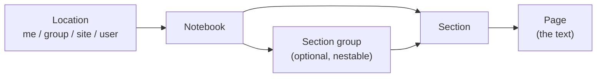

The OneNote app provides read/write access to [Microsoft OneNote](https://www.onenote.com) through the [Microsoft Graph](https://learn.microsoft.com/graph/integrate-with-onenote) v1.0 REST API. It can be consumed two ways: as a remote MCP server that **Agent Factory** agents call as tools, or as a Builder app whose instructions you call directly from DSUL. The MCP surface groups every operation into **five entity tools** (`notebooks`, `sectionGroups`, `sections`, `pages`, `locations`), each driven by an `action` argument, and runs in the **tenant app-instance context** (it resolves the installing workspace's own credentials). The same tree is also exposed as **MCP Resources**, so a knowledge base can be pointed at a whole notebook or at a single section.

Authentication is **always delegated** — Microsoft withdrew app-only authentication from the Graph OneNote API on 31 March 2025 — so Microsoft 365 permissions apply exactly as they stand: a caller reads and writes only what their own account could. Three modes are available:

- **Per-user OAuth2 with a central client** (`oauthCentral`, default): one Microsoft Entra application is registered once by the platform maintainer; every end user signs in with their own Microsoft 365 account. Nothing to register per tenant — each workspace installs the app and clicks *Connect*.
- **Per-user OAuth2 with a tenant client** (`oauth`): paste your own Entra client ID/secret in the connector configuration app. Each user signs in with their own account against your application (PKCE authorization-code flow).
- **Direct access token** (`accessToken`): a caller-managed Graph access token, used as-is with no exchange.

<CardGroup cols={3}>
  <Card title="Read the whole tree" icon="book-open">
    Browse notebooks, section groups and sections across personal, group and SharePoint site locations, and read a page's full text as Markdown
  </Card>
  <Card title="Write back" icon="pen-to-square">
    Create notebooks, section groups, sections and pages, patch a page's content, delete a page and copy items between containers
  </Card>
  <Card title="Feed a knowledge base" icon="database">
    The same tree is published as MCP Resources, so a whole notebook or a single section can be indexed and queried semantically
  </Card>
</CardGroup>

OneNote content is a four-level tree, and every tool argument follows it:



## Who is this for?

This connector is used by four different roles. Jump to the section that matches yours; each one is self-contained.

<CardGroup cols={2}>
  <Card title="Agent builder" icon="robot">
    You build agents in **Agent Factory** and want them to read and write OneNote. → *Agent builder* tab.
  </Card>
  <Card title="Knowledge base owner" icon="database">
    You want OneNote pages indexed and searchable semantically, kept up to date. → *Knowledge base (sync)* tab.
  </Card>
  <Card title="Platform admin" icon="shield-halved">
    You run the platform and set up the shared Microsoft Entra application once for everyone. → *Platform admin setup* accordion below.
  </Card>
  <Card title="Workspace builder" icon="puzzle-piece">
    You write Builder automations (DSUL) that call OneNote operations directly. → *Workspace builder* tab.
  </Card>
</CardGroup>

## Prerequisites (Microsoft side)

- A **Microsoft 365** account with OneNote (personal OneDrive notebooks, Microsoft 365 group / Teams notebooks and SharePoint site notebooks are all reachable).
- A **Microsoft Entra** application registration (single- or multi-tenant), with the **Microsoft Graph delegated** permissions the connector requests. There is no application-permission path: app-only authentication was removed from the Graph OneNote API on 31 March 2025, so a client-credentials configuration is refused with an explicit message rather than silently failing on Graph.
- Admin consent may be required in your tenant for `Notes.*` and `Sites.Read.All`, depending on your consent policy.

The OAuth scopes requested by default are:

```text
offline_access
https://graph.microsoft.com/User.Read
https://graph.microsoft.com/Notes.ReadWrite.All
https://graph.microsoft.com/Sites.Read.All
```

`offline_access` is what makes Entra issue a refresh token; without it, scheduled knowledge-base syncs for that user cannot run. `Sites.Read.All` is only needed to *locate* SharePoint site notebooks (`locations` tool); drop it if you only work with personal and group notebooks.

<Accordion title="Platform admin (Governance): one-time platform setup" icon="shield-halved">
  **Goal:** two one-time tasks: (1) configure the shared **central Entra application** so every workspace lets its users sign in with their own Microsoft 365 account, and (2) expose OneNote as a reusable **capability** in AI Governance so agent builders can pick it without pasting endpoint URLs.

  ## 1. Configure the connector

  <Steps>
    <Step title="Register the application in Microsoft Entra">
      In the [Entra admin center](https://entra.microsoft.com) open **Identity > Applications > App registrations > New registration**. Add a **Web** redirect URI pointing at the core workspace callback:

      ```text
      <api-url>/workspaces/<core-workspace-id>/webhooks/oauthCallback
      ```

      (e.g. `https://api.studio.prisme.ai/v2/workspaces/Kk431UO/webhooks/oauthCallback` on production, where `Kk431UO` is the id of the `one-note` core workspace).

      <Warning>
        Use the workspace **raw id**, not the `slug:one-note` form. Microsoft Entra rejects the `:` in a redirect URI whatever the encoding, and truncates the URI before it — the sign-in then fails with a redirect-URI mismatch that gives no hint about the cause.
      </Warning>

      Under **API permissions**, add the Microsoft Graph **delegated** permissions listed in *Prerequisites* and grant admin consent. Under **Certificates & secrets**, create a client secret. Keep the **Application (client) ID**, the **client secret** and, for a single-tenant application, the **directory (tenant) ID**.
    </Step>
    <Step title="Enter the credentials through the configuration app">
      Open the central `one-note` workspace and launch its **Configuration app** at `<studio>/apps/one-note` (e.g. `https://studio.prisme.ai/apps/one-note`), also linked as `Configuration app` on the installed instance. Its **Maintainer** view asks for the **Client ID**, the **client secret**, the **tenant** and the default **scopes**; the app stores them in the core workspace's secrets for you. Do not edit Studio's raw Secrets by hand. These credentials stay in the `one-note` workspace and are never exposed to tenants or end users: the token exchange is proxied through the core `centralTokenExchange` webhook, so the client secret never leaves the core workspace.
    </Step>
    <Step title="Tell workspaces to use the central client">
      Each consuming workspace selects auth mode **`oauthCentral`** in the connector configuration app (no client id/secret to enter on their side). Their users then just click **Connect**. A tenant may narrow the scopes it asks for, but never widen them beyond the scopes the central application itself declares.
    </Step>
  </Steps>

  ## 2. Declare the capability in AI Governance

  Generic connectors (broad tool surfaces meant to be shared across many agents, like OneNote) are best exposed as a named **capability** in AI Governance. Agent builders then enable that capability on their agents instead of pasting a raw MCP endpoint.

  <Steps>
    <Step title="Open AI Governance > Capabilities">
      Create (or edit) the **OneNote** capability.
    </Step>
    <Step title="Point it at the MCP endpoint">
      Set the capability's MCP server URL to the connector's **MCP Endpoint**, and set its **Scope** to:

      ```text
      context_id,agent_id,user_id
      ```

      The `agent_id` in the scope is what lets the connector identify and authorize the calling agent.
    </Step>
    <Step title="Make it available to agent builders">
      Once created, the capability appears in the capability picker for agent builders in your organization, who enable it on their agents. Access to the catalog follows your organization's existing roles; there is no per-capability role grant.
    </Step>
    <Step title="Smoke-test">
      From an agent that has the capability, in a workspace configured for `oauthCentral`, call `locations` with `action: "me"`. The user is prompted to connect once (Microsoft sign-in); subsequent calls reuse the stored token transparently and refresh it automatically. The response names the Microsoft 365 account the connector is acting as — the fastest way to confirm which identity is in play.
    </Step>
  </Steps>

  <Warning>
    Declaring the capability makes the connector **available**; it does not by itself authorize a specific agent. This connector follows the **tenant-context model**: which agents may actually call it is gated per-workspace by the **authorized-agents allowlist** in the configuration app (see the *Workspace builder* tab). There is also **no OAuth auth-config JSON** to attach in Governance: connect / status / disconnect are handled by the connector's own webhooks, wired automatically on install.
  </Warning>
</Accordion>

---

<Tabs>
  <Tab title="Agent builder (Agent Factory)">
    ## Agent builder

    **Goal:** let an agent you build in Agent Factory read and write OneNote through MCP tools.

    <Note>
      Before an agent can call the connector, a *Workspace builder* must have installed and configured the OneNote app in a workspace (see the *Workspace builder* tab), and, for the central OAuth mode, a *Platform admin* must have provisioned the shared Entra application (see the *Platform admin setup* accordion above).
    </Note>

    This connector runs in the **tenant app-instance context**: your agent is authorized two ways at once — it is identified by the `agent_id` that Agent Factory injects through the capability *Scope*, and that agent must appear in the connector's **authorized-agents allowlist** (managed in the configuration app). The Microsoft Graph token itself is resolved server-side from the configured auth mode, and it is always the **signed-in user's own** token: the agent sees exactly the notebooks that person can already open, no more.

    <Steps>
      <Step title="Install and configure the connector in your workspace">
        Follow the *Workspace builder* tab: install **OneNote** in your workspace, open its **Configuration app**, choose the auth mode and connect a Microsoft 365 account. The config app displays and copies the workspace's **MCP Endpoint**.
      </Step>
      <Step title="Allowlist your agent">
        In that workspace's config app, open **Authorized agents** and tick your agent (the **Install capability** button does this for you). An agent that is not listed is refused with an explicit message.
      </Step>
      <Step title="Add the MCP capability to your agent">
        In your agent, add a capability pointing at your workspace's **MCP Endpoint** URL, and set its **Scope** to:

        ```text
        context_id,agent_id,user_id
        ```

        The `agent_id` is what lets the connector identify and authorize your agent; without it, every call is rejected with an explicit "agent could not be identified" message. This *Scope* is separate from the Microsoft Graph OAuth scopes.
      </Step>
      <Step title="Connect a Microsoft 365 account">
        On the first tool call, an unconnected user is prompted to sign in; Agent Factory surfaces a `connect_url`. The `accessToken` mode needs no interactive sign-in.
      </Step>
      <Step title="Brief the agent in its system prompt">
        Wiring the capability is not enough; the agent must know the MCP exists and when to use it. Copy-pasteable starter:

        ```text
        You have access to the OneNote MCP server (tools: notebooks, sectionGroups, sections, pages, locations). Each tool takes an `action` argument. Use it whenever the user asks about their OneNote notebooks, sections or pages: listing, locating, reading page text, creating or updating. OneNote has NO full-text search — to answer on what is inside pages, narrow the list by title or date with `pages/list`, then read with `pages/getContent`. Notebooks belonging to a Microsoft 365 group or a SharePoint site need `scope` and `scopeId`; use the `locations` tool to find those ids first. Confirm with the user before any write (create, updateContent, delete, copy).
        ```
      </Step>
    </Steps>

    <Warning>
      **Microsoft Graph has no full-text search on OneNote.** `titleContains` and OData `$filter` match **titles and metadata only** — never page content. An agent that must answer questions about what is *written inside* pages should query a knowledge base fed by this connector's MCP Resources (see the *Knowledge base (sync)* tab); the live tools are for locating, reading and writing known pages.
    </Warning>

    <Note>
      **Legacy AI Knowledge agents** (no native MCP picker): add the connector under **Advanced > Tools > MCP** and paste the **MCP Endpoint** URL. The agent still has to be allowlisted in the config app and its identity propagated so the connector can read its `agent_id`.
    </Note>

    <Note>
      **Restricting to read-only (least privilege).** The OneNote tools cover both reads and writes (`create`, `createPage`, `updateContent`, `delete`, `copy*`). The requested OAuth scopes **are** the grant, so the connector only obtains what the **Scopes** field in the configuration app asks for. To allow only read access, set a read-only scope list:

      ```text
      offline_access https://graph.microsoft.com/User.Read https://graph.microsoft.com/Notes.Read.All https://graph.microsoft.com/Sites.Read.All
      ```

      With central OAuth (`oauthCentral`) you do **not** create your own Entra application; keep `oauthCentral` and just enter the read-only scopes — the tenant scope narrows the platform default (it can never widen it beyond what the central application declares). Write calls are then rejected by Microsoft with `403`, while the connection itself stays healthy because every connection check is a read. Note this is set at the workspace level: a workspace editor can widen it again; restricting the permissions of the Entra application, or of the connected account, is the only hard guarantee.

      Beware of the intermediate `Notes.Create` scope: it allows creating a page but **not** updating or deleting one, and Microsoft answers `403` with error `40004` in that case.
    </Note>

    ## Available Tools

    Each tool takes an `action` argument selecting the concrete operation, plus the per-action parameters. The four content tools share `scope` (`me` — the default — `group`, `site` or `user`) and `scopeId`, which say **where** the notebooks live.

    | Tool | Description |
    |------|-------------|
    | `notebooks` | OneNote notebooks. Actions: `list`, `get`, `listSections`, `listSectionGroups`, `listRecent`, `create`, `createSection`, `createSectionGroup`, `copy`, `copyStatus`. |
    | `sectionGroups` | The optional folder level between a notebook and its sections. Actions: `list`, `get`, `listSections`, `listSubGroups`, `createSection`, `createSubGroup`. |
    | `sections` | The containers that hold pages. Actions: `list`, `get`, `listPages`, `createPage`, `copyToNotebook`, `copyToSectionGroup`, `copyStatus`. |
    | `pages` | Pages, including their full text. Actions: `list`, `get`, `getContent`, `getPreview`, `create`, `updateContent`, `delete`, `copyToSection`, `copyStatus`. |
    | `locations` | Where notebooks live — read-only. Actions: `listGroups`, `searchSites`, `getSite`, `me`. |

    <Note>
      **The write surface stops where Graph's does.** Microsoft Graph offers **no delete and no rename** for a notebook, a section group or a section: those methods simply do not exist. `pages/delete` is the only delete on the whole OneNote API. Copies are asynchronous: they answer immediately and are polled with `copyStatus` using the `operationId` returned by the copy.
    </Note>

    ## Output Formats

    Every tool accepts an `outputFormat` argument that controls the MCP response shape:

    - **`verbose`** (default): human-readable text optimized for LLM consumption
    - **`structured`**: concise machine-readable JSON in `structuredContent`
    - **`both`**: the text block and the structured payload together

    ## Tool Details

    ### pages

    ```json
    {
      "name": "pages",
      "arguments": {
        "action": "getContent",
        "pageId": "1-a1b2c3d4e5f6...",
        "maxChars": 200000
      }
    }
    ```

    `getContent` returns the page as **Markdown**, headed by its title, notebook, section, section author, dates and a link to open it in OneNote. OneNote stores pages as HTML; the connector converts it (headings, lists, pipe tables) so the text chunks cleanly for retrieval.

    | Parameter | Required | Description |
    |-----------|----------|-------------|
    | `action` | Yes | One of `list`, `get`, `getContent`, `getPreview`, `create`, `updateContent`, `delete`, `copyToSection`, `copyStatus`. |
    | `pageId` | For get/getContent/getPreview/updateContent/delete/copyToSection | Target page id. |
    | `sectionId` | For create | Section the page is created in. |
    | `html` | For create | The page as OneNote-flavoured HTML. Include `<head><title>…</title></head>` or the page is created untitled. |
    | `commands` | For updateContent | Non-empty **array** of patch commands `{ target, action, content, position? }` (`target`: `body`, `title` or an element id; `action`: `append`, `insert`, `prepend`, `replace`, `delete`). |
    | `titleContains` | No | Case-insensitive substring on the page **title**. Does not search page content. |
    | `maxChars` | No | `getContent` only: cap on the returned text (default 200000). |
    | `scope` / `scopeId` | No / when scope ≠ `me` | Graph root owning the pages: `me`, `group`, `site` or `user`, plus the matching id. |

    ### notebooks

    ```json
    {
      "name": "notebooks",
      "arguments": {
        "action": "list",
        "scope": "group",
        "scopeId": "2d5f...",
        "titleContains": "roadmap",
        "top": 20
      }
    }
    ```

    | Parameter | Required | Description |
    |-----------|----------|-------------|
    | `action` | Yes | One of `list`, `get`, `listSections`, `listSectionGroups`, `listRecent`, `create`, `createSection`, `createSectionGroup`, `copy`, `copyStatus`. |
    | `notebookId` | For get/listSections/listSectionGroups/createSection/createSectionGroup/copy | Target notebook id. |
    | `displayName` | For create/createSection/createSectionGroup | Name of the notebook, section or section group to create. |
    | `body` | For copy | `{ groupId?, renameAs? }`. There is **no destination id**: a notebook copy lands in the caller's own OneDrive unless `groupId` says otherwise. |
    | `operationId` | For copyStatus | Last segment of the `operationLocation` returned by the copy. |
    | `titleContains` | No | Case-insensitive substring on the notebook **name**. |
    | `top` / `skip` / `select` / `filter` / `orderby` / `expand` | No | OData paging and shaping (`$top` max 100, default 20). |

    ### sections

    ```json
    {
      "name": "sections",
      "arguments": {
        "action": "createPage",
        "sectionId": "1-9f8e...",
        "html": "<html><head><title>Weekly report</title></head><body><p>Ready.</p></body></html>"
      }
    }
    ```

    | Parameter | Required | Description |
    |-----------|----------|-------------|
    | `action` | Yes | One of `list`, `get`, `listPages`, `createPage`, `copyToNotebook`, `copyToSectionGroup`, `copyStatus`. |
    | `sectionId` | For get/listPages/createPage/copyTo* | Target section id. |
    | `html` | For createPage | The page as OneNote-flavoured HTML, sent as `text/html`. |
    | `body` | For copyTo* | `{ id: <destination notebook or section group id>, groupId?, renameAs? }`. |
    | `pagelevel` | No | `listPages` only: also return each page's indentation level and order. |
    | `titleContains` | No | On the section **name** for `list`, on the page **title** for `listPages`. |

    <Note>
      Unlike a page, a **section does carry `createdBy` / `lastModifiedBy`**. Graph exposes no author on a page (only `createdByAppId`), so whenever a name is shown next to a page it is the section's last modifier, and it is labelled as such — never presented as the page's author.
    </Note>

    ### locations

    ```json
    {
      "name": "locations",
      "arguments": {
        "action": "searchSites",
        "search": "marketing",
        "top": 10
      }
    }
    ```

    | Parameter | Required | Description |
    |-----------|----------|-------------|
    | `action` | Yes | One of `listGroups`, `searchSites`, `getSite`, `me`. |
    | `search` | For searchSites | Site keyword; `"*"` lists all reachable sites. |
    | `siteId` | For getSite | Site id, or a path of the form `hostname:/sites/<name>`. |
    | `skiptoken` | No | Pagination token (`searchSites`, `listGroups`), taken from the previous response. |

    Use this tool **first** whenever the notebooks are not the signed-in user's own: `listGroups` returns the ids that feed `scope: group`, `searchSites` those that feed `scope: site`. A site created moments ago may not be searchable yet — `/sites?search=` is served by the SharePoint search index, which takes minutes to hours; address it by path with `getSite` in the meantime.
  </Tab>

  <Tab title="Workspace builder (DSUL)">
    ## Workspace builder

    **Goal:** install the connector in a workspace, configure authentication and the agent allowlist, and call OneNote operations from your automations.

    ## Installation

    1. Go to **Apps** in your workspace
    2. Search for **OneNote** and install it
    3. Open the **Configuration app** (the link auto-populated on install) to choose the auth mode, connect a Microsoft 365 account, and allow the agents that may call the connector

    ## Configuration

    | Field | Description |
    |-------|-------------|
    | **Configuration app** | Auto-populated on install; open this link to configure authentication (mode + credentials), connect a Microsoft 365 account, manage the authorized-agents allowlist, and copy the MCP endpoint. |
    | **Microsoft Graph API version** | `v1.0` (default) or `beta`. The base URL becomes `https://graph.microsoft.com/<version>`. |
    | **Knowledge-sync** | Delegated MCP Resource access settings. `trustedCallers` lists the workspace slugs allowed to browse on a named user's behalf; it ships pre-filled with the Knowledge Sync workspace so a scheduled sync is recognized without any configuration. |

    The configuration app drives everything; the app instance itself has no per-field credential form. From it you pick one of:

    | Auth mode | What you provide | Best for |
    |-----------|------------------|----------|
    | `oauthCentral` | Nothing; just click **Connect** | Workspaces on a platform where the admin set up the central Entra application |
    | `oauth` | Your own Entra **Client ID + Secret** (+ tenant), with redirect URI `<api-url>/workspaces/<your-workspace-id>/webhooks/<app-instance>.oauthCallback` | You manage your own Entra application |
    | `accessToken` | A pre-minted Microsoft Graph **access token** | Short-lived / caller-managed tokens |

    <Note>
      Credentials are provisioned into the workspace's Secrets by the `onInstall` flow and resolved server-side. The agent allowlist (**Authorized agents**) gates which Agent Factory agents may call the MCP endpoint; see the *Agent builder* tab. There is no application-identity mode: `clientCredentials` is explicitly refused, because Microsoft removed app-only authentication from the Graph OneNote API on 31 March 2025.
    </Note>

    ## Available Instructions

    Every instruction resolves credentials from the workspace configuration. The four content categories share the `scope` (`me`, `group`, `site`, `user`) and `scopeId` arguments, and the OData shaping arguments `top`, `skip`, `select`, `filter`, `orderby`, `expand`. The MCP server exposes the same operations behind the five entity tools (see the *Agent builder* tab).

    ### Notebooks

    | Instruction | Description | Returns |
    |-------------|-------------|---------|
    | `listNotebooks` | List the notebooks at a location; narrow with `titleContains` (substring on the name) or a raw OData `filter`. | `{ value: [ Notebook ], "@odata.nextLink" }` |
    | `getNotebook` | Fetch one notebook by `notebookId`. | A Notebook resource `{ id, displayName, createdBy, lastModifiedBy, links, sectionsUrl, … }`. |
    | `listNotebookSections` | List the sections directly inside a notebook, by `notebookId`. | `{ value: [ Section ] }` |
    | `listNotebookSectionGroups` | List the section groups directly inside a notebook, by `notebookId`. | `{ value: [ SectionGroup ] }` |
    | `listRecentNotebooks` | The signed-in user's most recently opened notebooks, across every location. | `{ value: [ RecentNotebook { displayName, lastAccessedTime, links } ] }` |
    | `createNotebook` | Create a notebook from `displayName`. | The created Notebook `{ id, displayName, links }`. |
    | `createNotebookSection` | Create a section inside a notebook: `notebookId` + `displayName`. | The created Section `{ id, displayName, pagesUrl }`. |
    | `createNotebookSectionGroup` | Create a section group inside a notebook: `notebookId` + `displayName`. | The created SectionGroup `{ id, displayName }`. |
    | `copyNotebook` | Copy a notebook (asynchronous); `body` = `{ groupId?, renameAs? }`. Without `groupId` the copy lands in the caller's own OneDrive. | `{ operationLocation }` (HTTP 202) — poll with `getCopyStatus`. |

    ### Section Groups

    | Instruction | Description | Returns |
    |-------------|-------------|---------|
    | `listSectionGroups` | List every section group at a location, nested ones included. | `{ value: [ SectionGroup ] }` |
    | `getSectionGroup` | Fetch one section group by `sectionGroupId`. | A SectionGroup resource `{ id, displayName, parentNotebook, sectionsUrl, … }`. |
    | `listSectionGroupSections` | List the sections directly inside a section group, by `sectionGroupId`. | `{ value: [ Section ] }` |
    | `listSectionGroupSubGroups` | List the section groups nested inside a section group, by `sectionGroupId`. | `{ value: [ SectionGroup ] }` |
    | `createSectionGroupSection` | Create a section inside a section group: `sectionGroupId` + `displayName`. | The created Section `{ id, displayName, pagesUrl }`. |
    | `createSectionGroupSubGroup` | Create a nested section group: `sectionGroupId` + `displayName`. | The created SectionGroup `{ id, displayName }`. |

    ### Sections

    | Instruction | Description | Returns |
    |-------------|-------------|---------|
    | `listSections` | List every section at a location, those inside section groups included. | `{ value: [ Section ] }` |
    | `getSection` | Fetch one section by `sectionId`. This is where an author comes from — a section carries `createdBy` / `lastModifiedBy`. | A Section resource `{ id, displayName, createdBy, lastModifiedBy, parentNotebook, … }`. |
    | `listSectionPages` | List the pages of a section by `sectionId`, most recently modified first; `pagelevel` adds indentation level and order. | `{ value: [ Page ], "@odata.nextLink" }` |
    | `copySectionToNotebook` | Copy a section into a notebook (asynchronous); `body` = `{ id: <notebookId>, groupId?, renameAs? }`. | `{ operationLocation }` (HTTP 202) — poll with `getCopyStatus`. |
    | `copySectionToSectionGroup` | Copy a section into a section group; `body` = `{ id: <sectionGroupId>, groupId?, renameAs? }`. | `{ operationLocation }` (HTTP 202) — poll with `getCopyStatus`. |

    ### Pages

    | Instruction | Description | Returns |
    |-------------|-------------|---------|
    | `listPages` | List the pages at a location, most recently modified first; `titleContains` filters on the **title** only. | `{ value: [ Page { id, title, createdDateTime, lastModifiedDateTime, links } ], "@odata.nextLink" }` |
    | `getPage` | Fetch one page's metadata by `pageId`; `pagelevel` adds its indentation level and order. | A Page resource `{ id, title, contentUrl, parentSection, parentNotebook, links }`. |
    | `getPagePreview` | A short (~300 character) snippet of a page by `pageId`, plus a preview image link when there is one. | `{ previewText, links: { previewImageUrl } }` |
    | `createPage` | Create a page in a section: `sectionId` + `html`, posted as `text/html`. The `<title>` element becomes the page title. | The created Page `{ id, title, contentUrl, links }`. |
    | `updatePageContent` | Patch a page by `pageId` with `commands`, an **array** of `{ target, action, content, position? }`. | Empty (HTTP 204). |
    | `deletePage` | Delete a page by `pageId`. The only delete Microsoft Graph offers on OneNote. | Empty (HTTP 204). |
    | `copyPageToSection` | Copy a page into another section (asynchronous); `body` = `{ id: <sectionId>, groupId? }`. | `{ operationLocation }` (HTTP 202) — poll with `getCopyStatus`. |

    <Note>
      A page's **full text** is deliberately not an App instruction: it is served by the MCP tool `pages` with `action: "getContent"` and by the MCP Resources surface, both of which convert OneNote's HTML into Markdown. From DSUL, read a page's `contentUrl`, or query the knowledge base fed by the connector.
    </Note>

    ### Locations

    | Instruction | Description | Returns |
    |-------------|-------------|---------|
    | `listMyGroups` | The Microsoft 365 groups and Teams the signed-in user belongs to; their ids feed `scope: group`. Needs only `User.Read`. | `{ value: [{ id, displayName, mail, groupTypes }], "@odata.nextLink" }` |
    | `searchSites` | The SharePoint sites the user can reach; `search` is a keyword, `"*"` lists all. Their ids feed `scope: site`. | `{ value: [{ id, name, displayName, webUrl }], "@odata.nextLink" }` |
    | `getSite` | Fetch one site by composite id or by `hostname:/sites/<name>` — the way to reach a site the search index has not picked up yet. | A Site resource `{ id, displayName, webUrl }`. |
    | `getMe` | The signed-in user's profile: which Microsoft 365 account the connector is acting as. | `{ id, displayName, userPrincipalName, mail }` |

    ### Copy status

    | Instruction | Description | Returns |
    |-------------|-------------|---------|
    | `getCopyStatus` | Poll an asynchronous copy by `operationId` — the last segment of the `operationLocation` returned by any `copy*` instruction. | `{ id, status: "NotStarted"\|"Running"\|"Completed"\|"Failed", resourceLocation, error? }` |

    ## Feeding a knowledge base

    The same workspace instance also serves the connector's **MCP Resources** surface, which is what a knowledge base syncs from — including the `knowledgeSync.trustedCallers` setting above. That flow is covered in the *Knowledge base (sync)* tab; nothing extra has to be installed for it.

    ## DSUL Examples

    **Find a notebook by name in a Microsoft 365 group:**

    ```yaml
    - OneNote.listMyGroups:
        top: 50
      output: groups
    - OneNote.listNotebooks:
        scope: group
        scopeId: '{{groups.value[0].id}}'
        titleContains: roadmap
      output: notebooks
    ```

    **Walk a notebook down to its pages:**

    ```yaml
    - OneNote.listNotebookSections:
        notebookId: '{{notebookId}}'
      output: sections
    - OneNote.listSectionPages:
        sectionId: '{{sections.value[0].id}}'
        top: 20
        orderby: lastModifiedDateTime desc
      output: pages
    ```

    **Create a section, then a page inside it:**

    ```yaml
    - OneNote.createNotebookSection:
        notebookId: '{{notebookId}}'
        displayName: 'Weekly reports'
      output: section
    - OneNote.createPage:
        sectionId: '{{section.id}}'
        html: '<html><head><title>{{reportTitle}}</title></head><body><p>{{reportBody}}</p></body></html>'
      output: page
    ```

    <Warning>
      Let a freshly created section settle before posting pages into it. OneNote provisions the section asynchronously, and a page created immediately afterwards can lose its `<title>` and end up untitled.
    </Warning>

    **Append a paragraph to an existing page:**

    ```yaml
    - OneNote.updatePageContent:
        pageId: '{{pageId}}'
        commands:
          - target: body
            action: append
            content: '<p>Reviewed on {{reviewDate}}.</p>'
    ```

    **Copy a page into another section and wait for the result:**

    ```yaml
    - OneNote.copyPageToSection:
        pageId: '{{pageId}}'
        body:
          id: '{{targetSectionId}}'
      output: copy
    - OneNote.getCopyStatus:
        operationId: '{{copy.operationId}}'
      output: status
    ```
  </Tab>

  <Tab title="Knowledge base (sync)">
    ## Knowledge base

    **Goal:** index OneNote pages into a knowledge base so an agent can search their **content**, and keep that base up to date automatically.

    <Note>
      Before a base can be attached, a *Workspace builder* must have installed and configured the OneNote app in a workspace and connected a Microsoft 365 account (see the *Workspace builder* tab). Nothing else is needed: the same app instance serves both the agent tools and the sync surface. The **Authorized agents** allowlist does **not** apply here — it gates the connector as an agent *tool*, and has no effect on synchronization.
    </Note>

    ## Why a knowledge base rather than the tools

    Microsoft Graph offers **no full-text search** on OneNote. `titleContains` and OData `$filter` reach titles, names and dates — never what is written inside a page. Answering "what did we decide about X?" over a corpus of notebooks is therefore not a job for the live tools: it is a retrieval job, and the connector exists on the sync side for exactly that. The tools remain the right call to locate, read and write a *known* page.

    ## How it fits together

    The connector publishes the OneNote tree as **MCP Resources**; Knowledge Sync browses it, diffs it, and hands pages to the base:

    ```mermaid
    flowchart LR
      Graph["Microsoft Graph<br/>OneNote"]
      Conn["OneNote connector<br/>MCP resources"]
      Sync["Knowledge Sync<br/>browse · diff · index"]
      KB["Knowledge base<br/>vector store"]
      Agent["Agent"]

      Sync -->|"resources/list · resources/read"| Conn
      Conn -->|"delegated Graph calls"| Graph
      Sync -->|"Markdown documents"| KB
      Agent -->|"search"| KB
      Agent -.->|"per-reader access check"| Sync
    ```

    The resource tree mirrors the OneNote hierarchy, and any container level can be picked as a sync root — a whole location, a notebook, a section group or a single section:

    ```text
    onenote://owner/{me|groups|sites}
    onenote://group/{groupId}
    onenote://site/{siteId}
    onenote://{owner}/notebook/{notebookId}
    onenote://{owner}/sectionGroup/{sectionGroupId}
    onenote://{owner}/section/{sectionId}
    onenote://{owner}/page/{pageId}
    ```

    The owner is part of the identity: a OneNote id is only resolvable relative to its Graph root, so the same page under `me` and under a group is not the same URI.

    ## Attach the connector to a base

    <Steps>
      <Step title="Copy the MCP endpoint">
        Open the connector's **Configuration app** in the workspace where it is installed; it displays and copies that workspace's MCP endpoint:

        ```text
        <api-url>/workspaces/<workspace-id>/webhooks/<app-instance>.mcp
        ```
      </Step>
      <Step title="Create the connection in Knowledges">
        Go to **Knowledges → Connectors → New Connection → Your own MCP server**, paste the endpoint and click **Check**. On success the dialog names the provider (`one-note`) and the levels you will be able to browse.
      </Step>
      <Step title="Browse to the root you want to sync">
        Walk down from the top level — personal notebooks, groups, sites — to the notebook, section group or section you want, and confirm with **Use this location**. Everything below the selected root is synced, nested containers included.
      </Step>
      <Step title="Pick the destination and sync">
        Choose an existing knowledge base or create one from the same step, then click **Sync Now**. Large sources are spread over several runs; the schedule (*Hourly* to *Daily*, under **Auto-sync**) finishes the job.
      </Step>
    </Steps>

    The full wizard, the run history and the connection settings are documented once for every provider in [Knowledges → Connectors](/products/ai-knowledge/connectors). This tab covers only what is specific to OneNote.

    <Note>
      A connection carrying its own endpoint is **private to whoever attached it**: nothing is published to the organization's catalog, and no colleague sees it. If a platform admin has instead published OneNote as a capability (see the *Platform admin setup* accordion), it also appears under **Available Providers**, and each person then signs in with their own Microsoft 365 account when creating a connection.
    </Note>

    ## Who may sync, and who may read

    | Moment | Acts as | Authorized by |
    |--------|---------|---------------|
    | Attaching the connection, browsing the tree | You | Your **role on the workspace** holding the connector's configuration — the right to read that workspace is the right to read this OneNote through it |
    | A scheduled sync run | No user at all | The calling workspace must be listed in `knowledgeSync.trustedCallers`; the Knowledge Sync workspace ships there by default |
    | Answering a reader's question | The reader | A live per-reader access check (`pages/checkAccess`) against Microsoft Graph |

    Because every Graph call is **delegated**, the sync only ever reads what the connected Microsoft 365 account can already open — there is no application identity that could reach more.

    <Note>
      **Per-user access control is supported and worth keeping on.** The connector declares an access tool, so each reader's own rights are re-checked in OneNote at query time: an explicit `200` from Graph allows the page, denials stay denied, and a provider failure **fails closed** rather than leaking. A reader with no usable token is asked to connect their account instead of silently getting nothing. Turning the setting off serves every synced page to anyone who can query the agent, whatever their OneNote rights.
    </Note>

    <Note>
      **Sync only reads.** A read-only scope set (`Notes.Read.All`, plus `Sites.Read.All` to reach site notebooks) is enough for the whole synchronization path — see *Restricting to read-only* in the *Agent builder* tab. If the consent screen mentions write permissions, they come from the connector's use as an agent tool, not from the sync.
    </Note>

    ## What gets indexed

    A OneNote page has no downloadable file and no pre-authenticated URL, so the connector converts its HTML to **Markdown** and returns the text inline as `text/markdown`. That is deliberate on two counts: the platform's indexable-format list does not include `text/html`, and a retriever chunks far better on headings, lists and pipe tables than on a wall of prose.

    Each document opens with a header carrying its **title, notebook, section, section author, dates and OneNote link**, then the page content. The sync engine forwards only a citation URL to the store, so anything that must survive into the base has to be in the text itself — which is why that header is part of the document rather than metadata.

    | Aspect | Behavior |
    |--------|----------|
    | Document unit | One OneNote **page** = one document. Notebooks, section groups and sections are containers, never indexed themselves. |
    | Format | `text/markdown`, converted from OneNote's HTML subset (headings, nested lists, pipe tables, links preserved). |
    | Size ceiling | 200 000 characters per page; beyond it the text is cut on a line boundary and the document says so explicitly. |
    | Images & attachments | Cannot travel inline: replaced by a visible `[image]` / `[attachment: name]` marker so a reader is told something was there. |
    | Revision marker | `lastModifiedDateTime`. Unchanged pages are never re-read and never re-indexed. |
    | Deletions | Graph exposes no OneNote delta feed, so each run is a **full traversal**: a page absent from a complete listing is removed from the base. A listing that failed halfway deletes nothing. |
    | Untitled pages | Very common — every page created through the API without a `<title>` is untitled. Listing names them `Untitled page <short id>` so they stay distinguishable, and reading recovers the real title from the first heading of the content. |

    <Note>
      **The Knowledge profile this connector declares** — the descriptor Knowledges probes at `onenote://profile/knowledge`:

      | Field | Value |
      |-------|-------|
      | `provider` | `one-note` |
      | `hierarchy` | `location` › `notebook` › `sectionGroup` › `section` › `page` |
      | `canonical_uri` | `onenote://{owner}/page/{pageId}` |
      | `revision.primary` | `lastModifiedDateTime` |
      | `read` | Inline text only, 200 000 characters max; no binary |
      | `list` | 50 resources per page by default, 100 max; `delta_on_drive: false` |
      | `access` | Tool `pages`, action `checkAccess` |
      | `authentication` | `oauth`, `oauthCentral`, `accessToken` — delegated only |
    </Note>

    ## Troubleshooting the sync

    **The URL check says "You are not allowed to read it"**: you have no role on the workspace holding the connector's configuration. Ask its administrator for one — this is not about your OneNote rights.

    **The URL check says "It answered, but could not serve its content"**: the connector itself is not fully configured. Open its configuration app and connect a Microsoft 365 account.

    **A browsing column is empty on a notebook that has sections**: a notebook's children live in two Graph collections (section groups, then sections), and most notebooks have no section group at all. The connector skips an empty collection within the same call, so this should not happen — if it does, reload the wizard step rather than assuming the notebook is empty.

    **A page is missing from the base**: check it is a page and not an attachment, that it is under the selected root, and that the connected account can open it in OneNote. A page whose content fetch was refused by Graph (throttling, or a page the token may list but not open) is reported as a synchronization error rather than indexed as its own error message.

    **Every page re-indexes on each run**: expected only on the first runs. `lastModifiedDateTime` changes when a page is edited in OneNote — including by an automated edit, so a bot touching pages daily makes them re-index daily.

    **A scheduled sync stops after a right was revoked**: the role check runs on the interactive paths only. A scheduled run is authorized as the platform's synchronization workspace, so revoking someone's access does not stop it — delete the connection to stop it for certain.
  </Tab>
</Tabs>

---

## Error Handling

| HTTP code | Meaning |
|-----------|---------|
| `400` | Bad request: invalid parameters, malformed OData filter, or a `commands` payload that is not a non-empty array. |
| `401` | Unauthorized: the Microsoft Graph access token is missing, expired or revoked. The user must reconnect (OAuth modes). |
| `403` | Forbidden: the token lacks the scope this call needs — reading takes `Notes.Read.All`, writing takes `Notes.ReadWrite.All` (`Notes.Create` only allows creating, error `40004`), listing SharePoint sites takes `Sites.Read.All`. Set the scopes in the configuration app, then disconnect and reconnect so Microsoft issues a new token. |
| `404` | Not found: the notebook, section group, section or page id does not exist, or is not visible to the connected account — or the id was used against the wrong `scope`. |
| `409` | Conflict: a container with that name already exists at this level. |
| `429` | Throttled by Microsoft Graph: back off and retry, honouring `Retry-After`. |
| `500` / `503` | Graph service error: transient; retry shortly, no reconnection needed. |

### Common Issues

**"This agent is not authorized to use this connector"**: The calling agent is not in the allowlist. Open the configuration app → **Authorized agents** → tick this agent (or enable **Allow all agents**) and Save.

**"The calling agent could not be identified"**: The MCP capability *Scope* does not declare `agent_id`, so Agent Factory never injects the agent identity. Set the Scope to `context_id,agent_id,user_id` on the capability, then allow the agent in the config app.

**"OneNote is not connected for this user"**: No per-user OAuth token. Open the configuration app (OAuth mode) and click **Connect**, or use the agent's connect flow.

**"Microsoft token refresh failed … must reconnect"**: The stored refresh token was revoked or expired. Entra **rotates** refresh tokens, and only issues one at all when `offline_access` is among the requested scopes — a connection made without it works interactively but cannot be refreshed for scheduled syncs. The user must reconnect from the config app.

**"Microsoft Graph not authenticated" / "OAuth is not configured"**: Neither a tenant Entra application nor the central platform client is available. Set the client id/secret in the config app, or ask the platform maintainer to provision the central application.

**"OneNote cannot be read with an application identity"**: The workspace is configured for `clientCredentials`. There is no such path: Microsoft withdrew app-only authentication from the Graph OneNote API on 31 March 2025. Use a delegated OAuth mode — each person connects their own Microsoft 365 account and sees exactly the notebooks they already have access to.

**A search for a phrase inside pages returns nothing**: expected. Graph indexes no OneNote page content, so `titleContains` and `$filter` only ever match titles, names and dates. Narrow with `pages/list` then read with `pages/getContent`, or query a knowledge base fed by the connector.

**Pages come back untitled**: a OneNote page very often has an empty `title` — every page created through the API without a `<title>` element does. The connector names such pages by a short suffix of their id when listing, and recovers the real title from the first heading of the content when reading. Always give `createPage` a `<head><title>…</title></head>`.

## External Resources

<CardGroup cols={2}>
  <Card title="Microsoft Graph OneNote API" icon="microsoft" href="https://learn.microsoft.com/graph/integrate-with-onenote">
    Official reference for the OneNote resources, permissions and HTML page format on Microsoft Graph v1.0.
  </Card>
  <Card title="Tool Agents" icon="robot" href="/products/agent-factory/capabilities">
    Learn how Agent Factory agents consume MCP tools in Prisme.ai.
  </Card>
</CardGroup>
