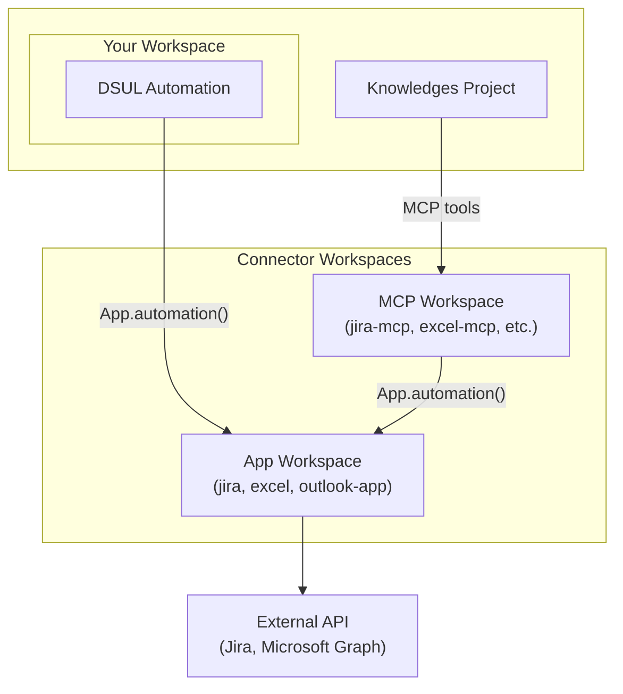

Connectors provide ready-to-use integrations with popular external services. Each connector can be used in two ways depending on your use case.

## Integration Modes

<CardGroup cols={2}>
  <Card title="App Mode" icon="puzzle-piece">
    Import the connector as an app into your workspace and call automations directly from DSUL.
    
    **Best for:** Workflow automations, data pipelines, scheduled jobs
  </Card>
  <Card title="MCP Mode" icon="robot">
    Connect the MCP endpoint to Agent Factory agents. They discover and use tools automatically.
    
    **Best for:** AI agents, conversational interfaces, dynamic tool selection
  </Card>
</CardGroup>

## Available Connectors

<CardGroup cols={2}>
  <Card title="Azure OCR" icon="/images/connectors/azure-ocr.png" href="/apps-store/marketplace/connectors/azure-ocr">
    Extract text and structured data from images and documents with Azure Computer Vision and Document Intelligence, from Agent Factory agents (MCP) or Builder workflows.
  </Card>
  <Card title="Bing Search" icon="/images/connectors/bing-search.svg" href="/apps-store/marketplace/connectors/bing-search">
    Search the web from AI agents through Bing Grounding in Azure AI Foundry.
  </Card>
  <Card title="Brave Search" icon="/images/connectors/brave-search.svg" href="/apps-store/marketplace/connectors/brave-search">
    Web search and LLM-ready grounding context via Brave Search API. Exposes `brave_search` (raw results) and `brave_llm_context` (structured snippets) as MCP tools.
  </Card>
  <Card title="DataGalaxy" icon="/images/connectors/data-galaxy.svg" href="/apps-store/marketplace/connectors/data-galaxy">
    Read/write access to the DataGalaxy data catalog: sources, structures, glossary, links, comments and tasks.
  </Card>
  <Card title="Excel" icon="/images/connectors/excel.jpg" href="/apps-store/marketplace/connectors/excel">
    Read and write Excel workbooks stored in OneDrive or SharePoint. 50+ operations for worksheets, ranges, tables, and charts.
  </Card>
  <Card title="Figma" icon="/images/connectors/figma.svg" href="/apps-store/marketplace/connectors/figma">
    Read Figma files, comments, components, styles and library data. 13 entity tools covering files, images, webhooks, variables and analytics.
  </Card>
  <Card title="GitLab" icon="/images/connectors/gitlab.svg" href="/apps-store/marketplace/connectors/gitlab">
    Manage GitLab projects, issues, merge requests and CI/CD pipelines. 94 tools covering projects, MRs, pipelines, branches, commits, releases and more.
  </Card>
  <Card title="Google Chat" icon="/images/connectors/google-chat.png" href="/apps-store/marketplace/connectors/google-chat">
    Bridge a Google Chat bot to a Prisme.ai AI Knowledge agent through an HTTPS webhook. Per-thread context, async acknowledgement and service-account-signed replies.
  </Card>
  <Card title="Google Search" icon="/images/connectors/google-search.svg" href="/apps-store/marketplace/connectors/google-search">
    Run Google web searches from AI agents — synthesized grounded answers (Gemini) or rich filtered results and image search (Custom Search), via a Google API key or service account.
  </Card>
  <Card title="Google Workspaces" icon="/images/connectors/google-workspaces.png" href="/apps-store/marketplace/connectors/google-workspaces">
    Drive, Docs, Sheets, Gmail and Calendar through five MCP entity tools, with per-user OAuth (central or tenant client), service-account JWT or a direct access token.
  </Card>
  <Card title="Gryzzly" icon="/images/connectors/gryzzly.svg" href="/apps-store/marketplace/connectors/gryzzly">
    Manage time tracking in Gryzzly: customers, projects, tasks, declarations, leave periods and payroll exports.
  </Card>
  <Card title="HubSpot" icon="/images/connectors/hubspot.png" href="/apps-store/marketplace/connectors/hubspot">
    Manage HubSpot CRM and Marketing data via PAT or per-user OAuth. ~120 operations across contacts, companies, deals, tickets, engagements, lists, forms, emails and workflows.
  </Card>
  <Card title="Jira" icon="/images/connectors/jira.svg" href="/apps-store/marketplace/connectors/jira">
    Search, create, and manage Jira issues. Supports both Jira Cloud and Data Center deployments.
  </Card>
  <Card title="monday.com" icon="/images/connectors/monday.png" href="/apps-store/marketplace/connectors/monday">
    Manage monday.com boards, items, columns, docs and users via the v2 GraphQL API.
  </Card>
  <Card title="Outlook" icon="/images/connectors/outlook.png" href="/apps-store/marketplace/connectors/outlook">
    Read, send, and manage emails via Microsoft Graph API. Full mailbox access with folder management.
  </Card>
  <Card title="Prisme.ai Storage" icon="database" href="/apps-store/marketplace/connectors/storage-client">
    Wraps the Prisme.ai Storage backend (files, vector stores, crawling, RBAC, API keys, skills). 38 operations, forward-auth — no per-tenant API key.
  </Card>
  <Card title="Salesforce" icon="/images/connectors/salesforce.svg" href="/apps-store/marketplace/connectors/salesforce">
    Read/write Salesforce CRM data via REST API v62.0: records, SOQL/SOSL, Bulk API 2.0, Composite, Tooling, Process & Approvals, Reports and Metadata deploys.
  </Card>
  <Card title="SAP LeanIX" icon="/images/connectors/sap-leanix.svg" href="/apps-store/marketplace/connectors/sap-leanix">
    Query and manage SAP LeanIX Enterprise Architecture — fact sheets (Pathfinder GraphQL), Integration API (LDIF sync) and surveys, via a LeanIX API token.
  </Card>
  <Card title="ServiceNow" icon="/images/connectors/service-now.svg" href="/apps-store/marketplace/connectors/service-now">
    Manage ServiceNow ITSM tickets, change requests, problems and service catalog with Basic or OAuth2 auth.
  </Card>
  <Card title="SharePoint" icon="/images/connectors/sharepoint.svg" href="/apps-store/marketplace/connectors/sharepoint">
    Browse and download files from SharePoint document libraries. Supports per-user access validation.
  </Card>
  <Card title="SonarQube" icon="/images/connectors/sonarqube.svg" href="/apps-store/marketplace/connectors/sonarqube">
    Read and act on SonarQube / SonarCloud code quality data: projects, issues, hotspots, measures, quality gates, rules and badges.
  </Card>
  <Card title="Tableau" icon="/images/connectors/tableau.svg" href="/apps-store/marketplace/connectors/tableau">
    Read and act on Tableau Cloud / Server: REST API 3.x, Metadata GraphQL, VizQL Data Service and Pulse from DSUL or AI agents.
  </Card>
  <Card title="WebDAV" icon="/images/connectors/webdav.jpg" href="/apps-store/marketplace/connectors/webdav">
    Browse, read and write files on any WebDAV server (Nextcloud, ownCloud, generic HTTPS WebDAV). 10 file/directory operations with Basic or Bearer auth.
  </Card>
  <Card title="Word" icon="/images/connectors/word.jpg" href="/apps-store/marketplace/connectors/word">
    Build, upload, parse, convert, version, and manage Microsoft Word documents stored in OneDrive or SharePoint.
  </Card>
</CardGroup>

## Choosing the Right Mode

| Criteria | App Mode | MCP Mode |
|----------|----------|----------|
| **Caller** | DSUL automations | AI agents (LLM) |
| **Tool discovery** | Manual (you specify which automation) | Automatic (agent selects tools) |
| **Authentication** | Workspace config | Headers, user session, or workspace config |
| **Use case** | Deterministic workflows | Conversational AI, agentic tasks |

### Provider-Specific Fields

Some external services expose configurable fields that are defined outside Prisme.ai, such as Jira custom fields, CRM properties, ticket attributes, or board columns.

Connector operations should expose these through a generic structured object such as `fields` when the provider API accepts arbitrary field IDs or keys. Prisme.ai passes values to fields that already exist in the external service; it does not create new provider fields unless the connector explicitly includes administrative tools for that provider.

When field IDs, available work types, screens, layouts, or create/update metadata matter, use the connector's discovery operations first. Avoid hardcoding provider-specific IDs or assumptions in automations and tests.

### When to Use App Mode

- You're building a workflow automation (e.g., sync data on a schedule)
- You know exactly which operations to call
- You want to chain multiple operations in a single automation
- You don't need AI to decide which operations to use

```yaml
# Example: App mode in DSUL
- Jira.searchJira:
    jql: "project = DEV AND status = 'In Progress'"
    maxResults: 10
    output: results
```

### When to Use MCP Mode

- You're building an AI agent that needs access to external services
- The agent should dynamically choose which operations to call
- Users interact via natural language (chat interface)
- You want tool discovery and schema introspection

```json
// Example: MCP tool call from AI agent
{
  "name": "searchJira",
  "arguments": {
    "jql": "project = DEV AND status = 'In Progress'",
    "maxResults": 10
  }
}
```

## Architecture

Each connector follows a two-workspace pattern:

<Frame>

</Frame>

The **App workspace** contains:
- Business logic and API client code
- Authentication handling
- Data transformation

The **MCP workspace** contains:
- JSON-RPC 2.0 endpoint
- Tool definitions with schemas
- Output formatting for LLM consumption

## Next Steps

<CardGroup cols={2}>
  <Card title="Jira Connector" icon="/images/connectors/jira.svg" href="/apps-store/marketplace/connectors/jira">
    Get started with Jira integration
  </Card>
  <Card title="Building Custom Connectors" icon="tools" href="/apps-store/marketplace/extending-apps">
    Create your own connector for any API
  </Card>
</CardGroup>
