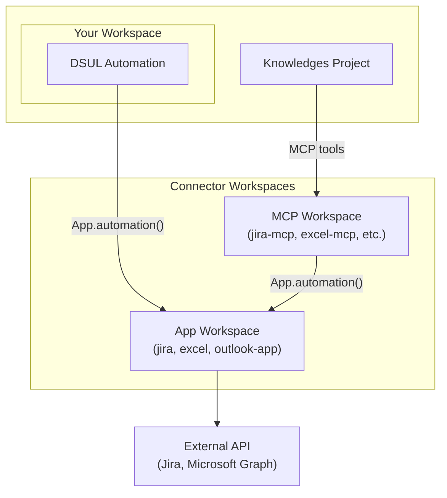

Connectors provide ready-to-use integrations with popular external services. Each connector can be used in two ways depending on your use case.

## Integration Modes

<CardGroup cols={2}>
  <Card title="App Mode" icon="puzzle-piece">
    Import the connector as an app into your workspace and call automations directly from DSUL.
    
    **Best for:** Workflow automations, data pipelines, scheduled jobs
  </Card>
  <Card title="MCP Mode" icon="robot">
    Connect the MCP endpoint to Knowledges projects. AI agents discover and use tools automatically.
    
    **Best for:** AI agents, conversational interfaces, dynamic tool selection
  </Card>
</CardGroup>

## Available Connectors

<CardGroup cols={2}>
  <Card title="Azure OCR" icon="image" href="/apps-store/marketplace/connectors/azure-ocr">
    Extract text and structured data from images and documents via Azure Computer Vision and Document Intelligence.
  </Card>
  <Card title="Bing Search" icon="magnifying-glass" href="/apps-store/marketplace/connectors/bing-search">
    Search the web from AI agents through Bing Grounding in Azure AI Foundry.
  </Card>
  <Card title="DataGalaxy" icon="book" href="/apps-store/marketplace/connectors/data-galaxy">
    Read/write access to the DataGalaxy data catalog: sources, structures, glossary, links, comments and tasks.
  </Card>
  <Card title="Excel" icon="file-excel" href="/apps-store/marketplace/connectors/excel">
    Read and write Excel workbooks stored in OneDrive or SharePoint. 50+ operations for worksheets, ranges, tables, and charts.
  </Card>
  <Card title="GitLab" icon="gitlab" href="/apps-store/marketplace/connectors/gitlab">
    Manage GitLab projects, issues, merge requests and CI/CD pipelines. 94 tools covering projects, MRs, pipelines, branches, commits, releases and more.
  </Card>
  <Card title="Gryzzly" icon="clock" href="/apps-store/marketplace/connectors/gryzzly">
    Manage time tracking in Gryzzly: customers, projects, tasks, declarations, leave periods and payroll exports.
  </Card>
  <Card title="Jira" icon="ticket" href="/apps-store/marketplace/connectors/jira">
    Search, create, and manage Jira issues. Supports both Jira Cloud and Data Center deployments.
  </Card>
  <Card title="monday.com" icon="table" href="/apps-store/marketplace/connectors/monday">
    Manage monday.com boards, items, columns, docs and users via the v2 GraphQL API.
  </Card>
  <Card title="Outlook" icon="envelope" href="/apps-store/marketplace/connectors/outlook">
    Read, send, and manage emails via Microsoft Graph API. Full mailbox access with folder management.
  </Card>
  <Card title="ServiceNow" icon="headset" href="/apps-store/marketplace/connectors/service-now">
    Manage ServiceNow ITSM tickets, change requests, problems and service catalog with Basic or OAuth2 auth.
  </Card>
  <Card title="SharePoint" icon="folder-open" href="/apps-store/marketplace/connectors/sharepoint">
    Browse and download files from SharePoint document libraries. Supports per-user access validation.
  </Card>
  <Card title="SonarQube" icon="shield-check" href="/apps-store/marketplace/connectors/sonarqube">
    Read and act on SonarQube / SonarCloud code quality data: projects, issues, hotspots, measures, quality gates, rules and badges.
  </Card>
  <Card title="Tableau" icon="chart-line" href="/apps-store/marketplace/connectors/tableau">
    Read and act on Tableau Cloud / Server: REST API 3.x, Metadata GraphQL, VizQL Data Service and Pulse from DSUL or AI agents.
  </Card>
</CardGroup>

## Choosing the Right Mode

| Criteria | App Mode | MCP Mode |
|----------|----------|----------|
| **Caller** | DSUL automations | AI agents (LLM) |
| **Tool discovery** | Manual (you specify which automation) | Automatic (agent selects tools) |
| **Authentication** | Workspace config | Headers, user session, or workspace config |
| **Use case** | Deterministic workflows | Conversational AI, agentic tasks |

### When to Use App Mode

- You're building a workflow automation (e.g., sync data on a schedule)
- You know exactly which operations to call
- You want to chain multiple operations in a single automation
- You don't need AI to decide which operations to use

```yaml
# Example: App mode in DSUL
- Jira.searchJira:
    jql: "project = DEV AND status = 'In Progress'"
    maxResults: 10
    output: results
```

### When to Use MCP Mode

- You're building an AI agent that needs access to external services
- The agent should dynamically choose which operations to call
- Users interact via natural language (chat interface)
- You want tool discovery and schema introspection

```json
// Example: MCP tool call from AI agent
{
  "name": "searchJira",
  "arguments": {
    "jql": "project = DEV AND status = 'In Progress'",
    "maxResults": 10
  }
}
```

## Architecture

Each connector follows a two-workspace pattern:

<Frame>

</Frame>

The **App workspace** contains:
- Business logic and API client code
- Authentication handling
- Data transformation

The **MCP workspace** contains:
- JSON-RPC 2.0 endpoint
- Tool definitions with schemas
- Output formatting for LLM consumption

## Next Steps

<CardGroup cols={2}>
  <Card title="Jira Connector" icon="ticket" href="/apps-store/marketplace/connectors/jira">
    Get started with Jira integration
  </Card>
  <Card title="Building Custom Connectors" icon="tools" href="/apps-store/marketplace/extending-apps">
    Create your own connector for any API
  </Card>
</CardGroup>
