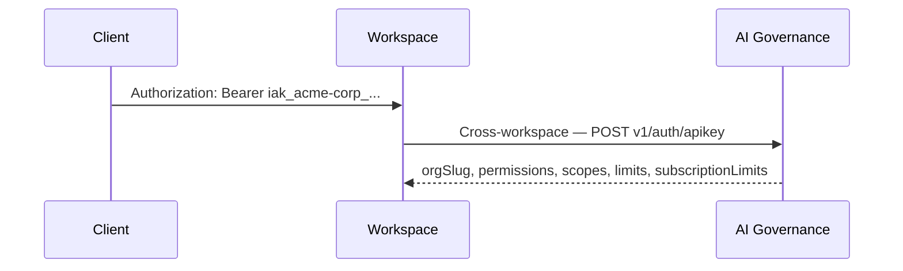
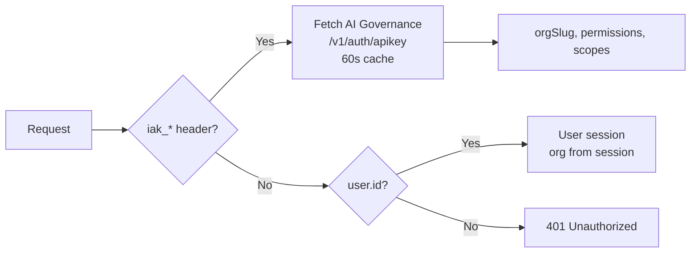
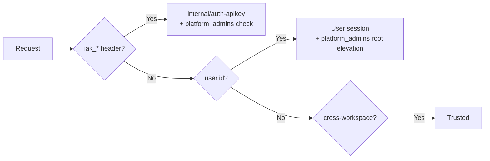
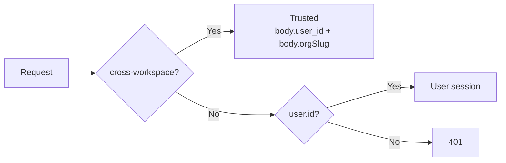
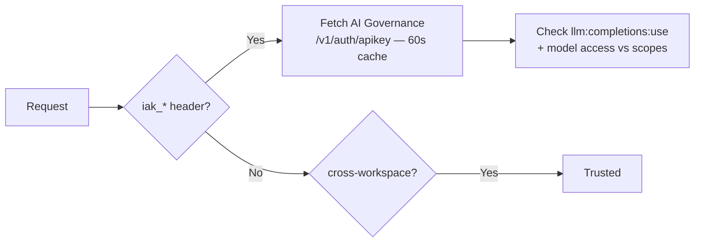
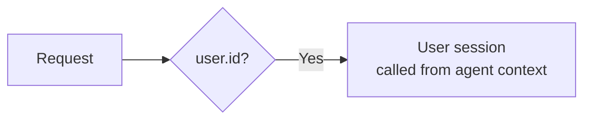

The platform supports multiple authentication modes. Each serves a different caller type, and workspaces implement them through their `_auth` private automation.

## Authentication Modes

| Mode | Caller | Trigger | Token Format |
|------|--------|---------|--------------|
| **User Session** | Browser / frontend | OIDC PKCE flow | Bearer token in `Authorization` header or access-token cookie |
| **API Key** | External integrations | `iak_*` prefixed key | Bearer token in `Authorization` header |
| **Access Token** | Programmatic clients | `at:` prefixed token | Bearer token in `Authorization` header giving some user's identity |
| **Cross-Workspace Call** | Other workspaces | `fetch` to webhook URL | Identified by `run.sourceWorkspaceId` |
| **Internal Auth** | Runtime → API Gateway | Runtime-signed JWT | `prismeaiInternal` claim |

## User Session (OIDC)

The frontend authenticates users via OIDC PKCE flow through the Prisme.ai API Gateway.

**Flow:**
1. User visits the platform → redirected to OIDC provider
2. Authorization code exchange via `sdk.getToken()`
3. Access token stored in `localStorage` under `platform-token`
4. Token included as `Authorization: Bearer {token}` on all API calls
5. CSRF token included on mutating requests via `x-prismeai-csrf-token` header

**CSRF protection:** Required only for cookie-authenticated browser requests on non-GET methods. Bypassed for bearer token auth, cross-workspace calls, and unauthenticated requests.

### Active Organization

The user's **active organization** determines which permissions and scopes apply. It is resolved on each request:
1. URL path (`/v2/orgs/:orgSlug/...`) takes priority
2. Then the session-persisted `activeOrgSlug`
3. Falls back to the user's first organization membership

See [IAM Context > Active Organization](/products/ai-governance/iam-context#active-organization) for details on switching.

### Context Available in Automations

**`session` context** — The active org and its role are available via the session:

| Variable | Description |
|----------|-------------|
| `{{session.id}}` | Session ID |
| `{{session.org.slug}}` | Active organization slug |
| `{{session.org.name}}` | Organization name |
| `{{session.org.role.slug}}` | User's role slug in the active org |
| `{{session.org.role.permissions}}` | Role permission strings (array) |
| `{{session.org.role.scopes}}` | Role scope strings (array) |
| `{{session.org.groups}}` | Groups the user belongs to in this org |
| `{{session.org.settings}}` | Org settings (e.g. LLM governance) |
| `{{session.org.subscription}}` | Org subscription object |

**`user` context** — Persistent user profile data:

| Variable | Description |
|----------|-------------|
| `{{user.id}}` | User ID (read-only) |
| `{{user.email}}` | User email |
| `{{user.role}}` | Workspace CASL role (e.g. `owner`, `editor`) — **not** the org role |
| `{{user.orgSlugs}}` | Array of all org slugs the user belongs to (read-only) |

**`run` context** — Current execution metadata (read-only):

| Variable | Description |
|----------|-------------|
| `{{run.permissions}}` | Org permissions as a nested object (`{product: {resource: {action: true}}}`) |
| `{{run.scopes}}` | Raw scopes array from org role |
| `{{run.correlationId}}` | Request correlation ID |
| `{{run.ip}}` | Client IP address |
| `{{run.authenticatedWorkspaceId}}` | Calling workspace ID (for service-to-service calls) |
| `{{run.sourceWorkspaceId}}` | Source workspace ID |
| `{{run.trigger}}` | Trigger info: `{type, value, id, import}` |

<Note>
`user.role` is the **workspace-level** role (from CASL security rules), not the organization role. The organization role is in `session.org.role`.
</Note>

## API Keys (`iak_*`)

API keys are created and managed through AI Governance. They enable programmatic access to the platform from external systems.

**Key format:** `iak_{orgSlug}_{uuid}` (e.g., `iak_acme-corp_a1b2c3d4e5f6g7h8`).

**Validation flow:**



The validation result is **cached for 60 seconds** in the workspace's global cache (`global.apikey_auth_cache`) to avoid hitting Governance on every request.

**API key context includes:**
- `orgSlug` — Organization the key belongs to
- `permissions` — Granted permissions (e.g., `llm:completions:use`, `memories:read`)
- `scopes` — Resource scopes (e.g., allowed models, agent IDs)
- `subscriptionLimits` — Rate limits and quotas from the org's subscription
- `llm` — LLM governance configuration (allowed models, providers)

See [API Keys](/products/ai-governance/api-keys) for the full lifecycle documentation.

## Access Tokens (`at:`)

Access tokens are long-lived programmatic tokens created via `POST /v2/user/accessTokens`. Unlike OIDC tokens, they bypass the OAuth flow entirely.

- **Format:** `at:` prefix followed by a random string
- **Storage:** Stored hashed in MongoDB (not JWTs)
- **Validation:** Looked up server-side on each request
- **Use case:** CI/CD pipelines, scripts, and long-running integrations

## Service Accounts

Service accounts (`sa:` prefixed user IDs) provide machine-to-machine identity scoped to an organization. They authenticate via API keys and carry specific permissions and scopes.

Service accounts are managed via the native v2 API — see the [API Reference](/api-reference).

## Cross-Workspace Calls

When a workspace calls another workspace's webhook, the platform automatically identifies the caller via `run.sourceWorkspaceId`. This is a guaranteed identity — the runtime injects it based on the calling workspace, and it cannot be forged.

**In DSUL automations:**

```yaml
- fetch:
    url: '{{global.apiUrl}}/workspaces/slug:llm-gateway/webhooks/v1/chat/completions'
    body:
      model: gpt-4o
      messages: '{{messages}}'
```

**On the receiving side**, the calling workspace is identified via:
- `run.sourceWorkspaceId` — The calling workspace's ID (injected by the runtime)

Each receiving workspace implements its own authorization logic to decide what callers are allowed to do. For example, AI Governance allows Agent Factory to search LLM Gateway events.

## Internal Auth

For cross-service calls between the Runtime and the API Gateway (e.g., the `access-manager` module), the Runtime signs a JWT with a `prismeaiInternal: true` claim. This identifies the call as coming from a trusted platform service, distinct from workspace-to-workspace calls.

## Per-Workspace Implementation

Each workspace implements `_auth` differently based on its access patterns:

### Agent Factory (Full Three-Mode)



Agent Factory supports all three modes because it's accessed by:
- The SecureChat frontend (user session)
- External integrations (API keys)
- AI Insights and other workspaces (cross-workspace calls)

### AI Governance



Governance has a special `platform_admins` list that grants `root` role to specific user IDs.

### Storage (Internal Service)



Storage does **not** support `iak_*` keys — it's an internal service only accessed by other workspaces or the frontend.

### LLM Gateway (Inline Auth)



LLM Gateway implements auth inline in its endpoint automations rather than in a shared `_auth` helper, because it needs model-level access checks.

### AI Collection (Agent Context Only)



AI Collection only supports user sessions because it's always called from within an agent execution context, never directly by external clients.

## Permission Model

Permissions are string-based and follow a `product:resource:action` pattern:

```
orgs:members:manage
llm:completions:use
agent-factory:agents:*
storage:*
*
```

See [Roles & Permissions](/products/ai-governance/roles-permissions) for the full permission catalog, resource scopes, and wildcard behavior.

Permission checking in DSUL automations leverages `run.permissions`, a nested object parsed from the user's org role (e.g. `{"memories": {"read": true, "manage": true}}`):

```yaml
# _check-permission example (from tools-memories)
# Input: permission = "memories:read"
- set:
    name: _parts
    value: ''
- set:
    name: _domain
    value: '{{_parts.0}}'
- set:
    name: _action
    value: '{{_parts.1}}'
- conditions:
    '{{run.permissions["*"].manage}}':
      - set:
          name: allowed
          value: true
    '{{run.permissions[{{_domain}}][{{_action}}]}} or {{run.permissions[{{_domain}}].manage}}':
      - set:
          name: allowed
          value: true
    default:
      - set:
          name: allowed
          value: false
```

## Security Rules (RBAC)

Each workspace defines RBAC rules in `security.yml`:

```yaml
authorizations:
  roles:
    editor: {}
    viewer: {}
    workspace:
      auth:
        apiKey: {}
  rules:
    - role: editor
      action: [read, update, get_usage]
      subject: workspaces
    - role: viewer
      action: read
      subject: [workspaces, pages]
    - role: workspace
      action: [create, update, read, delete]
      subject: files
    - action: create
      subject: events
      conditions:
        source.serviceTopic: topic:runtime:emit
      reason: Anyone can create events via runtime
```

Key concepts:
- **Roles**: `editor`, `viewer`, `workspace` (API key service account)
- **Subjects**: `workspaces`, `pages`, `files`, `events`, `automations`
- **Actions**: `read`, `create`, `update`, `delete`, `manage` (all)
- **Conditions**: Filter rules by event source, session, user ID
- **Inverted rules**: `inverted: true` creates deny rules (e.g., block reading API key events)
