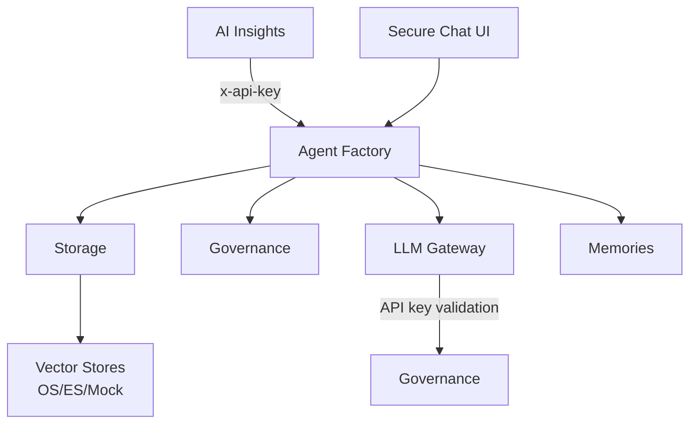

Workspaces form a directed dependency graph. Understanding how they call each other is key to working with the platform.

## Dependency Graph



### Detailed Dependencies

| Source | Target | Auth Method | Purpose |
|--------|--------|-------------|---------|
| Agent Factory | Storage | Workspace JWT | File/vector operations |
| Agent Factory | LLM Gateway | Workspace JWT | Chat completions, embeddings |
| Agent Factory | AI Governance | Workspace JWT | API key validation |
| Agent Factory | Tools Memories | Workspace JWT | Long-term memory |
| Agent Factory | Guardrails | Workspace JWT | Input/output safety |
| Agent Factory | AI Collection | MCP (agent context) | Structured data tools |
| LLM Gateway | AI Governance | Workspace JWT | API key validation |
| Storage | LLM Gateway | Workspace JWT | Embeddings for RAG |
| Storage | Vector Providers | Installed app call | Vector CRUD |
| AI Insights | Agent Factory | API key (`x-api-key`) | Agent data, conversations |
| AI Insights | LLM Gateway | Workspace JWT | Analysis LLM calls |
| Agent Evaluations | Agent Factory | API key (`x-api-key`) | Test agent conversations |
| Agent Evaluations | LLM Gateway | Workspace JWT | Judge LLM calls |
| Guardrails | LLM Gateway | Workspace JWT | Safety check LLM calls |
| Memories | LLM Gateway | Workspace JWT | Embedding generation |

### Dependency Sinks

These workspaces have **no outbound cross-workspace calls** — they are pure dependency sinks:

- **AI Governance** — The authority. Called by everyone, calls no one.
- **Vector Providers** (OpenSearch, Elasticsearch, Mock) — Called by Storage only.
- **Prompt Library** — Called by SecureChat frontend, no workspace dependencies.
- **Capabilities** — Called by Agent Factory frontend, no workspace dependencies.

## Cross-Workspace Call Patterns

### Pattern 1: Workspace JWT + Fetch

The most common pattern. Used when one workspace calls another's REST API:

```yaml
# Step 1: Generate workspace JWT
- auth:
    workspace: true
    output: _wsJwt

# Step 2: Call the target workspace
- fetch:
    url: '{{global.apiUrl}}/workspaces/slug:llm-gateway/webhooks/v1/chat/completions'
    method: POST
    headers:
      Authorization: 'Bearer {{_wsJwt.jwt}}'
      Content-Type: application/json
    body:
      model: gpt-4o
      messages: '{{messages}}'
    output: llmResponse
```

This pattern is copy-pasted (not shared as a library) into every workspace that needs it. Each workspace has its own `_llm` helper:

```yaml
# automations/_llm.yml (found in 5+ workspaces)
slug: _llm
private: true
arguments:
  endpoint:
    type: string
  body:
    type: object
do:
  - auth:
      workspace: true
      output: _wsJwt
  - fetch:
      url: '{{global.apiUrl}}/workspaces/slug:llm-gateway/webhooks/{{endpoint}}'
      method: POST
      headers:
        Authorization: 'Bearer {{_wsJwt.jwt}}'
      body: '{{body}}'
      output: __output
```

### Pattern 2: API Key + Fetch

Used when the caller acts as an external client rather than a trusted service. The target workspace validates the key against Governance:

```yaml
# AI Insights calling Agent Factory
- fetch:
    url: '{{global.apiUrl}}/workspaces/slug:{{config.agent_factory.slug}}/webhooks/v1/agents/{{agentId}}'
    method: GET
    headers:
      x-api-key: '{{config.agent_factory.api_key}}'
    output: agent
```

This pattern is used when:
- The caller needs to impersonate an organization (API keys are org-scoped)
- The target workspace needs to apply governance rules (quotas, permissions)

### Pattern 3: Installed App Call

For provider workspaces installed as apps, the calling workspace uses the app's slug directly:

```yaml
# Storage calling vector provider (installed as app)
- VectorOpensearch.search:
    index: '{{index_name}}'
    vector: '{{embedding}}'
    limit: 10
    filter_json: '{{filter}}'
    output: results
```

This is the cleanest pattern — no HTTP call, no JWT. The Prisme runtime handles the cross-workspace dispatch. Swapping providers means changing the installed app, not the calling code.

## Provider Abstraction

The platform uses a **provider pattern** for swappable backends. The best example is vector storage:

### Vector Store Router

Storage workspace has a `_vector-router` that dispatches to the correct provider:

```yaml
# automations/_vector-router.yml
- conditions:
    '{{provider}}':
      opensearch:
        - VectorOpensearch.{{operation}}:
            # args
      elasticsearch:
        - VectorElasticsearch.{{operation}}:
            # args
```

All providers implement the **identical interface**:

| Operation | Arguments | Returns |
|-----------|-----------|---------|
| `create-index` | `index`, `dimensions`, `similarity` | `{success, index}` |
| `upsert` | `index`, `vectors [{id, vector, metadata}]` | `{success, count}` |
| `search` | `index`, `vector`, `limit`, `filter`, `min_score` | `{results, total}` |
| `delete-vectors` | `index`, `ids` or `filter` | `{success, deleted_count}` |
| `delete-index` | `index` | `{success}` |

Swapping from OpenSearch to Elasticsearch requires only changing the `default_vector_provider` config in Storage : no code changes.

### LLM Provider Routing

LLM Gateway implements a similar pattern for LLM providers. The `_resolve-provider` automation walks a provider chain:

```
openai → azure_openai → openai_like → anthropic → vertex → bedrock → fallback
```

Each provider has its own connection config (API keys, endpoints, regions). The gateway also supports:
- **Model routing strategies**: `rules`, `llm_classifier`, `capabilities`, `cost_optimized`, `hybrid`
- **Failover**: If the primary model fails, automatically try the failover model from the catalog
- **Carbon tracking**: Estimate energy and carbon footprint per request