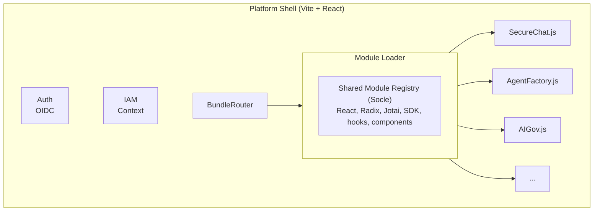

The platform frontend (`services/platform`) is a Vite + React SPA that acts as a **meta-shell** for all Prisme.ai products. It is not a monolithic app — individual products are compiled as standalone JavaScript bundles and loaded dynamically at runtime.

## Tech Stack

| Layer | Technology |
|-------|------------|
| Framework | React 18 + TypeScript |
| Build | Vite 6 (shell) + esbuild (builtin apps) |
| Routing | react-router-dom v7 |
| State | Jotai v2 (atoms + `atomWithStorage`) |
| Styling | TailwindCSS v3 with CSS variables |
| UI | shadcn/ui pattern (Radix UI + CVA + tailwind-merge) |
| i18n | i18next + react-i18next (RTL support) |
| Forms | react-hook-form + zod |
| SDK | `@prisme.ai/sdk` |

## Architecture



## Routing

The shell handles routing at three levels:

### Static Routes (App.tsx)

```
/signin, /signup, /forgot    → Auth pages (no shell)
/settings                    → Settings page
/builder/*                   → Builder app (bundle-loaded)
/apps/:appSlug/*             → AppRenderer (dynamic)
/c/*, /share/*, /            → BundleRouter (manifest-driven)
```

### BundleRouter (Primary Mechanism)

The `BundleRouter` reads `/builtin-bundles/routes-manifest.json` at startup. This file is generated at build time and maps URL patterns to bundle files:

```json
{
  "/": {
    "bundle": "/builtin-bundles/secure-chat.abc123.js",
    "workspaceSlug": "agent-factory"
  },
  "/c/:agentId": {
    "bundle": "/builtin-bundles/secure-chat.abc123.js",
    "workspaceSlug": "agent-factory"
  },
  "/apps/ai-governance/*": {
    "bundle": "/builtin-bundles/ai-governance.def456.js",
    "workspaceSlug": "ai-governance-v2"
  }
}
```

Pattern matching priority: exact match → parameterized → wildcard.

### AppRenderer (Fallback)

For `/apps/:appSlug/*`, the `AppRenderer` first checks the routes manifest. If no match, it falls back to fetching the app config from the workspace API (for legacy published apps).

## Module Loader

This is the key architectural innovation. Each builtin app is:

1. **Compiled by esbuild** as CommonJS with all platform libraries marked as `external`
2. **Served as a plain `.js` file** with a content hash for cache busting
3. **Executed at runtime** using `new Function(code)` with an injected `require()`

The module loader (`src/lib/moduleLoader.ts`):

```
fetch("/builtin-bundles/secure-chat.abc123.js")
    → text content
    → scan for lazy module references
    → create custom require() → shared modules registry
    → new Function('require', 'exports', 'module', code)
    → returns default export (React component)
```

This means all apps **share a single React instance**, a single Jotai store, a single SDK connection — zero library duplication.

## Shared Module Registry (Socle)

The socle (`src/lib/sharedModules.ts`) is a registry of everything builtin apps can `require()`. It includes:

**Always available (eager):**
- `react`, `react-dom`, `react-router-dom`, `jotai`
- All Radix UI primitives
- All shadcn/ui components (`Button`, `Card`, `Input`, etc.)
- `lucide-react` icons
- `@prisme.ai/sdk`
- Platform hooks (`useAuth`, `useWorkspace`, `usePlatform`, `useIAMContext`)
- Socle components (`AppLayout`, `PageHeader`, `StatCard`, `ModelSelector`)
- Socle hooks (`useAppRouter`, `useWorkspaceEvents`, `useDemoMode`)
- `react-i18next`, `clsx`, `tailwind-merge`, `class-variance-authority`

**On-demand (lazy, loaded when detected in bundle code):**
- `react-markdown`, `remark-gfm`, `rehype-katex`, `rehype-highlight` (chat apps)
- `@monaco-editor/react` (governance, builder)
- `@xyflow/react` (insights)
- `@tiptap/*` (engage)

Apps import from the socle like any npm module:

```tsx
import { useState, useEffect } from 'react'
import { Button, Card } from '@prisme/ui'
import { SparklesIcon } from 'lucide-react'
import { useAuth } from '@/hooks/useAuth'
```

At build time, these are marked `external`. At runtime, the custom `require()` resolves them from the socle registry.

## Builtin Apps

Each builtin app lives in `services/platform/builtin-apps/<slug>/`:

```
builtin-apps/
└── my-app/
    ├── manifest.json       # slug, name, version, workspaceSlug, routes
    └── src/
        └── App.tsx         # React entry point
```

### manifest.json

```json
{
  "slug": "my-app",
  "name": "My App",
  "version": "1.0.0",
  "workspaceSlug": "my-backend-workspace",
  "routes": ["/apps/my-app/*"]
}
```

### App.tsx Entry Point

```tsx
interface AppProps {
  sdk: SDK
  user: User
  workspace: { id: string; slug: string; name: string }
}

export default function App({ sdk, workspace }: AppProps) {
  // Your React app here
  // Use sdk.streamEvents(workspace.id) for WebSocket
  // Use fetch against workspace webhooks for REST
}
```

### Current Builtin Apps

| Slug | Name | Routes | Backend Workspaces |
|------|------|--------|--------------------|
| `secure-chat` | SecureChat | `/`, `/c/:agentId`, `/c/:agentId/:convId`, `/share/:shareId` | agent-factory, ai-governance, prompt-library, llm-gateway, ai-insights, storage |
| `ai-governance` | Governance | `/apps/ai-governance/*` | ai-governance-v2, llm-gateway, agent-factory |
| `agent-factory` | Agent Factory | `/apps/agent-factory/*` | agent-factory, agent-evaluations, ai-governance, capabilities, llm-gateway, storage |
| `ai-knowledge` | AI Knowledge | `/apps/ai-knowledge/*` | storage |
| `ai-collection` | AI Collection | `/apps/ai-collection/*` | ai-collection |
| `ai-insights` | AI Insights | `/apps/ai-insights/*` | ai-insights-v2, agent-factory |
| `ai-engage` | Engage | `/apps/ai-engage/*` | ai-governance-v2 |
| `builder` | Builder | `/builder/*` | (platform hooks directly) |

## IAM Context

On startup, the platform shell fetches IAM context from the AI Governance workspace:

```
GET /v2/workspaces/slug:ai-governance-v2/webhooks/v1/iam/context
```

This returns:
- **Organization** — Current org, branding (logo, colors, fonts, custom CSS)
- **Navigation** — Sidebar menu items with icons, badges, categories, external links
- **Membership** — User's role and permissions
- **Organizations list** — All orgs the user belongs to

The sidebar renders dynamically from this config. If no IAM workspace is found, the shell falls back to a degraded mode showing only the builder link.

## Build System

The build is two-phase:

**Phase 1: Shell** (`tsc -b && vite build`)
- Produces the platform shell in `dist/`
- Vite chunks: monaco, xyflow, icons, radix, vendor, sdk

**Phase 2: Builtin Apps** (`npx tsx scripts/build-builtin-apps.ts`)
- Uses **esbuild** (not Vite) for each app
- Produces CJS bundles compatible with `new Function()` execution
- Content-hashed filenames: `secure-chat.abc12345.js`
- Outputs to `dist/builtin-bundles/`:
  - `<slug>.<hash>.js` — Bundle
  - `<slug>.json` — Metadata
  - `bundle-map.json` — Slug → hashed filename
  - `routes-manifest.json` — URL pattern → bundle mapping
  - `index.json` — List of all apps

## Docker Deployment

Multi-stage build: Node (build) → nginx:alpine (runtime).

The `docker-entrypoint.sh` generates `/env-config.js` at container start, injecting environment variables as `window.__ENV__`. This enables runtime configuration without rebuilding the Docker image.

Key environment variables:

| Variable | Purpose | Default |
|----------|---------|---------|
| `API_URL` | Backend API base URL | `https://api.prisme.ai/v2` |
| `CONSOLE_URL` | Console URL | `https://console.prisme.ai` |
| `OIDC_STUDIO_CLIENT_ID` | OIDC client ID | `local-client-id` |
| `PAGES_HOST` | Pages hostname pattern | `.pages.prisme.ai` |
| `BUNDLE_BASE_URL` | Builtin bundles path | `/builtin-bundles` |
| `ENABLED_AUTH_PROVIDERS` | Auth provider config (JSON) | (empty) |
| `DISABLE_LOCAL_SIGNUP` | Disable local signup | `false` |

The nginx config serves:
- Static assets with immutable caching (`/assets/`, `/builtin-bundles/`)
- No-cache for dynamic files (`routes-manifest.json`, `bundle-map.json`, `env-config.js`, `index.html`)
- SPA fallback to `index.html` for all routes
