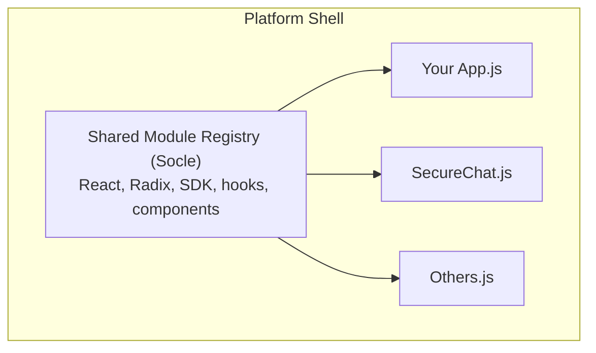

Builtin apps are **React applications** compiled as standalone JavaScript bundles and loaded dynamically by the platform shell. They share React, UI components, and the SDK with the shell — no library duplication.

## Architecture



## Step 1: Create the Backend Workspace

In the Builder (`http://localhost:3000/builder`):

1. Create a workspace (e.g., "my-product")
2. Add automations for your API endpoints
3. Note the workspace **slug**

## Step 2: Initialize the App

```bash
npm run builtin:init my-app -- --workspaceSlug=my-product
```

This creates:

```
builtin-apps/my-app/
├── manifest.json
└── src/
    └── App.tsx
```

### manifest.json

```json
{
  "slug": "my-app",
  "name": "My App",
  "version": "0.1.0",
  "workspaceSlug": "my-product",
  "routes": ["/apps/my-app", "/apps/my-app/*"]
}
```

- `slug` — Unique identifier, becomes the bundle filename
- `workspaceSlug` — Backend workspace to connect to
- `routes` — URL patterns that load this app

## Step 3: Write Your App

```tsx
import { useState, useEffect, useCallback, useRef } from 'react'
import { Button, Card, Input } from '@prisme/ui'
import { SparklesIcon } from 'lucide-react'
import { cn } from '@/lib/utils'

interface AppProps {
  sdk: SDK
  user: User
  workspace: { id: string; slug: string; name: string }
}

export default function App({ sdk, workspace }: AppProps) {
  const [data, setData] = useState(null)

  useEffect(() => {
    // Fetch data from your backend workspace
    fetch(`${sdk.apiUrl}/workspaces/slug:${workspace.slug}/webhooks/v1/my-endpoint`, {
      headers: { Authorization: `Bearer ${sdk.token}` }
    })
      .then(res => res.json())
      .then(setData)
  }, [sdk, workspace])

  return (
    <div className="p-6">
      <h1 className="text-2xl font-bold">My App</h1>
      {data && <pre>{JSON.stringify(data, null, 2)}</pre>}
    </div>
  )
}
```

### Available Imports

Your app can import from the socle:

```tsx
// React
import { useState, useEffect, useCallback } from 'react'

// UI Components (shadcn/ui pattern)
import { Button, Card, Input, Select, Dialog, ... } from '@prisme/ui'

// Icons
import { SparklesIcon, SearchIcon, ... } from 'lucide-react'

// Utilities
import { cn } from '@/lib/utils'

// Platform hooks
import { useAuth } from '@/hooks/useAuth'
import { useWorkspace } from '@/hooks/useWorkspace'
import { usePlatform } from '@/hooks/usePlatform'

// Socle hooks
import { useAppRouter } from '@/socle/hooks/useAppRouter'
import { useWorkspaceEvents } from '@/socle/hooks/useWorkspaceEvents'

// Socle components
import { AppLayout } from '@/socle/components/AppLayout'
import { PageHeader } from '@/socle/components/PageHeader'
import { StatCard } from '@/socle/components/StatCard'

// SDK
import { SDK } from '@prisme.ai/sdk'

// State
import { atom, useAtom } from 'jotai'

// Routing
import { useNavigate, useParams, Link } from 'react-router-dom'
```

### WebSocket Events

For real-time communication with your backend:

```tsx
useEffect(() => {
  let events = null

  const connect = async () => {
    events = await sdk.streamEvents(workspace.id)

    events.on('my-response', (data) => {
      console.log('Received:', data.payload)
    })
  }

  connect()
  return () => events?.close()
}, [sdk, workspace.id])

// Emit events
events.emit('my-event', { foo: 'bar' })
```

## Step 4: Build

```bash
npm run build:builtin --prefix services/platform
```

This produces `dist/builtin-bundles/my-app.<hash>.js` and updates the routes manifest.

## Step 5: Import (One Time Only)

```bash
npm run builtin:import my-app --prefix services/platform
```

This updates the backend workspace's `config.value.bundles` to point to the bundle path. **Only needed once** — the path doesn't change.

## Step 6: Develop

```bash
# Edit code
vim builtin-apps/my-app/src/App.tsx

# Rebuild (NOT re-import)
npm run build:builtin --prefix services/platform

# Refresh browser
```

## Using Multiple Backend Workspaces

A single app can connect to multiple backends:

```tsx
export default function App({ sdk, workspace }: AppProps) {
  // Primary workspace (from manifest)
  const primaryApi = `${sdk.apiUrl}/workspaces/slug:${workspace.slug}/webhooks`

  // Additional workspace
  const governanceApi = `${sdk.apiUrl}/workspaces/slug:ai-governance-v2/webhooks`

  // Fetch from both
  const [agents, org] = await Promise.all([
    fetch(`${primaryApi}/v1/agents`, { headers: authHeaders }).then(r => r.json()),
    fetch(`${governanceApi}/v1/iam/context`, { headers: authHeaders }).then(r => r.json()),
  ])
}
```

## API Client Pattern

For workspaces with many endpoints, use the `createApiFetch` helper:

```tsx
import { createApiFetch } from '@/socle/lib/ApiClient'

export default function App({ sdk, workspace }: AppProps) {
  const api = createApiFetch(sdk, workspace.slug)

  // GET
  const agents = await api('v1/agents')

  // POST
  const created = await api('v1/agents', {
    method: 'POST',
    body: JSON.stringify({ name: 'New Agent' })
  })
}
```

## Troubleshooting

| Issue | Solution |
|-------|----------|
| "Module X is not available" | Add the module to `src/lib/sharedModules.ts` |
| App doesn't load | Check `config.value.bundles[slug].bundle` in the workspace |
| Bundle not found | Verify `dist/builtin-bundles/` contains the file |
| WebSocket not connecting | Check `VITE_PRISME_TOKEN` in `.env.local` |
| Stale bundle | Rebuild with `npm run build:builtin` and hard-refresh |
