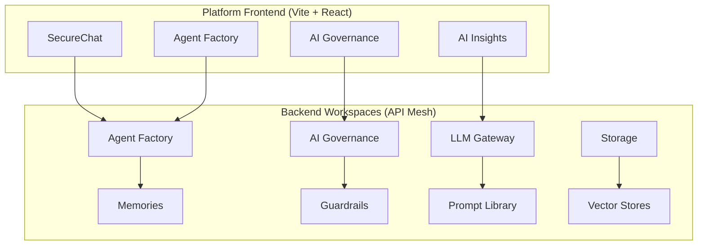

## The New Prisme.ai Platform

The Prisme.ai platform has been redesigned around a **workspace-as-microservice** architecture. Each product is composed of backend workspaces exposing REST and event-driven APIs, paired with full React frontends compiled as builtin apps.

This documentation covers the new platform architecture, every product and service, and how to develop on top of it.

<CardGroup cols={2}>
  <Card title="Architecture" icon="cubes" href="/architecture/overview">
    Understand the workspace mesh, frontend shell, and how everything connects
  </Card>
  <Card title="Products" icon="puzzle-piece" href="/products/overview">
    Agent Factory, AI Governance, AI Collection, AI Insights, AI Knowledge
  </Card>
  <Card title="Services" icon="server" href="/services/llm-gateway/overview">
    LLM Gateway, Storage, Capabilities, Prompt Library
  </Card>
  <Card title="Tools" icon="screwdriver-wrench" href="/tools/overview">
    Vector stores, Guardrails, Memories, Search, Evaluations
  </Card>
  <Card title="Development" icon="code" href="/development/getting-started">
    Build new products: builtin apps, workspace APIs, SDK usage
  </Card>
  <Card title="Self-Hosting" icon="server" href="/self-hosting/overview">
    Deploy the platform on your infrastructure
  </Card>
</CardGroup>

## Key Concepts

<Tabs>
  <Tab title="Workspace Mesh">
    Every backend service is a **Prisme.ai workspace** — a self-contained unit with automations (business logic), imports (data stores), and security rules. Workspaces communicate via REST webhooks and events. The result is a composable microservice mesh where providers (vector stores, LLM, guardrails) are swappable without changing consumer code.
  </Tab>
  <Tab title="Builtin Apps">
    The frontend is a Vite + React SPA (`services/platform`) that acts as a **meta-shell**. Individual products (SecureChat, AI Governance, Agent Factory, etc.) are compiled as JavaScript bundles and loaded dynamically at runtime. They share a common module registry — React, UI components, hooks, SDK — so there's zero duplication.
  </Tab>
  <Tab title="API-First">
    All workspace APIs follow the same pattern: `POST /v2/workspaces/slug:{workspace}/webhooks/v1/{resource}`. Authentication supports user sessions (OIDC), API keys (`iak_*`), and cross-workspace calls. Every product is usable headlessly through its API.
  </Tab>
</Tabs>

## Platform at a Glance

## Quick Navigation

<CardGroup cols={3}>
  <Card title="Agent Factory" icon="robot" href="/products/agent-factory/overview">
    Create, configure, and deploy AI agents
  </Card>
  <Card title="LLM Gateway" icon="brain" href="/services/llm-gateway/overview">
    Multi-provider LLM routing with governance
  </Card>
  <Card title="AI Governance" icon="shield-check" href="/products/ai-governance/overview">
    Organizations, roles, API keys, SSO
  </Card>
  <Card title="Storage" icon="database" href="/services/storage/overview">
    Files, vector stores, and RAG pipeline
  </Card>
  <Card title="AI Collection" icon="table" href="/products/ai-collection/overview">
    Structured data storage and querying
  </Card>
  <Card title="Build an App" icon="hammer" href="/development/builtin-apps">
    Create a new builtin app from scratch
  </Card>
</CardGroup>
