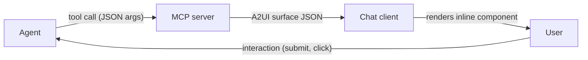

**A2UI** (Agent-to-UI) is one of the three open standards Prisme.ai is built on, alongside [A2A](https://google-a2a.github.io/A2A/) and [MCP](https://modelcontextprotocol.io/). It lets an agent return a **structured UI surface** in the conversation — a card, a form, a table, a confirmation dialog — rather than a wall of text. The user interacts with the surface; their input is delivered back to the agent as the next turn.

You expose A2UI surfaces to your agent the same way you expose any other tool: through an **MCP server** the agent calls. The server returns the surface description; the chat client (SecureChat, embedded widget, etc.) renders it inline.

## What the user sees

When the agent calls an A2UI tool, the chat client renders the surface in the conversation flow — not as a code block or screenshot, but as a real component the user can click, type into, or scroll.

| Surface | Example use |
|---|---|
| **Card** | "Project status: Active, 73% complete" with a colored badge and progress bar |
| **Form** | Multi-field input that pauses the agent until the user submits |
| **Table** | Sortable rows for search results or records |
| **Action card** | Approve / Reject buttons for HITL approvals |
| **Confirmation** | Yes / No dialog before a destructive action |
| **Loader** | Spinner or progress bar tied to an async job |
| **Feedback** | Rating slider + comment area |

The user's response (submitted form values, selected option, button click) is dispatched as an event that the agent receives on its next turn.

## How it works



The MCP server is just a regular Prisme.ai workspace with an HTTP endpoint that speaks JSON-RPC 2.0. Each tool's response contains a `__surface` payload describing the components to render.

## Add A2UI tools to your agent

You bring A2UI tools into an agent in three steps:

1. **Create a workspace** in Builder to host the MCP server
2. **Declare the tools** in the workspace config and implement one automation per tool
3. **Attach the MCP server** to your agent under Capabilities

### Step 1 — Create the workspace

In **Builder**, create a new workspace (or use an existing one). The fastest way to bootstrap is to start from the [mcp-starter repository on GitHub](https://github.com/prismeai/mcp-starter) — it contains the JSON-RPC routing automation, a sample tool, and the workspace config layout. Clone it, push it to your environment, and you have a working MCP server you can extend.

If you'd rather build from scratch, the minimal layout is:

```
my-a2ui-server/
├── index.yml           # workspace metadata + config.mcpTools list
└── automations/
    ├── mcp.yml         # JSON-RPC 2.0 entrypoint (initialize, tools/list, tools/call)
    └── show_card.yml   # one automation per tool
```

### Step 2 — Declare your tools

The MCP server advertises its tools to the agent through `tools/list`. The list lives in the workspace's `config.value.mcpTools` so you can add, remove, or update tools without editing automations.

Add one entry per tool with `name`, `description`, and `inputSchema`:

```yaml
# index.yml
config:
  value:
    mcpTools:
      - name: show_card
        description: >-
          Display a rich project status card to the user with title, status
          badge, progress bar, and description. Use when presenting a project
          or item summary visually rather than as text.
        inputSchema:
          type: object
          properties:
            title:
              type: string
              description: Card title
            status:
              type: string
              description: Status label (e.g. Active, Paused, Completed)
            progress:
              type: number
              description: Completion percentage (0-100)
            description:
              type: string
              description: Short description text
          required: []
```

<Tip>
The `description` is the only signal the LLM gets to decide whether to call your tool. Be explicit about *when* the agent should reach for it ("Use when presenting tabular data", "Use for binary approval decisions"). Vague descriptions lead to the agent ignoring the tool or misusing it.
</Tip>

Then implement the tool as a private automation. Its `output` must contain a `content` array (MCP convention) and a `__surface` object describing the UI:

```yaml
# automations/show_card.yml
slug: show_card
private: true
arguments:
  arguments:
    type: object
do:
  - set:
      name: _title
      value: '{{arguments.title}}'
  - set:
      name: _status
      value: '{{arguments.status}}'
  - set:
      name: _progress
      value: '{{arguments.progress}}'
output:
  content:
    - type: text
      text: 'Displayed project card: {{_title}} ({{_status}}, {{_progress}}%)'
  __surface:
    surface_id: project-card
    catalog_id: prisme://blocks/v1
    wait_for_action: false
    components:
      - id: card
        component: Card
        children: [card-title, badge, progress-bar]
      - id: card-title
        component: Text
        content: { path: /project/name }
        variant: heading
      - id: badge
        component: Badge
        label: { path: /project/status }
      - id: progress-bar
        component: Progress
        value: { path: /project/progress }
        max: 100
    data_model:
      project:
        name: '{{_title}}'
        status: '{{_status}}'
        progress: '{{_progress}}'
```

Two payloads, one purpose:
- `content[].text` is what the LLM sees as the tool's textual result (it can reason about what was displayed).
- `__surface` is what the chat client renders for the user.

The full list of available components (`Card`, `Column`, `Row`, `Text`, `Badge`, `Progress`, `Divider`, `TextField`, `TextArea`, `Select`, `CheckBox`, `Table`, `Button`, …) is documented in the [A2UI surfaces specification](/dsul/overview).

### Step 3 — Attach the MCP server to your agent

1. Open the agent in **Agent Creator**
2. Click **Capabilities** → **Add Capability**
3. Pick **MCP Server**
4. Configure:
   - **Server URL** — the MCP endpoint of your workspace, e.g. `https://api.studio.prisme.ai/v2/workspaces/slug:my-a2ui-server/webhooks/mcp`
   - **Display name** — what shows up in the capability list (e.g. *"A2UI Surfaces"*)
   - **Headers** — any auth your server expects (typically none if it's a workspace-scoped MCP, or `Authorization: Bearer <token>` if you require one)
5. Click **Add**

The platform calls `initialize` and `tools/list` on the server, discovers your tools, and exposes them to the LLM.

### Step 4 — Nudge the agent in your instructions

Add a few lines to the agent's **Instructions** so the LLM actually reaches for the surfaces instead of falling back to text:

> When the user needs to fill multiple fields, use `show_form` instead of asking questions one at a time.
> When presenting tabular data (search results, records), use `show_table`.
> For binary decisions or approvals, use `show_confirmation` or `show_action_card` and wait for the user's response before continuing.

Without this nudge, most models will default to plain text because that's their training prior. The surfaces are tools — they need to be promoted as the better choice for the right situations.

## Going further

- **Spec & components** — [A2UI surfaces specification](/dsul/overview) lists every component, props, and event shape
- **Boilerplate** — [`prismeai/mcp-starter`](https://github.com/prismeai/mcp-starter) is the recommended scaffold
- **MCP authentication** — for OAuth-protected MCP servers (rare for A2UI but possible), see [MCP Connections & OAuth](/products/ai-securechat/mcp-connections)
- **User-first activation** — if some surfaces should only be summoned by the user (e.g. a feedback form), pair the MCP with [user-first tools](./user-first-tools)
