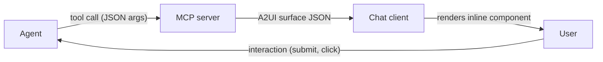

**A2UI** (Agent-to-UI) is one of the three open standards Prisme.ai is built on, alongside [A2A](https://google-a2a.github.io/A2A/) and [MCP](https://modelcontextprotocol.io/). It lets an agent return a **structured UI surface** in the conversation (a card, a form, a table, a confirmation dialog) rather than a wall of text. The user interacts with the surface; their input is delivered back to the agent as the next turn.

Because Prisme.ai is built on open standards rather than a closed stack, you expose A2UI surfaces to your agent the same way you expose any other tool: through an **MCP server** the agent calls. The server returns the surface description; the chat client (Chat, embedded widget, etc.) renders it inline.

## What the user sees

When the agent calls an A2UI tool, the chat client renders the surface in the conversation flow, not as a code block or screenshot, but as a real component the user can click, type into, or scroll.

| Surface | Example use |
|---|---|
| **Card** | "Project status: Active, 73% complete" with a colored badge and progress bar |
| **Form** | Multi-field input that pauses the agent until the user submits |
| **Table** | Sortable rows for search results or records |
| **Action card** | Approve / Reject buttons for HITL approvals |
| **Confirmation** | Yes / No dialog before a destructive action |
| **Loader** | Spinner or progress bar tied to an async job |
| **Feedback** | Rating slider + comment area |

The user's response (submitted form values, selected option, button click) is dispatched as an event that the agent receives on its next turn.

## How it works


```mermaid
flowchart LR
  A[Agent] -- "tool call (JSON args)" --> B[MCP server]
  B -- "A2UI surface JSON" --> C[Chat client]
  C -- "renders inline component" --> D[User]
  D -- "interaction (submit, click)" --> A
```

The MCP server is just a regular Prisme.ai workspace with an HTTP endpoint that speaks JSON-RPC 2.0. Each tool's response contains a `__surface` payload describing the components to render.

## Add A2UI tools to your agent

You bring A2UI tools into an agent in three steps:

1. **Create a workspace** in Builder to host the MCP server
2. **Declare the tools** in the workspace config and implement one automation per tool
3. **Attach the MCP server** to your agent under Capabilities

### Step 1: Create the workspace

In **Builder**, create a new workspace (or use an existing one). The fastest way to bootstrap is to start from the [starter-mcp repository on GitHub](https://github.com/prismeai/starter-mcp); it contains the JSON-RPC routing automation, a sample tool, and the workspace config layout. Clone it, push it to your environment, and you have a working MCP server you can extend.

If you'd rather build from scratch, the minimal layout is:

```
my-a2ui-server/
├── index.yml           # workspace metadata + config.mcpTools list
└── automations/
    ├── mcp.yml         # JSON-RPC 2.0 entrypoint (initialize, tools/list, tools/call)
    └── show_card.yml   # one automation per tool
```

### Step 2: Declare your tools

The MCP server advertises its tools to the agent through `tools/list`. The list lives in the workspace's `config.value.mcpTools` so you can add, remove, or update tools without editing automations.

Add one entry per tool with `name`, `description`, and `inputSchema`:

```yaml
# index.yml
config:
  value:
    mcpTools:
      - name: show_card
        description: >-
          Display a rich project status card to the user with title, status
          badge, progress bar, and description. Use when presenting a project
          or item summary visually rather than as text.
        inputSchema:
          type: object
          properties:
            title:
              type: string
              description: Card title
            status:
              type: string
              description: Status label (e.g. Active, Paused, Completed)
            progress:
              type: number
              description: Completion percentage (0-100)
            description:
              type: string
              description: Short description text
          required: []
```

<Tip>
The `description` is the only signal the LLM gets to decide whether to call your tool. Be explicit about *when* the agent should reach for it ("Use when presenting tabular data", "Use for binary approval decisions"). Vague descriptions lead to the agent ignoring the tool or misusing it.
</Tip>

Then implement the tool as a private automation. Its `output` must contain a `content` array (MCP convention) and a `__surface` object describing the UI:

```yaml
# automations/show_card.yml
slug: show_card
private: true
arguments:
  arguments:
    type: object
do:
  - set:
      name: _title
      value: '{{arguments.title}}'
  - set:
      name: _status
      value: '{{arguments.status}}'
  - set:
      name: _progress
      value: '{{arguments.progress}}'
output:
  content:
    - type: text
      text: 'Displayed project card: {{_title}} ({{_status}}, {{_progress}}%)'
  __surface:
    surface_id: project-card
    catalog_id: prisme://blocks/v1
    wait_for_action: false
    components:
      - id: card
        component: Card
        children: [card-title, badge, progress-bar]
      - id: card-title
        component: Text
        content: { path: /project/name }
        variant: heading
      - id: badge
        component: Badge
        label: { path: /project/status }
      - id: progress-bar
        component: Progress
        value: { path: /project/progress }
        max: 100
    data_model:
      project:
        name: '{{_title}}'
        status: '{{_status}}'
        progress: '{{_progress}}'
```

Two payloads, one purpose:
- `content[].text` is what the LLM sees as the tool's textual result (it can reason about what was displayed).
- `__surface` is what the chat client renders for the user.

The full list of available components and their props is in the [Component reference](#component-reference) below.

### Step 3: Attach the MCP server to your agent

1. Open the agent in **Agent Creator**
2. Click **Capabilities** → **Add Capability**
3. Pick **MCP Server**
4. Configure:
   - **Server URL**: the MCP endpoint of your workspace, e.g. `https://api.studio.prisme.ai/v2/workspaces/slug:my-a2ui-server/webhooks/mcp`
   - **Display name**: what shows up in the capability list (e.g. *"A2UI Surfaces"*)
   - **Headers**: any auth your server expects (typically none if it's a workspace-scoped MCP, or `Authorization: Bearer <token>` if you require one)
5. Click **Add**

The platform calls `initialize` and `tools/list` on the server, discovers your tools, and exposes them to the LLM.

### Step 4: Nudge the agent in your instructions

Add a few lines to the agent's **Instructions** so the LLM actually reaches for the surfaces instead of falling back to text:

> When the user needs to fill multiple fields, use `show_form` instead of asking questions one at a time.
> When presenting tabular data (search results, records), use `show_table`.
> For binary decisions or approvals, use `show_confirmation` or `show_action_card` and wait for the user's response before continuing.

Without this nudge, most models will default to plain text because that's their training prior. The surfaces are tools; they need to be promoted as the better choice for the right situations.

## Interactive surfaces

A surface is **read-only by default**. To make buttons clickable and forms submittable, the tool must declare that it waits for the user:

```yaml
__surface:
  wait_for_action: true
```

With `wait_for_action: true`, the tool call stays pending: the agent pauses, the surface becomes interactive, and the user's click resolves the call. Without it, the surface renders but every `Button` is disabled and clicks do nothing. This is the single most common mistake when a surface "renders but doesn't react".

### The `action` property

A `Button` (and the `Loader`) triggers an action. Exactly two forms are supported:

```yaml
action: approve            # shorthand: the action name as a string
```

```yaml
action:
  name: approve            # object form
```

Any other shape (an `event:` wrapper, a `sendMessage` verb, a `path` binding inside the action) is not part of the catalog and results in a button with no handler.

### What the agent receives

When the user clicks, the pending tool call resolves and the agent receives:

```json
{
  "action": {
    "name": "approve",
    "surfaceId": "action-card-1",
    "sourceComponentId": "btn-approve",
    "timestamp": "2026-07-30T14:00:00.000Z"
  },
  "dataModel": { }
}
```

- `action.name` is the button's action name: this is how the agent knows what was chosen
- `dataModel` contains the full form state when the surface sets `send_data_model: true` (empty otherwise)

The agent then continues the conversation with this result, exactly like any other tool output.

### Example: clickable suggested questions

A common pattern: propose follow-up questions as buttons, and treat the clicked one as the user's next request. The trick is to use the question text itself as the action name:

```yaml
# automations/show_related_questions.yml
slug: show_related_questions
private: true
arguments:
  arguments:
    type: object
do:
  - set:
      name: _btn_ids
      value: []
  - set:
      name: _components
      value: []
  - repeat:
      'on': '{{arguments.questions}}'
      do:
        - set:
            name: _btn_ids[]
            value: q-{{$index}}
        - set:
            name: _components[]
            value:
              id: q-{{$index}}
              component: Button
              label: '{{item}}'
              variant: outline
              action:
                name: '{{item}}'   # the question text IS the action name
  - set:
      name: _components[]
      value:
        id: col
        component: Column
        gap: '2'
        children: '{{_btn_ids}}'
output:
  content:
    - type: text
      text: Related questions proposed to the user.
  isError: false
  __surface:
    surface_id: related-questions
    catalog_id: prisme://blocks/v1
    wait_for_action: true          # required, or the buttons are disabled
    send_data_model: false
    text: Related questions proposed to the user.
    components: '{{_components}}'
```

In the tool's `description`, tell the LLM what comes back: *"The conversation pauses until the user clicks one; the text of the clicked question is returned to the agent as the user's new request."*

### Forms and two-way binding

Input components (`TextField`, `TextArea`, `Select`, `CheckBox`, `Switch`, `Slider`) bind to the `data_model` through a `{ path: ... }` value (JSON Pointer, RFC 6901):

```yaml
components:
  - id: name-input
    component: TextField
    label: Your name
    value: { path: /user/name }
  - id: newsletter
    component: CheckBox
    label: Subscribe to the newsletter
    checked: { path: /user/newsletter }
  - id: submit
    component: Button
    label: Submit
    variant: primary
    action:
      name: submit
data_model:
  user:
    name: ''
    newsletter: false
```

As the user types, the surface state updates in place. When they click a button, the whole `data_model` is attached to the action (set `send_data_model: true` on the surface), so the agent receives every field in one payload. Text inputs bind on `value` (or `text`); `CheckBox` and `Switch` bind on `checked` (or `value`).

## Component reference

The `prisme://blocks/v1` catalog. Every component shares four base properties:

| Property | Type | Description |
|---|---|---|
| `id` | string (required) | Unique identifier within the surface |
| `component` | string (required) | Component type, from the tables below |
| `children` | string[] | IDs of child components (for containers) |
| `className` | string | Extra CSS classes (Tailwind utilities) |

All other props are flat siblings of `component`. Any prop value can be a static value or a binding `{ path: /json/pointer, default: ... }` resolved against the surface's `data_model`.

### Layout

| Component | Props | Notes |
|---|---|---|
| `Row` | `gap` (default `2`), `align` (`start`\|`center`\|`end`\|`stretch`, default `center`), `justify` (`start`\|`center`\|`end`\|`between`\|`around`, default `start`) | Horizontal flex container |
| `Column` | `gap` (default `2`), `align` (default `stretch`), `justify` (default `start`) | Vertical flex container |

### Containers

| Component | Props | Notes |
|---|---|---|
| `Card` | `title`, `variant` (`default`\|`outline`\|`ghost`\|`elevated`) | Card with optional header |
| `Tabs` | `defaultValue` | Tabbed container |
| `Modal` | `open` | Modal container |

### Display

| Component | Props | Notes |
|---|---|---|
| `Text` | `content` (or `text`), `variant` (`body`\|`heading`\|`caption`\|`code`), `weight` (`normal`\|`medium`\|`semibold`\|`bold`) | Text span |
| `Badge` | `label` (or `text`), `variant` (default `default`) | Status badge |
| `Alert` | `message` (or `content`), `title`, `variant` (`default`\|`destructive`\|`success`\|`warning`\|`info`\|`error`) | Callout box |
| `Progress` | `value` (default 0), `max` (default 100) | Progress bar |
| `Divider` | `orientation` (default `horizontal`) | Separator line |
| `Avatar` | `src`, `alt`, `fallback` | `src` must be http(s) or relative; unsafe protocols are blocked |

### Interactive

| Component | Props | Binding |
|---|---|---|
| `Button` | `label`, `variant` (default `outline`), `size` (default `default`), `disabled`, `action` | Triggers the [action flow](#the-action-property) |
| `TextField` | `label`, `placeholder`, `type` (default `text`), `disabled` | `value` (or `text`) |
| `TextArea` | `label`, `placeholder`, `rows` (default 3), `disabled` | `value` (or `text`) |
| `Select` | `options` (string[] or `{value, label}[]`), `label`, `placeholder`, `disabled` | `value` |
| `CheckBox` | `label`, `disabled` | `checked` (or `value`) |
| `Switch` | `label`, `disabled` | `checked` (or `value`) |
| `Slider` | `min` (default 0), `max` (default 100), `step` (default 1), `disabled` | `value` |

### Data

| Component | Props | Notes |
|---|---|---|
| `DataTable` | `data` (array of records), `columns` (`{key, header}[]`), `title` | Renders nothing if `data` or `columns` is empty |
| `List` | `items` (`{id, label}[]`), `variant` (`bullet`\|`number`\|`none`, default `bullet`) | Simple list |

### Media

| Component | Props | Notes |
|---|---|---|
| `Image` | `src`, `alt`, `width`, `height` | `src` must be http(s) or relative; unsafe protocols are blocked |

### Loader

| Component | Props | Notes |
|---|---|---|
| `Loader` | `timeout` (seconds), `poll` (relative URL), `interval` (seconds, default 30, min 1), `style` (`spinner`\|`progress`\|`image`), `aspect` (`square`\|`landscape`\|`portrait`), `message`, `action` | Fires its `action` automatically on timeout or when polling completes; no user click involved |

The `Loader` is the one component whose action fires without a click. In `poll` mode it fetches the URL (same-origin relative path only) every `interval` seconds; the endpoint responds with `{ done, progress, message }`, and when `done` is true the action fires with the final response attached. After 3 consecutive failed polls, a `<action>_error` action fires instead.

## Going further

- **Boilerplate**: [`prismeai/starter-mcp`](https://github.com/prismeai/starter-mcp) is the recommended scaffold
- **MCP authentication**: for OAuth-protected MCP servers (rare for A2UI but possible), see [MCP Connections & OAuth](/products/ai-securechat/mcp-connections)
- **User-first activation**: if some surfaces should only be summoned by the user (e.g. a feedback form), pair the MCP with [user-first tools](./user-first-tools)
