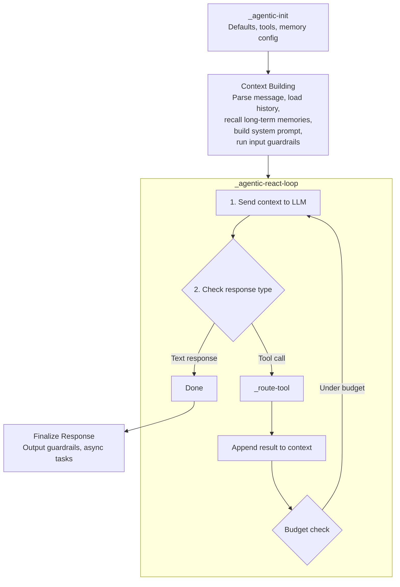

For agents with profiles `agent_light` and above, Agent Factory implements a **ReAct (Reasoning + Acting) loop** — the agent reasons about the task, selects tools, executes them, observes results, and iterates until the task is complete or a budget limit is reached.

## Loop Architecture



## Initialization

The initialization happens in two phases:

**Phase 1: `_agentic-init`** — Sets up defaults, resolves tools, and configures memory:
1. **Profile defaults** — Apply budget, turn limits, and feature flags from the agent's profile
2. **Tool resolution** — Resolve system tools + custom tools into function schemas
3. **Memory configuration** — Configure working memory, session memory, and long-term memory settings

**Phase 2: Context Building** — Prepares the LLM context:
1. **Parse message** — Extract user message and attachments
2. **Load history** — Retrieve conversation history (session memory)
3. **Long-term memory recall** — Query the [Memories workspace](/tools/memories) for relevant past memories
4. **Build system prompt** — Assemble system prompt with agent configuration
5. **Input guardrails** — Run configured input guardrails before the LLM call

The built context is passed to `_agentic-react-loop`.

## ReAct Loop (`_agentic-react-loop`)

Each iteration:

1. **LLM call** — Send the full context (system prompt + messages + tool results) to the LLM via [LLM Gateway](/services/llm-gateway/overview)
2. **Response analysis**:
   - **Text response** → Return to user (loop ends)
   - **Tool call** → Execute via `_route-tool`, append result, continue loop
3. **Budget check** — Verify tokens, tool calls, and cost are within limits
4. **Context size check** — If context exceeds `context_budget`, trigger compaction

### Budget Limits

Each profile defines hard limits:

| Profile | Max Turns | Token Budget | Tool Calls | Cost Budget |
|---------|-----------|-------------|------------|-------------|
| `agent_light` | 10 | 20K | 15 | — |
| `agent_full` | 30 | 100K | 50 | $1.00 |
| `orchestrator` | 50 | 200K | 100 | $5.00 |

When a budget is exceeded, the agent is forced to produce a final text response summarizing its progress.

## Context Compaction (`_context-compaction`)

When the conversation context grows beyond 70% of the `context_budget`, the system compacts it:

1. **Summarize** older messages into a concise summary
2. **Preserve** the most recent messages (last N turns)
3. **Keep** the system prompt and tool definitions intact
4. **Update** working memory with the summary

This allows long-running conversations to continue without hitting model context limits.

**Compaction strategies:**
- `summarize_oldest` — Keeps the last N turns intact, summarizes older messages via LLM call
- `compact_tool_results` — Replaces old tool results with compact status placeholders
- `hybrid` (default) — Runs `compact_tool_results` first, then `summarize_oldest` if still over threshold

## Memory Management

### Working Memory

A per-conversation scratchpad that the agent can write to and read from. Used for:
- Keeping track of intermediate results
- Storing plans and progress
- Maintaining state across tool calls

Configuration:
```json
{
  "max_tokens": 4000,
  "compaction_strategy": "summarize"
}
```

When working memory exceeds `max_tokens`, it's compacted using the configured strategy.

### Session Memory (`_session-memory`)

Persists conversation state across turns. Stored in the conversation record. Includes:
- Message history
- Tool call results
- Working memory snapshots
- Context summaries from compaction

### Long-Term Memory

Cross-conversation memory powered by the [Memories workspace](/tools/memories):

- **Save** — Agent can explicitly save facts, preferences, relationships, and instructions
- **Recall** — Automatically queried during initialization to load relevant past memories (up to 50 memories by default, configurable via `max_memories`)

## Planning (Agent Full+)

When planning is enabled, the agent can create structured plans before executing tasks:

```json
{
  "tool": "planning_create_plan",
  "arguments": {
    "goal": "Research Q3 market trends",
    "steps": [
      {
        "step_number": 1,
        "description": "Search knowledge base for Q3 reports",
        "expected_outcome": "List of relevant documents"
      },
      {
        "step_number": 2,
        "description": "Analyze key metrics from reports",
        "expected_outcome": "Summary of trends"
      },
      {
        "step_number": 3,
        "description": "Compare with Q2 data",
        "expected_outcome": "Quarter-over-quarter analysis"
      }
    ]
  }
}
```

Plans are tracked in the conversation context. The agent can refer to the plan to guide its actions and report progress.

## Reflection (Agent Full+)

After completing actions, the agent can self-evaluate:

```json
{
  "tool": "reflection_evaluate",
  "arguments": {
    "what_worked": "Knowledge base search returned relevant Q3 documents",
    "what_didnt_work": "Missing competitive analysis data",
    "alternative_approaches": "Try searching external sources for competitor data",
    "confidence_level": "medium",
    "should_continue": true
  }
}
```

Reflection results are added to the context, helping the agent course-correct.

## Multi-Agent Delegation (Orchestrator)

Orchestrator agents can delegate subtasks to other agents:

```json
{
  "tool": "agent_delegate",
  "arguments": {
    "agent_id": "agent_specialist_123",
    "task": "Analyze the financial data in the attached spreadsheet",
    "context": {
      "file_id": "file_xyz",
      "focus": "revenue trends"
    }
  }
}
```

**Constraints:**
- Maximum delegation depth: 3 (prevents infinite loops)
- The orchestrator waits for the delegate's response before continuing
- Delegate responses are added to the orchestrator's context

The orchestrator can discover available agents via `agent_list_available`.

## Streaming

During the agentic loop, events are streamed to the client using [A2A Protocol](https://google.github.io/A2A/) event names:

| Event | Description |
|-------|-------------|
| `task.status` | Task status changed (e.g., `working`, `completed`, `input-required`) |
| `task.output.delta` | Incremental output — text tokens, tool calls, tool results |
| `task.output.completed` | Final output with usage statistics |

This gives the frontend visibility into the agent's reasoning process.

## Caching

The agentic loop uses multiple cache layers to minimize redundant work:

| Cache | Scope | Key | Invalidation |
|-------|-------|-----|-------------|
| Agent config | Global (double-buffered) | `agents_cache_a` / `agents_cache_b` | `agents.updated` / `agents.deleted` events |
| Init (tools, memory config) | Session | `agent_init_<agent_id>` | Agent `updatedAt` version mismatch |
| IAM permissions | Global | `agent_perms_v3_<agent_id>` | TTL-based |
| MCP tools/list | Global | Sanitized server URL | TTL-based |
| Auth (API keys, user session) | Global | Per-key / per-user | 60s TTL |
| Conversation metadata | Session | `conv_meta` (max 100 entries) | Evicted on overflow |

The double-buffered agent cache alternates between two maps (`a`/`b`), each holding up to 50 entries. When one fills up, the other is cleared and becomes active, ensuring bounded memory usage.
