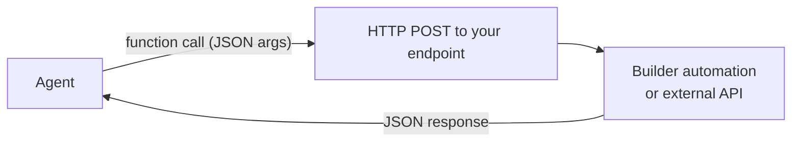

A **custom tool** lets your agent call any HTTP endpoint you control. The most common pattern is to build the endpoint as a [Builder automation](/products/ai-builder/automations) and plug it into the agent in two minutes — but any reachable URL works (internal API, third-party SaaS, serverless function, etc.).

Custom tools sit alongside MCP servers, Skills, and File Search under the agent's **Capabilities** tab.

<Note>
**When to pick a custom tool over an MCP server**: an MCP server exposes many tools at once and is reusable across agents. A custom tool is a single endpoint you wire up directly. If you only need one or two specific actions and you already have (or want) a Builder automation, a custom tool is faster.
</Note>

## How it works



When the LLM decides to invoke the tool, the platform sends a `POST` to your endpoint with a JSON body containing the arguments. Whatever you return becomes the tool's observation in the conversation.

## Step 1 — Build the endpoint as a Builder automation

This is the recommended path: you stay inside Prisme.ai, secrets and access control are already handled, and the call shows up in [Activity / Insights](/products/ai-insights/overview).

1. Open your workspace in **Builder**.
2. Create a new automation (e.g. `getCustomerProfile`).
3. Set the trigger to **Endpoint** so the automation is reachable over HTTP.
4. Declare the input schema under **Arguments** — those become the parameters the agent sees.
5. Implement the logic (`fetch`, `Custom Code.run`, `Collection.findMany`, etc.).
6. Set an `output` so the response payload is well-defined.

Minimal example:

```yaml
slug: getCustomerProfile
name: Get customer profile
description: Returns a customer profile by id, including subscription status
when:
  endpoint: true
arguments:
  customerId:
    type: string
    description: The customer identifier (e.g. cus_12345)
do:
  - fetch:
      url: 'https://crm.internal/api/customers/{{customerId}}'
      headers:
        Authorization: 'Bearer {{config.CRM_TOKEN}}'
      output: profile
output: '{{profile}}'
```

The endpoint URL is shown next to the trigger in the automation editor — it looks like `https://api.studio.prisme.ai/v2/workspaces/<id>/webhooks/getCustomerProfile`. Copy it; you'll paste it into the agent in step 2.

<Tip>
Keep the **description** crisp and action-oriented (`Returns…`, `Creates…`, `Cancels…`). It's the only thing the LLM has to decide whether to call your tool.
</Tip>

<Note>**Screenshot to add:** screenshot of an automation editor in Builder with the Endpoint trigger highlighted, the Arguments panel showing customerId, and the webhook URL visible at the top.</Note>

## Step 2 — Attach the tool to your agent

1. Open the agent in **Agent Creator**.
2. Click the **Capabilities** tab.
3. Click **Add Capability**.
4. Select the **Custom** tab.
5. Pick **Custom Function** (the catalog entry, marked with a ⚡ icon).

A configuration form opens. Fill it in:

| Field | What to put |
|---|---|
| **Display Name** | Human-readable label shown in the UI (`Customer profile lookup`) |
| **Function Name** | Unique technical name the LLM uses to call the tool. Snake-case, no spaces (`get_customer_profile`) |
| **Endpoint URL** | The webhook URL from step 1 |
| **Description** | What the function does — this is what the LLM reads to decide when to use it |
| **Headers** | Optional. For Prisme.ai webhooks you don't need any; for external APIs, add `Authorization`, `X-Api-Key`, etc. |
| **Parameters Schema** | A JSON Schema describing the function arguments |

Example **Parameters Schema** for our automation above:

```json
{
  "type": "object",
  "properties": {
    "customerId": {
      "type": "string",
      "description": "The customer identifier (e.g. cus_12345)"
    }
  },
  "required": ["customerId"]
}
```

Click **Add**. The tool now appears under the agent's Capabilities and can be called from the next conversation.

<Note>**Screenshot to add:** screenshot of the "Add Capability" modal on the Custom tab with "Custom Function" selected, then the configuration form with Display Name, Function Name, Endpoint URL, Description and Parameters Schema fields filled in.</Note>

## Step 3 — Update the instructions

The agent doesn't pick up tools just by being attached — your [Instructions](/products/agent-factory/instructions) need to tell it *when* to use them.

> When the user mentions a customer by id or asks about their plan, call `get_customer_profile` with the id, then summarize subscription status, plan tier, and renewal date.

Without this nudge, the LLM may ignore the tool or use it inconsistently.

## Step 4 — Test in the Playground

Open the [Playground](/products/agent-factory/playground) and try a prompt that should trigger the tool. You'll see:

- The function call (name + arguments) the agent decided on
- The raw JSON response from your endpoint
- The agent's final reply built from that response

If the call doesn't fire, sharpen the description and the parameter descriptions — those drive the LLM's tool-selection behavior. If the call fires but errors, open the automation's Activity tab to see the actual request the agent sent.

<Note>**Screenshot to add:** Playground screenshot showing an agent message with an expanded "Tool call" block listing the function name, the arguments JSON, and the response JSON.</Note>

## Calling an external endpoint instead of a Builder automation

Skip step 1 and point the **Endpoint URL** at any HTTPS endpoint. You typically need to:

- Add an `Authorization` or `X-Api-Key` header in the **Headers** section
- Make sure the endpoint accepts JSON in the body matching your **Parameters Schema**
- Ensure responses are JSON (the agent renders strings as text, but JSON gives it structure to reason over)

For OAuth-based services, prefer wrapping the call in a Builder automation that uses the [Secrets module](/products/ai-builder/module-secrets) to inject the token — this avoids storing credentials inside the agent config.

## Best practices

<AccordionGroup>
  <Accordion title="Names and descriptions are your tool-selection prompt">
    The LLM sees only `name`, `description`, and the parameter schema. Treat these like a prompt: tell it precisely what the tool does and when to use it. Avoid `tool_1` / `do_thing`.
  </Accordion>
  <Accordion title="Keep parameters small and well-typed">
    Use `enum` for fixed sets (e.g. `status: [active, cancelled, trialing]`). Mark required fields. Each parameter description should help the LLM extract the value from the user's message.
  </Accordion>
  <Accordion title="Return JSON, not prose">
    `{ "plan": "pro", "renews_on": "2026-08-12" }` is much more useful to the agent than `The customer is on the pro plan and renews on 2026-08-12`. The agent will turn the JSON into prose itself.
  </Accordion>
  <Accordion title="Fail loudly, with structure">
    On errors, return `{ "error": "customer_not_found", "customerId": "cus_12345" }` rather than an HTTP 500 with no body. The agent can react ("I couldn't find that customer — can you confirm the id?") instead of bailing out.
  </Accordion>
  <Accordion title="One tool, one job">
    Resist the temptation to ship a "do_anything" tool with a `verb` parameter. Multiple narrow tools are easier for the LLM to pick correctly than one fat tool with a switch.
  </Accordion>
</AccordionGroup>

## Editing or removing a tool

In the **Capabilities** tab:

- Click the **gear icon** next to a tool to update its URL, parameters, or description.
- Click the **trash icon** to remove it. Don't forget to update your Instructions if they reference the removed tool.

## Next steps

<CardGroup cols="2">
  <Card title="Build the endpoint" icon="hammer" href="/products/ai-builder/automations">
    Learn how to write an automation, declare arguments, and expose a webhook.
  </Card>
  <Card title="Custom Code in automations" icon="code" href="/products/ai-builder/custom-code">
    Run custom JavaScript or Python inside the automation that powers your tool.
  </Card>
  <Card title="Capabilities reference" icon="puzzle-piece" href="/products/agent-factory/capabilities">
    See all capability types — MCP, Skills, File Search, Guardrails, Sub-agents.
  </Card>
  <Card title="Test in Playground" icon="flask" href="/products/agent-factory/playground">
    Watch tool calls live and tune descriptions until selection is reliable.
  </Card>
</CardGroup>
