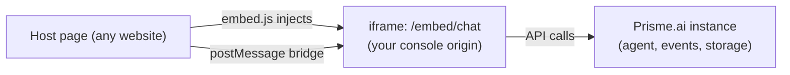
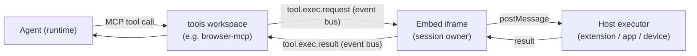

The **embed** turns any agent into a chat widget you can drop on a third‑party
website with a single script tag. The widget is served as a hosted page from your
instance and injected in an **`<iframe>`**, so it is fully isolated from the host
page (CSS, JS, origin) and loads **no remote code** — which also makes it safe for
native‑browser contexts (Manifest V3 browser extensions, mobile web views).

Beyond a chat box, the embed exposes a **programmatic API** (send messages, feed
the current page as context) and a **client‑side tool‑execution channel** that lets
the agent *act* on the page it is on (read, click, fill a form, navigate) — the
foundation the [browser extension](#browser-extension) is built on.

<Note>
The widget renders the same chat as [SecureChat](/products/ai-securechat/overview),
driven by the agent you point it at. It is **instance‑agnostic**: the same snippet
works against any Prisme.ai instance (SaaS or self‑hosted) — nothing is hardcoded.
</Note>

## How it works



- `embed.js` (served from your console) injects the iframe and relays everything
  over a **postMessage** bridge — it never runs the widget's code in the host page.
- The widget runs inside the iframe on your **console origin**, so it talks to your
  instance directly. The session **bearer token stays inside the iframe**; the host
  page never sees it.

## Quick start

Add the script and mount the widget. Two equivalent ways:

<CodeGroup>
```html Script tag (data attributes)
<!-- Auto-mounts into #prisme-app -->
<div id="prisme-app"></div>
<script
  src="https://studio.your-company.com/embed.js"
  data-agent-id="agent_xxxxxxxx"
  data-api-url="https://api.your-company.com/v2"
  data-mode="popover"
  data-auth="anonymous">
</script>
```

```html JavaScript API
<script src="https://studio.your-company.com/embed.js"></script>
<script>
  const chat = PrismeApp.mount({
    agentId: 'agent_xxxxxxxx',
    apiUrl: 'https://api.your-company.com/v2',
    mode: 'popover',
    auth: 'anonymous',
  });
  // chat.open(); chat.sendMessage('Summarize this page');
</script>
```
</CodeGroup>

<Tip>
Find your **Platform URL** (console) and **API URL** in the console under
**Settings → Access Tokens**. The **Agent ID** is on the agent's page in
[Agent Creator](/products/agent-factory/overview).
</Tip>

## Configuration

Every `mount()` option has a `data-*` equivalent for the script‑tag form.

| Option | `data-*` | Description |
|---|---|---|
| `agentId` | `data-agent-id` | The agent to talk to. **Required.** |
| `apiUrl` | `data-api-url` | Instance API base, e.g. `https://api.your-company.com/v2`. |
| `consoleUrl` | `data-console-url` | Console origin serving the widget. Defaults to the `embed.js` origin. |
| `mode` | `data-mode` | `popover` (default), `inline`, `modal`, `bottom-sheet`, `sidebar`. |
| `container` | `data-container` | CSS selector for `inline` mode (default `#prisme-app`). |
| `auth` | `data-auth` | `anonymous` (default), `login`, or `token`. See [Authentication](#authentication). |
| `orgSlug` | `data-org-slug` | Org slug for anonymous access when the org requires it. |
| `theme` | `data-theme` | `light` (default) or `dark`. |
| `showFAB` | `data-show-fab` | Show the floating launcher button (default `true`). |
| `fabIcon` | `data-fab-icon` | Custom launcher icon (URL or inline SVG). |
| `trigger` | `data-trigger` | CSS selector of your own element to open the widget. |
| `features` | `data-enable-*` | Toggle capabilities — see [Features](#features). |
| `colors` | `data-primary-color`… | 3‑value brand (primary/background/foreground). |
| `cssVariables` | `data-css-variables` | Full design‑token palette (JSON). |
| `customCss` | `data-custom-css` | Arbitrary CSS injected inside the widget. See [Theming](#theming). |
| `context` | `data-context` | Page context sent with every message. See [Page context](#page-context). |
| `token` / `tokenProvider` | — | For `auth: 'token'` (JS only). |
| `onOpen` / `onClose` | — | Lifecycle callbacks (JS only). |

### Features

Pass a `features` object (or `data-enable-*` booleans):

| Feature | Default | What it enables |
|---|---|---|
| `enableFiles` | `false` | File attachments (needs a storage backend). |
| `enableFeedback` | `false` | Thumbs up/down on answers. |
| `enableToolCalls` | `true` | Show the agent's tool calls. |
| `enableArtifacts` | `true` | Canvas / artifacts panel. |
| `enableVoice` | `false` | Voice‑to‑voice. |
| `enableSpeechToText` | `false` | Dictation (speech → text). |
| `disablePaste` | `false` | Block pasting into the composer (data‑leak hardening). |

## Display modes

- **`popover`** — floating launcher button, opens a panel. The default for a
  "help" widget in the corner.
- **`inline`** — rendered directly inside a container you provide (`container`).
  Always open; good for a dedicated chat section.
- **`modal`** — centered dialog over an overlay.
- **`bottom-sheet`** — slides up from the bottom (mobile‑friendly; swipe down to close).
- **`sidebar`** — docked panel on the side.

## Authentication

Pick the mode that matches who your users are.

<Tabs>
<Tab title="anonymous (default)">
No sign‑in. The gateway mints an anonymous session. Best for public sites and
demos. If the org restricts anonymous access, pass `orgSlug` so the gateway scopes
the session and applies the configured anonymous role.

```js
PrismeApp.mount({ agentId, apiUrl, auth: 'anonymous', orgSlug: 'acme' });
```
</Tab>
<Tab title="login (SSO popup)">
The user signs in through your instance's SSO in a popup opened by the loader
(from the host top context, so `window.opener` survives the OIDC hops). The token
is relayed back into the widget by `postMessage` — it never travels in a URL.

```js
PrismeApp.mount({ agentId, apiUrl, auth: 'login' });
```
</Tab>
<Tab title="token (service account / your backend)">
Your backend provides a Prisme.ai bearer. Use `tokenProvider` (recommended) so the
embed can refresh it on a 401; the token is requested over the bridge and stays in
the iframe.

```js
PrismeApp.mount({
  agentId, apiUrl, auth: 'token',
  // Called on mount and again on a 401 — return a fresh bearer from YOUR route.
  tokenProvider: () => fetch('/my-backend/prisme-token')
    .then(r => r.json()).then(d => d.token),
});
```

<Note>
The host page is responsible for minting/refreshing the token (e.g. via a
[service account](/products/agent-factory/settings) or an existing OIDC JWT). The
embed never holds a client secret.
</Note>
</Tab>
</Tabs>

## Theming

Three layers, from simplest to fullest — all driven from `mount()`:

<Steps>
<Step title="colors — quick brand">
```js
colors: { primary: '#6D28D9', background: '#FFFFFF', foreground: '#111111' }
```
Sets primary/background/foreground only; other tokens keep their defaults.
</Step>
<Step title="cssVariables — full palette (recommended)">
Every design token as **raw HSL channels** (`H S% L%`, no `hsl()` wrapper),
applied as inline custom properties inside the frame. Override tokens **in pairs**
(`*` with its `*-foreground`) so contrast is guaranteed.
```js
cssVariables: {
  '--background': '0 0% 100%', '--foreground': '240 10% 4%',
  '--primary': '262 83% 58%', '--primary-foreground': '0 0% 100%',
  '--card': '0 0% 100%', '--card-foreground': '240 10% 4%',
  // …
}
```
</Step>
<Step title="customCss — arbitrary CSS (escape hatch)">
When tokens aren't enough, restyle chat internals with raw CSS injected **inside
the iframe** (it can't touch the host page, and the host can't reach in):
```js
customCss: `.prompt-input { border-radius: 9999px }`
```
<Warning>
`customCss` runs inside the authenticated widget frame, so it is sanitized:
`@import` and non‑`data:` `url()` are stripped to prevent CSS‑based data
exfiltration. Use it for structural tweaks, not to load remote assets.
</Warning>
</Step>
</Steps>

Because the widget lives in an iframe, a stylesheet on the **host page cannot reach
inside it** — brand exclusively through the options above.

## Programmatic API

`mount()` returns a handle to drive the widget from your page:

| Method | Description |
|---|---|
| `open()` / `close()` / `toggle()` | Show/hide the panel (no‑op in `inline`). |
| `isOpen()` | Current open state. |
| `sendMessage(text, { contextSnippet? })` | Send a message as if the user typed it. Queued until the chat is ready, so an **immediate post‑mount call is never lost**. |
| `setInputQuote(text \| null)` | Quote a snippet into the composer (like the in‑chat "Ask" selection). |
| `setContext(context)` | Update the page context sent with every subsequent message (`null` clears it). |
| `setTheme('light' \| 'dark')` | Switch theme at runtime. |
| `unmount()` | Remove the widget and all listeners. |

```js
const chat = PrismeApp.mount({ agentId, apiUrl, mode: 'popover' });
chat.setContext({ title: document.title, url: location.href });
chat.sendMessage('Summarize this page in 3 bullet points');
chat.open();
```

## Page context

Give the agent awareness of the page without the user copy‑pasting. `context`
accepts a **string** or a **structured object**; structured fields are serialized
into a readable snippet attached to each message as `parts[].metadata.contextSnippet`.

```js
chat.setContext({
  title: document.title,
  url: location.href,
  selection: window.getSelection()?.toString(),
  content: document.querySelector('main')?.innerText,  // the readable page body
});
```

<Note>
Page content is treated as **untrusted input** to the agent (never as instructions).
Field lengths are capped so a large page can't blow up the message.
</Note>

## Advanced — let the agent act on the page

Reading the page is one half; the embed also ships a **generic client‑side
tool‑execution channel** so the agent can *act* — take a snapshot of the page,
click, fill a form, navigate, capture a screenshot — under explicit user control.



**How it works (MCP‑over‑events).** The agent is bound to a *tools workspace* — an
[MCP server](/products/ai-securechat/mcp-connections) that, instead of executing
server‑side, **emits a `tool.exec.request`** on the event bus. The embed (which owns
the authenticated session) receives it and relays the call to the **host that
mounted it**; the host executes in its own environment and returns a result, which
the embed re‑emits as `tool.exec.result`. Heavy binary results (screenshots) are
uploaded to Storage and only their URL travels on the bus.

The channel is **domain‑agnostic** — the tool catalog and the executor decide what
"act" means:

<CardGroup cols={2}>
<Card title="Browser extension" icon="puzzle-piece">
The shipping executor. Reads the page and performs `browser_*` tools (snapshot,
read, click, fill, select, navigate, screenshot) on the current tab. See
[Browser extension](#browser-extension).
</Card>
<Card title="Web app host" icon="window">
Your own web app can be the executor: expose your app's actions (add to cart, open
a view, run a client‑side function) as tools the agent calls — the agent acts on
*your* product, in the user's session.
</Card>
<Card title="Mobile app" icon="mobile">
A native web view / SDK host can fulfill device tools (scan a barcode, read GPS,
prefill a native form, open a screen). Storage offload keeps large payloads (photos)
off the event bus.
</Card>
<Card title="Desktop shell" icon="desktop">
An Electron/Tauri host can expose OS actions (files, native dialogs, automation).
</Card>
</CardGroup>

<Note>
Only the **tool catalog** (the workspace) and the **executor** (the host) are
specific to each surface. The subscription/relay is the same generic channel, so a
new host implements only its executor. The session bearer never leaves the iframe,
and the runtime treats every `tool.exec.result` as untrusted input.
</Note>

## Browser extension

The [Prisme.ai browser extension](https://github.com/prismeai/prismeai-browser-extension)
(Chrome/Edge, Manifest V3) is the turnkey way to give users a page‑aware agent that
can act on any site. It hosts the embed in a side panel, feeds the current page as
context, and is the executor for the browser tool channel above.

- **Instance‑agnostic**: users enter their Platform/API URLs and agent; one package
  works for any instance.
- **Enterprise**: force‑install + pre‑fill configuration via managed policy — no user
  input required.

See the extension repository for install, packaging and enterprise deployment.

## Security model

- **Isolation** — the widget is a cross‑origin `<iframe>`; host CSS/JS can't reach
  in, and the widget can't touch the host page.
- **No remote code** — everything the loader needs is in `embed.js`; the widget's
  runtime is served by your instance (MV3‑safe).
- **Token stays in the iframe** — the bearer is exchanged over `postMessage` after
  the `ready` handshake, never in a URL, and never exposed to the host page.
- **Origin‑pinned messaging** — both sides validate `event.source`/`event.origin`;
  replies are sent to the loader's exact origin.
- **`customCss` sanitized**, screenshot data URLs validated, and tool‑call results
  treated as untrusted.

## Self‑hosting & operations

**By default the widget is embeddable anywhere** — the customer just pastes the
snippet, no per‑site configuration (on SaaS or self‑hosted). The console serves the
`/embed/*` pages with `frame-ancestors *` (and no `X-Frame-Options`), while every
other console page stays strict (`frame-ancestors 'none'`).

This is safe because the widget is a **cross‑origin iframe**: a framing site can't
read the widget or its **session token** (Same‑Origin Policy keeps them isolated),
and sensitive actions require explicit confirmation. So allowing any site to *frame*
the page leaks nothing — the real protections are the isolation, the token that never
leaves the iframe, and per‑action confirmation.

- **To restrict** who may embed (high‑security self‑hosted), set
  **`EMBED_ALLOWED_ORIGINS`** on the **console (platform) service** — a
  comma‑separated allowlist, e.g. `https://acme.com,https://app.acme.com`. The
  console then serves `/embed/*` with `frame-ancestors 'self' <your origins>`
  instead of `*`.

<Note>
This knob is **embed‑specific** (independent from CORS): it only affects who may
*iframe* the `/embed/*` pages, nothing else.
</Note>

- Platform URL and API URL are shown to users in **Settings → Access Tokens** so they
  can configure any host (extension, SDK) without digging.
