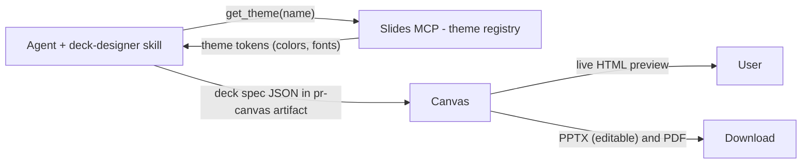

**Deck Designer** turns a brief into a professional, on-brand slide deck. The agent writes a *deck spec*, the [canvas](/products/ai-securechat/canvas) renders it as a live preview, and the same render exports to an **editable PPTX** and a **pixel-perfect PDF** — entirely client-side, with no backend and no data leaving your infrastructure.

It is built from three composable pieces — a **skill**, an **MCP server**, and the **canvas render/export engine** — so you can attach the same capability to any agent (sales, marketing, support…), not just a dedicated "Slides" agent.

## The model in one line

**One spec → one render → two exports.** The agent produces a *deck spec* (JSON). A theme-driven renderer turns it into a live HTML preview, and the same render is exported client-side to an editable PPTX (mapped from the rendered DOM geometry) and a pixel-perfect PDF. Look & feels are **data** (theme tokens served by an MCP server), so a new style is a new data entry — no code, no agent change.

## How it works



1. The user asks for a deck / slides / pitch / `.pptx`. The agent activates the **deck-designer** skill (progressive disclosure — see [Capabilities](./capabilities)).
2. The skill resolves a look & feel by calling the **Slides MCP** (`list_themes` → pick a style, `get_theme(name)` → tokens).
3. The agent writes the **deck spec** (slides + resolved theme tokens) and emits it as a canvas artifact: `<pr-canvas>{"type":"slides"}--- <deck spec JSON></pr-canvas>`.
4. The **canvas** renders the spec to a live HTML preview and offers **PPTX** (editable) and **PDF** exports — both run in the browser.

<Note>
Export is layout-agnostic. The PPTX is built from the **rendered DOM geometry** (`getBoundingClientRect` + `getComputedStyle`) mapped to native PowerPoint shapes/text — so any slide the renderer emits (including freeform HTML slides) exports to an editable `.pptx` with no per-layout code. The PDF rasterizes each rendered slide (landscape 16:9, one page per slide).
</Note>

## The three pieces

| Piece | What it is | Where it lives |
|---|---|---|
| **`deck-designer` skill** | Owns the deck-spec schema, the design system (palettes, typography, layout catalogue, anti-patterns), the QA discipline, and how to emit the canvas artifact | Published in the shared **capability Store** (the `capabilities` workspace catalog) |
| **Slides MCP** | A theme registry — `list_themes()` and `get_theme(name)` return look & feel token sets (colors, fonts) | A lightweight Prisme.ai workspace (`slides-mcp`) |
| **Canvas render/export engine** | Renders the deck spec to the preview and runs the PPTX/PDF export | Built into the chat client (SecureChat canvas) |

## Add Deck Designer to an agent

You bring deck building into any agent in **three steps** — open the agent and go to **Capabilities** (see [Agent Capabilities](./capabilities)):

<Steps>
  <Step title="Add the skill">
    **Add Capability → Skills → Deck Designer.** The skill carries its own instructions (the design system) and is loaded on demand when the user's request matches.
  </Step>
  <Step title="Add the Slides MCP server">
    **Add Capability → MCP server**, pointing at the Slides MCP endpoint (name it e.g. `slides-themes`):
    ```
    https://<your-api-host>/v2/workspaces/slug:slides-mcp/webhooks/mcp
    ```
    This is what `get_theme` / `list_themes` call to resolve a look & feel.
  </Step>
  <Step title="Enable canvas">
    Turn on **`canvas_enabled`** for the agent. Without it, the agent never learns to emit the deck artifact, so the preview and export won't appear.
  </Step>
</Steps>

<Warning>
All three are required. The skill alone resolves no theme and produces no preview; the MCP alone is never called; and without `canvas_enabled` the deck artifact is never emitted. A multi-skill agent keeps all its own tools — the model activates `deck-designer` only when the user asks for a deck.
</Warning>

## Themes (look & feel)

Themes ship as **data** in the Slides MCP, so re-skinning a deck is just picking another style — the content is untouched.

| Theme | Style |
|---|---|
| `executive` *(default)* | Formal — navy + gold, serif headlines. Finance / consulting / board. |
| `modern` | Clean tech-SaaS — white + teal, all-sans, airy whitespace. |
| `bold` | Energetic startup-marketing — high contrast, warm coral accent. |

Ask the agent *"what styles are available?"* (`list_themes`) or *"make the same deck in modern"* (`get_theme("modern")`) — the theme tokens are injected into the spec without rewriting the content.

## Customizing the skill and the MCP server

Both pieces are meant to be tailored to your brand and use cases.

### Add or edit a theme (customize the MCP server)

A new brand or style is a **new data entry** — no code, no agent change:

1. Open the `slides-mcp` workspace and edit `config.value.themes` (in `index.yml`).
2. Add an entry with your palette and fonts. Colors are **bare hex** (no leading `#` — the renderer adds it). Use cross-platform fonts (Georgia / Helvetica / Arial / Trebuchet MS) so the browser preview and the exported PPTX render with matching metrics.

```yaml
config:
  value:
    themes:
      my-brand:
        name: My Brand
        dark: 0B2540      # bare hex, no leading #
        light: F4F9FC
        ink: 16283C
        muted: 5B6B7C
        accent: 009DE0
        soft: D6F0FB
        line: DFE9F1
        fontHead: Arial
        fontBody: Arial
        headWeight: 700
```

`list_themes` exposes the new style automatically — the agent can offer it with no further change. You can also self-host your own copy of the MCP workspace and point your agent's MCP capability at it.

### Customize the skill instructions

The `deck-designer` skill lives in the shared **capability Store** (the `capabilities` workspace catalog, exposed via the `v1/servers` API). A skill entry's instructions live in its `config_schema` defaults, so you can:

- **Fork it for your team** — publish your own `type: skill` entry (e.g. tighter brand rules, your preferred layouts, a fixed default theme) and add that instead.
- **Use the Custom Skill template** — the catalog ships a generic **Custom Skill** entry: create a brand-new skill from scratch with your own instructions, activated on demand via progressive disclosure.

<Tip>
Keep the skill description sharp — it's the trigger the model sees, so it should clearly say *"decks / slides / presentation / pitch / .pptx"*. And prefer a capable model on the host agent: the design discipline is demanding and drives deck quality.
</Tip>

## Export formats

Exports run entirely in the browser — what you see in the preview is exactly what exports.

<CardGroup cols={2}>
  <Card title="PPTX (editable)" icon="file-powerpoint">
    Native PowerPoint shapes and text boxes, mapped from the rendered geometry — fully editable in PowerPoint / Google Slides / Keynote.
  </Card>
  <Card title="PDF" icon="file-pdf">
    Pixel-perfect, landscape 16:9, one page per slide — faithful to the preview.
  </Card>
</CardGroup>

## Next Steps

<CardGroup cols={3}>
  <Card title="Agent Capabilities" icon="puzzle-piece" href="./capabilities">
    How skills and MCP servers attach to an agent
  </Card>
  <Card title="Canvas" icon="palette" href="/products/ai-securechat/canvas">
    The collaborative workspace that renders and exports the deck
  </Card>
  <Card title="Custom Tools" icon="wrench" href="./custom-tools">
    Wire your own Builder automations as agent tools
  </Card>
</CardGroup>
