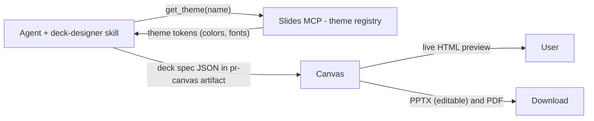

**Deck Designer** turns a brief into a professional, on-brand slide deck. The agent writes a *deck spec*, the [canvas](/products/ai-securechat/canvas) renders it as a live preview, and the same render exports to an **editable PPTX** and a **pixel-perfect PDF**, entirely client-side, with no backend and no data leaving your infrastructure.

It is built from three composable pieces (a **skill**, an **MCP server**, and the **canvas render/export engine**), so you can attach the same capability to any agent (sales, marketing, support…), not just a dedicated "Slides" agent.

## The model in one line

**One spec → one render → two exports.** The agent produces a *deck spec* (JSON). A theme-driven renderer turns it into a live HTML preview, and the same render is exported client-side to an editable PPTX (mapped from the rendered DOM geometry) and a pixel-perfect PDF. Look & feels are **data** (theme tokens served by an MCP server), so a new style is a new data entry: no code, no agent change.

## How it works


```mermaid
flowchart LR
  A[Agent + deck-designer skill] -- "get_theme(name)" --> B[Slides MCP - theme registry]
  B -- "theme tokens (colors, fonts)" --> A
  A -- "deck spec JSON in pr-canvas artifact" --> C[Canvas]
  C -- "live HTML preview" --> D[User]
  C -- "PPTX (editable) and PDF" --> E[Download]
```

1. The user asks for a deck / slides / pitch / `.pptx`. The agent activates the **deck-designer** skill (progressive disclosure; see [Capabilities](./capabilities)).
2. The skill resolves a look & feel by calling the **Slides MCP** (`list_themes` → pick a style, `get_theme(name)` → tokens).
3. The agent writes the **deck spec** (slides + resolved theme tokens) and emits it as a canvas artifact: `<pr-canvas>{"type":"slides"}--- <deck spec JSON></pr-canvas>`.
4. The **canvas** renders the spec to a live HTML preview and offers **PPTX** (editable) and **PDF** exports; both run in the browser.

<Note>
**Typed layouts** export through **native PowerPoint emitters** (fixed 16:9 geometry with automatic text-fit) — deterministic and identical across PowerPoint (Windows/Mac), LibreOffice and Keynote. **Freeform** HTML slides export through a **best-effort mapping of the rendered DOM geometry** (`getBoundingClientRect` + `getComputedStyle`) to PowerPoint shapes/text. The **PDF** rasterizes each rendered slide (landscape 16:9, one page per slide) and is always pixel-perfect. See [Layouts: typed vs. freeform](#layouts-typed-vs-freeform).
</Note>

## The three pieces

| Piece | What it is | Where it lives |
|---|---|---|
| **`deck-designer` skill** | Owns the deck-spec schema, the design system (palettes, typography, layout catalogue, anti-patterns), the QA discipline, and how to emit the canvas artifact | Published in the shared **capability Store** (the `capabilities` workspace catalog) |
| **Slides MCP** | A theme registry: `list_themes()` and `get_theme(name)` return look & feel token sets (colors, fonts) | A lightweight Prisme.ai workspace (`slides-mcp`) |
| **Canvas render/export engine** | Renders the deck spec to the preview and runs the PPTX/PDF export | Built into the chat client (Chat canvas) |

## Add Deck Designer to an agent

You bring deck building into any agent in **three steps**: open the agent and go to **Capabilities** (see [Agent Capabilities](./capabilities)):

<Steps>
  <Step title="Add the skill">
    **Add Capability → Skills → Deck Designer.** The skill carries its own instructions (the design system) and is loaded on demand when the user's request matches.
  </Step>
  <Step title="Add the Slides MCP server">
    **Add Capability → MCP server**, pointing at the Slides MCP endpoint (name it e.g. `slides-themes`):
    ```
    https://<your-api-host>/v2/workspaces/slug:slides-mcp/webhooks/mcp
    ```
    This is what `get_theme` / `list_themes` call to resolve a look & feel.
  </Step>
  <Step title="Enable canvas">
    Turn on **`canvas_enabled`** for the agent. Without it, the agent never learns to emit the deck artifact, so the preview and export won't appear.
  </Step>
</Steps>

<Warning>
All three are required. The skill alone resolves no theme and produces no preview; the MCP alone is never called; and without `canvas_enabled` the deck artifact is never emitted. A multi-skill agent keeps all its own tools; the model activates `deck-designer` only when the user asks for a deck.
</Warning>

## Themes (look & feel)

Themes ship as **data** in the Slides MCP, so re-skinning a deck is just picking another style; the content is untouched.

| Theme | Style |
|---|---|
| `executive` *(default)* | Formal: navy + gold, serif headlines. Finance / consulting / board. |
| `modern` | Clean tech-SaaS: white + teal, all-sans, airy whitespace. |
| `bold` | Energetic startup-marketing: high contrast, warm coral accent. |

Ask the agent *"what styles are available?"* (`list_themes`) or *"make the same deck in modern"* (`get_theme("modern")`); the theme tokens are injected into the spec without rewriting the content.

## Customizing the skill and the MCP server

Both pieces are meant to be tailored to your brand and use cases.

### Add or edit a theme (customize the MCP server)

A new brand or style is a **new data entry**, with no code and no agent change:

1. Open the `slides-mcp` workspace and edit `config.value.themes` (in `index.yml`).
2. Add an entry with your palette and fonts. Colors are **bare hex** (no leading `#`; the renderer adds it, and now tolerates a leading `#` too). Use **cross-platform fonts** — `Arial`, `Georgia`, `Times New Roman`, `Trebuchet MS`, `Verdana` — so the browser preview and the exported PPTX render with matching metrics. Office/Mac-only faces (Calibri, Cambria, Helvetica) are automatically substituted to keep the export consistent.

```yaml
config:
  value:
    themes:
      my-brand:
        name: My Brand
        dark: 0B2540      # bare hex, no leading #
        light: F4F9FC
        ink: 16283C
        muted: 5B6B7C
        accent: 009DE0
        soft: D6F0FB
        line: DFE9F1
        fontHead: Arial
        fontBody: Arial
        headWeight: 700
```

`list_themes` exposes the new style automatically; the agent can offer it with no further change. You can also self-host your own copy of the MCP workspace and point your agent's MCP capability at it.

#### Theme token reference

Every theme entry under `config.value.themes` is a token set. These are **all** the fields you can configure:

| Token | Role |
|---|---|
| `name` | Display name shown by `list_themes`. |
| `dark` | Primary dark color — background of `title`, `section`, `quote`, `closing` and the data panels. |
| `light` | Light background of content slides. |
| `ink` | Default body text color on light slides. |
| `muted` | Secondary text (labels, descriptions, footer). |
| `accent` | The single sharp accent — numbers, CTA, eyebrow, the mark, bars. Use one, sparingly. |
| `soft` | Soft tint — subtitles on dark slides, panel labels. |
| `line` | Borders, card outlines, dividers. |
| `fontHead` | Headline font. Use a **cross-platform** face (see above). |
| `fontBody` | Body font. Cross-platform. |
| `headWeight` | Headline weight (e.g. `600`–`800`). |

Colors are **bare hex** (a leading `#` is tolerated). The MCP exposes two tools: **`list_themes()`** → `[{ name, label }]`, and **`get_theme(name)`** → the token set above (falls back to `executive` for an unknown name). Adding a theme = adding an entry here — **no code, no agent change**.

### Customize the skill instructions

The `deck-designer` skill lives in the shared **capability Store** (the `capabilities` workspace catalog, exposed via the `v1/servers` API). A skill entry's instructions live in its `config_schema` defaults, so you can:

- **Fork it for your team**: publish your own `type: skill` entry (e.g. tighter brand rules, your preferred layouts, a fixed default theme) and add that instead.
- **Use the Custom Skill template**: the catalog ships a generic **Custom Skill** entry; create a brand-new skill from scratch with your own instructions, activated on demand via progressive disclosure.

<Tip>
Keep the skill description sharp; it's the trigger the model sees, so it should clearly say *"decks / slides / presentation / pitch / .pptx"*. And prefer a capable model on the host agent: the design discipline is demanding and drives deck quality.
</Tip>

## Layouts: typed vs. freeform

Deck Designer works from a set of **typed layouts** — hand-tuned, brand-aware building blocks: `title`, `section`, `agenda`, `bullets`, `twocolumn`, `stats`, `kpi`, `split`, `process`, `timeline`, `comparison`, `table`, `quote`, `closing`. When a point fits one of these, the agent fills its fields and the slide exports through a **native PowerPoint emitter**: fixed 16:9 geometry with automatic text-fitting, so the result is **deterministic and identical** across PowerPoint (Windows and Mac), LibreOffice and Keynote.

When no typed layout fits, the agent authors a **freeform** slide as inline HTML. Freeform gives full design freedom, but it exports through a **best-effort DOM-to-PowerPoint mapping** (reading the rendered geometry) rather than a native emitter.

<Warning>
**A freeform slide's `.pptx` can occasionally need a small adjustment.** A freeform slide is arbitrary HTML **written by the language model**, and PowerPoint re-renders text with its own fonts and line-breaking. So a freeform slide can sometimes **reflow** in the exported `.pptx` — a title wrapping to an extra line, a block a few pixels off — even when the on-screen **preview and the PDF are perfect**. This is inherent to converting free HTML to editable PowerPoint (it is not a data-loss bug).

If a freeform slide doesn't come out right, you have three options:
1. Ask the agent to use a **typed layout** for that point — the reliable path for editable PPTX.
2. Keep it freeform and **tweak the exported slide in PowerPoint** — it's fully editable.
3. Use the **PDF**, which is always pixel-perfect, if you only need to present or share.
</Warning>

### Tips for clean freeform export

- **Prefer typed layouts**; reach for freeform only when nothing fits.
- Keep freeform slides **simple**: one piece of text per element, generous spacing, no overflow.
- Use the theme's **cross-platform fonts** (see [Themes](#add-or-edit-a-theme-customize-the-mcp-server)) so the preview and the PPTX use matching metrics.

### Typed layout reference

Every slide is one object in `spec.slides`. This is the contract the **`deck-designer` skill** emits (and what you'd edit if you fork it). All fields are strings unless noted; `eyebrow` is the small uppercase kicker; empty/extra items beyond a layout's cap are dropped on export.

<AccordionGroup>
  <Accordion title="title — opener (dark)">
    ```json
    { "type": "title", "eyebrow?": "", "title": "", "subtitle?": "" }
    ```
  </Accordion>
  <Accordion title="section — section divider (dark)">
    ```json
    { "type": "section", "number?": "01", "title": "", "subtitle?": "" }
    ```
  </Accordion>
  <Accordion title="agenda — numbered contents (≤ 7 items)">
    ```json
    { "type": "agenda", "eyebrow?": "", "heading": "", "items": ["", ""] }
    ```
  </Accordion>
  <Accordion title="bullets — key points (≤ 6, use sparingly)">
    ```json
    { "type": "bullets", "eyebrow?": "", "heading": "", "points": ["", ""] }
    ```
  </Accordion>
  <Accordion title="twocolumn — takeaway + proof panel">
    ```json
    { "type": "twocolumn", "eyebrow?": "", "heading": "", "body?": "",
      "points?": ["… (≤ 4, left column)"],
      "panelTitle?": "", "panelPoints?": ["… (≤ 6, dark panel)"] }
    ```
  </Accordion>
  <Accordion title="stats — three big numbers (exactly 3)">
    ```json
    { "type": "stats", "eyebrow?": "", "heading": "",
      "stats": [ { "num": "600", "suffix?": "M", "label": "" } ] }
    ```
  </Accordion>
  <Accordion title="kpi — metric grid (3–6)">
    ```json
    { "type": "kpi", "eyebrow?": "", "heading": "",
      "metrics": [ { "num": "99.9", "suffix?": "%", "label": "" } ] }
    ```
  </Accordion>
  <Accordion title="split — capabilities + data panel">
    ```json
    { "type": "split", "eyebrow?": "", "heading": "",
      "features": [ { "icon": "tool|book|shield|chart", "title": "", "desc": "" } ],  // 3–4
      "panelTitle": "", "bars": [ { "label": "", "value": 86 } ] }                    // 3–4, value 0–100
    ```
  </Accordion>
  <Accordion title="process — numbered steps (3–5)">
    ```json
    { "type": "process", "eyebrow?": "", "heading": "",
      "steps": [ { "title": "", "desc": "" } ] }
    ```
  </Accordion>
  <Accordion title="timeline — roadmap (3–6 milestones, one highlight)">
    ```json
    { "type": "timeline", "eyebrow?": "", "heading": "",
      "milestones": [ { "quarter": "Q1 2026", "title": "", "desc": "", "highlight?": false } ] }
    ```
  </Accordion>
  <Accordion title="comparison — 2–3 columns, same rows (one highlight)">
    ```json
    { "type": "comparison", "eyebrow?": "", "heading": "",
      "columns": [ { "title": "", "highlight?": false,
        "rows": [ { "label": "", "value": "" } ] } ] }
    ```
  </Accordion>
  <Accordion title="table — grid (≤ 6 columns, ≤ 7 rows)">
    ```json
    { "type": "table", "eyebrow?": "", "heading": "",
      "columns": ["Col A", "Col B"], "rows": [ ["a1", "b1"], ["a2", "b2"] ] }
    ```
  </Accordion>
  <Accordion title="quote — testimonial (dark, ≤ 25 words)">
    ```json
    { "type": "quote", "eyebrow?": "", "quote": "", "author": "", "role?": "", "company?": "" }
    ```
  </Accordion>
  <Accordion title="closing — the ask / CTA (dark)">
    ```json
    { "type": "closing", "eyebrow?": "", "title": "", "cta?": "Get in touch →" }
    ```
  </Accordion>
  <Accordion title="freeform — anything else (best-effort export)">
    Fallback for layouts not covered above (matrix 2×2, case study, org chart, logo wall, pricing, code…). Author inline HTML using the theme CSS variables (`var(--dark|light|ink|muted|accent|soft|line|font-head|font-body)`); inline styles only, no external assets, one text per element, no overflow.
    ```json
    { "type": "freeform", "background": "light|dark|<hex>", "html": "<div style='…'>…</div>" }
    ```
  </Accordion>
</AccordionGroup>

## Export formats

Exports run entirely in the browser; what you see in the preview is exactly what exports.

<CardGroup cols={2}>
  <Card title="PPTX (editable)" icon="file-powerpoint">
    Native PowerPoint shapes and text boxes, fully editable in PowerPoint / Google Slides / Keynote. Typed layouts use deterministic native emitters; freeform slides use a best-effort geometry mapping (see [Layouts](#layouts-typed-vs-freeform)).
  </Card>
  <Card title="PDF" icon="file-pdf">
    Pixel-perfect, landscape 16:9, one page per slide, faithful to the preview.
  </Card>
</CardGroup>

## Next Steps

<CardGroup cols={3}>
  <Card title="Agent Capabilities" icon="puzzle-piece" href="./capabilities">
    How skills and MCP servers attach to an agent
  </Card>
  <Card title="Canvas" icon="palette" href="/products/ai-securechat/canvas">
    The collaborative workspace that renders and exports the deck
  </Card>
  <Card title="Custom Tools" icon="wrench" href="./custom-tools">
    Wire your own Builder automations as agent tools
  </Card>
</CardGroup>
