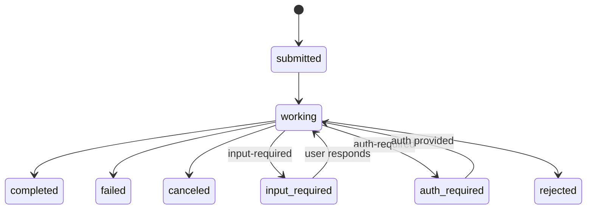

Tasks allow agents to execute long-running operations asynchronously. Instead of waiting for a synchronous response, the client receives a task ID and can poll for status or subscribe to updates.

## Endpoints

### List Tasks

```
GET v1/agents/:agent_id/tasks
```

| Param | Type | Description |
|-------|------|-------------|
| `status` | string | Filter by status (`submitted`, `working`, `completed`, `failed`, `canceled`, `input-required`, `auth-required`, `rejected`) |
| `limit` | integer | Results per page |
| `offset` | integer | Pagination offset |

Tasks are created implicitly when sending a message via `/messages/send` or `/messages/stream`. Each message exchange creates a task to track the agent's work.

### Get Task Status

```
GET v1/agents/:agent_id/tasks/:task_id
```

Returns the current status, progress, and result (if completed):

```json
{
  "task_id": "task_abc123",
  "status": "working",
  "progress": {
    "steps_completed": 3,
    "steps_total": 5,
    "current_step": "Analyzing competitor data"
  },
  "created_at": "2026-03-01T10:00:00Z",
  "started_at": "2026-03-01T10:00:01Z"
}
```

### Cancel Task

```
POST v1/agents/:agent_id/tasks/:task_id/cancel
```

Cancels a running or pending task. The agent's current operation is interrupted, and the task status is set to `cancelled`.

### Resolve HITL Task

```
POST v1/agents/:agent_id/tasks/:task_id/resolve
```

Resolves a pending Human-in-the-Loop approval. Accepts the user's approval or rejection, allowing the agentic loop to resume execution. See [HITL](#human-in-the-loop-hitl) below.

### Subscribe to Task Updates

```
GET v1/agents/:agent_id/tasks/:task_id/subscribe
```

Returns a Server-Sent Events stream with real-time task updates using A2A event names:

| Event | Description |
|-------|-------------|
| `task.status` | Task status changed |
| `task.output.delta` | Incremental output |
| `task.output.completed` | Task completed with result |

## Task Lifecycle



Task statuses follow the [A2A Protocol](https://google.github.io/A2A/) specification:

1. **submitted** — Task created, waiting for execution
2. **working** — Agent is actively processing the task
3. **completed** — Task finished successfully, result available
4. **failed** — Task encountered an unrecoverable error
5. **canceled** — Task was canceled by the user
6. **input-required** — Agent needs human input (approval or clarification via HITL)
7. **auth-required** — Agent needs additional authentication to proceed
8. **rejected** — Task was rejected (e.g., by guardrails or access control)

## Async Finalization

When a task completes, the `_async-task-finalize` automation handles post-processing:
- Stores the final result
- Updates task metadata (duration, token usage)
- Emits completion events
- Triggers any follow-up actions

## Archival

Multiple scheduled jobs manage task lifecycle:

| Job | Schedule | Purpose |
|-----|----------|---------|
| `_tasks-archive` | `0 3 * * *` (nightly) | Move completed tasks to `tasks_archive` |
| `_tasks-archive-purge` | `0 4 * * 0` (weekly) | Purge old archived tasks |
| `purge-expired-data` | `0 4 * * *` (daily) | Purge tasks exceeding per-agent retention policies |

1. Completed tasks older than the retention period are moved from `tasks` to `tasks_archive`
2. The archive retains task metadata and results
3. The `tasks` collection stays lean for active task queries
4. Retention policies (configurable per agent or per org) control how long data is kept

Archived tasks remain accessible for audit and analytics purposes but are stored separately to maintain query performance on active tasks.

## Human-in-the-Loop (HITL)

When an agent needs human input during task execution, the task transitions to `input-required`:

1. The agent calls `human_request_approval` or `human_ask_clarification`
2. The full loop state (messages, tool calls, budget counters) is serialized to the task's `pending_approval` field
3. The task status is set to `input-required`
4. When the user responds, the loop state is restored from `pending_approval` and execution resumes

This allows long-running agentic loops to pause and resume across requests without losing context.

