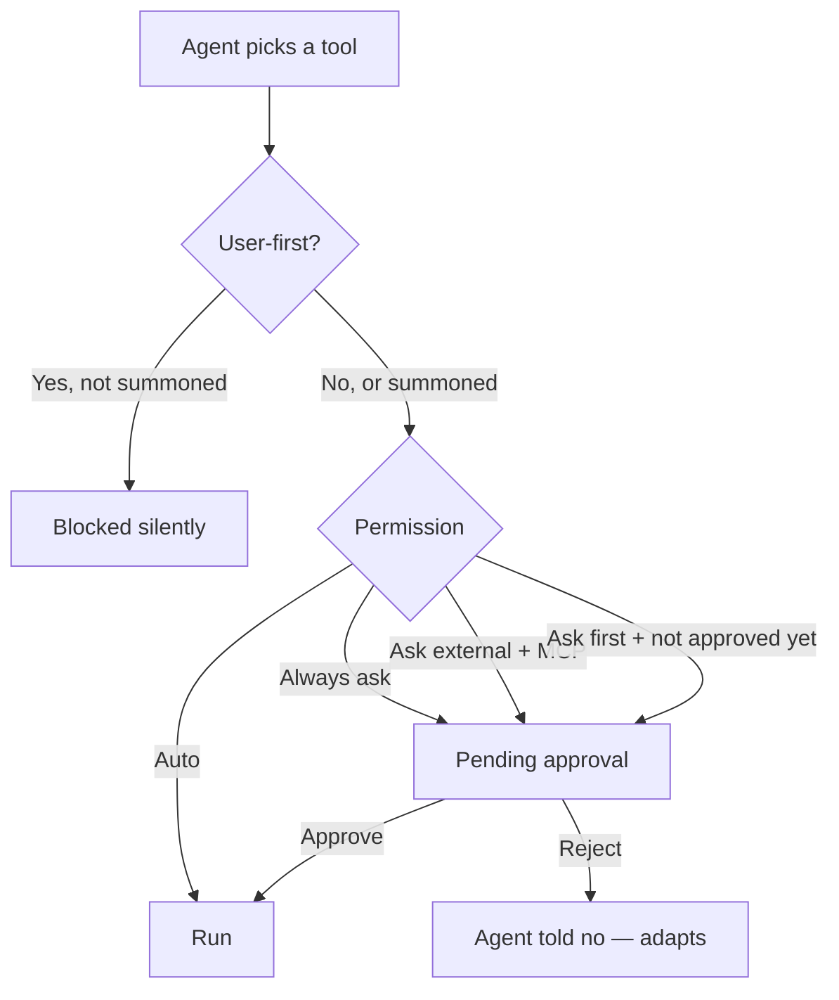

By default, when the agent decides to call a tool, the platform runs it immediately. **Tool permissions** let you hold the call until a human resolves it — universally, per tool, only on certain arguments, or by routing the decision to someone other than the chatting user.

This is the **Human-in-the-Loop (HITL)** layer of Agent Factory. It pairs with [User-First Tools](./user-first-tools):

- **Tool permissions** answer *"should this call run, and who decides?"*
- **User-first tools** answer *"can the agent reach for this tool on its own?"*

## For end users

### Approving or rejecting a call

When a tool needs approval, the chat pauses on a card showing the tool name, the arguments the agent is about to send, and **Approve** / **Reject** buttons.

- **Approve** → the call runs and the agent picks up.
- **Reject** → the agent is told you said no and adapts.

{/* TODO: screenshot — chat with a pending approval card (tool name, arguments, Approve/Reject buttons) */}

### Designated approvers

For sensitive tools an administrator can route the approval to someone other than you — for example, a manager, an on-call group, or the agent's owner. When that's the case, you'll see:

> *"This action requires approval from a designated approver. You will be notified when it is resolved."*

The current conversation stays paused until they decide. You can start a separate conversation with the agent in the meantime.

### "Ask once" mode

Some tools are configured to ask only the **first time** they run in a conversation. Approve once and follow-up calls to the same tool run automatically until you start a new conversation. (For an MCP integration this can cover every tool in the integration — depends on how the admin set it up.)

## For administrators

### Choose a default policy

Open the agent in **Agent Creator** → **Settings** → **Permissions** and set the **Default policy**. It applies to every tool that doesn't have a per-tool override.

| Policy             | Behavior                                                                       |
| ------------------ | ------------------------------------------------------------------------------ |
| **Auto**           | Run every call without asking. (Default.)                                      |
| **Always ask**     | Every call pauses for approval.                                                |
| **Ask external**   | Pause only on calls to **MCP** tools; native function tools still run automatically. |
| **Ask first**      | Pause on the first call in a conversation; auto-approve the rest.              |

{/* TODO: screenshot — Permissions tab, default policy with the four options visible */}

### Per-tool overrides

Add an override when a single tool needs a different policy from the default. Each rule supports:

- A **tool** (a function tool or an MCP server).
- A **policy** (one of the four above).
- Optional **conditions** — only pause when the call's arguments match. *Example: ask only when sending an email outside the company domain.*
- Optional **approvers** — route the approval to designated reviewers instead of the chatting user.

{/* TODO: screenshot — Permissions tab, one override rule expanded showing tool / policy / conditions / approvers fields */}

```yaml
tool_permissions:
  default: auto
  tools:
    # Slack: ask once per conversation.
    - tool: slack
      policy: ask_first

    # Email: always ask, but only outside the company.
    - tool: send_email
      policy: always_ask
      conditions:
        recipient_domain:
          $ne: example.com

    # Production deploys: route to the on-call group.
    - tool: deploy_production
      policy: always_ask
      approvers:
        - type: group
          id: g_oncall
```

### Designated approvers

`approvers` can be:

- **Owner** — the user who created the agent.
- **User** — a specific user.
- **Group** — anyone in the group.

When approvers are set, the chatting user sees the "designated approver" notice and the conversation pauses. The platform emits an approval event that your team's tooling (Slack bot, email gateway, custom workflow…) can subscribe to in order to reach out to the approvers — there is no built-in approver inbox today. As soon as one of them resolves it, the conversation resumes.

### Locking a whole MCP integration

A rule on an MCP server (e.g. `{ tool: "github", policy: "always_ask" }`) applies to **every tool** the server exposes — `create_issue`, `update_issue`, `search_repos`, … This matches how administrators usually think about integrations: gate it as a whole rather than enumerating its dynamic children.

- `ask_first` set on an MCP **parent** covers every child for the conversation: approve `create_issue` once and `search_repos` runs without prompting.
- A rule on a specific child name still wins over the parent rule — useful to lift a single child out of a restriction.

### Composition with user-first activation

|                          | + No permission rule        | + Always ask                                                                       |
| ------------------------ | --------------------------- | ---------------------------------------------------------------------------------- |
| `activation: auto`       | Agent uses freely.          | Agent picks → user approves.                                                       |
| `activation: user_first` | User summons → runs.        | User summons → user approves. **Recommended for any tool with real-world side effects.** |

If the agent tries to call a user-first tool without being summoned, the call is silently blocked — it never reaches the approval gate.

## Behavior reference



The "ask first" memory is per-conversation. Pending approvals survive page reloads — you can come back later and resolve.

Decisions made by designated approvers are recorded by the platform so your team's notification or audit tooling can react to them.

## FAQ

<AccordionGroup>
  <Accordion title="Can I require two approvers for the same call?">
    Not yet. The pending approval resolves as soon as one configured approver acts.
  </Accordion>
  <Accordion title="Does 'ask first' persist across conversations?">
    No. It's per-conversation. A new conversation prompts again.
  </Accordion>
  <Accordion title="Reject vs Stop generating — what's the difference?">
    **Reject** tells the agent the specific call was refused; it can adapt or try something else. **Stop generating** halts the whole run.
  </Accordion>
  <Accordion title="Can I self-approve as the owner?">
    Add `{ type: owner }` to the rule's approvers. When the chatting user is the owner, the approval is delivered to them.
  </Accordion>
  <Accordion title="Does this apply to skills, guardrails, or file search?">
    No. The approval gate applies to function tools and MCP tool calls.
  </Accordion>
</AccordionGroup>

## Related

- [User-First Tools](./user-first-tools) — control whether the agent sees a tool at all.
- [Custom Tools](./custom-tools) — the function tools you'll most often want to gate.
- [Capabilities](./capabilities) — overview of all tool types.
