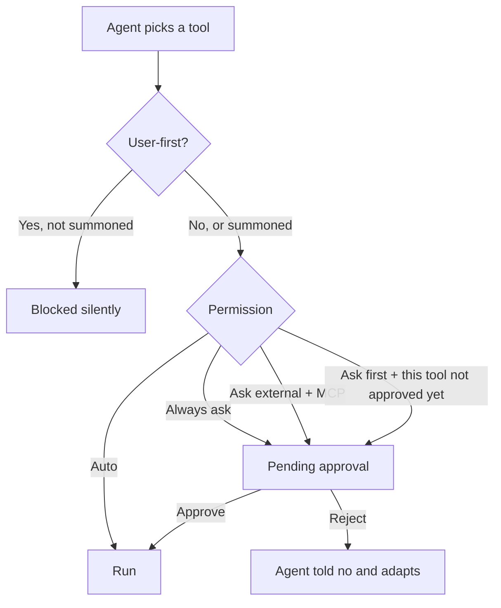

By default, when the agent decides to call a tool, the platform runs it immediately. **Tool permissions** let you hold the call until a human resolves it: universally, per tool, only on certain arguments, or by routing the decision to someone other than the chatting user.

This is the **Human-in-the-Loop (HITL)** layer of the platform's governed-by-design foundation. It pairs with [User-First Tools](./user-first-tools):

- **Tool permissions** answer *"should this call run, and who decides?"*
- **User-first tools** answer *"can the agent reach for this tool on its own?"*

## For end users

### Approving or rejecting a call

When a tool needs approval, the chat pauses on a card showing the tool name, the arguments the agent is about to send, and **Approve** / **Reject** buttons.

- **Approve** → the call runs and the agent picks up.
- **Reject** → the agent is told you said no and adapts.

<Frame>
  
</Frame>

<Note>
**Several tools in one message.** A model often asks for more than one tool at a time. When one of them needs approval, the others are held with it rather than dropped: your decision is applied to that call, and the turn then resumes with the whole set, so the agent never ends up answering with half of the results it asked for.
</Note>

Three behaviours are worth knowing while a card is pending:

- **Answering with a message instead of a button** denies the pending tools. Your message is delivered as the next thing the agent hears, nothing disappears from the conversation, and the agent adapts as it would after a **Reject**.
- **Refreshing the page** keeps the approval. The card comes back actionable on the message it belongs to, so an approval left open can be resolved later, or from another device.
- **System tools are never gated.** Policies apply to the tools acting on the outside world; the agent's internal machinery (`todo_write`, `budget_get_remaining`, `human_ask_clarification`) runs without asking even under **Always ask**. See [System tools by profile](/products/agent-factory/capabilities#system-tools-by-profile).

### Designated approvers

For sensitive tools an administrator can route the approval to someone other than you: for example, a manager, an on-call group, or the agent's owner. When that's the case, you'll see:

> *"This action requires approval from a designated approver. You will be notified when it is resolved."*

The current conversation stays paused until they decide. You can start a separate conversation with the agent in the meantime.

### "Ask once" mode

Some tools are configured to ask only the **first time** they run in a conversation. Approve once and follow-up calls to the same tool run automatically until you start a new conversation.

Each tool asks for itself. Approving one tool of an MCP integration doesn't approve the rest of the integration: even when the administrator set the policy on the integration as a whole, every tool in it still asks the first time *it* runs.

## For administrators

### Choose a default policy

Open the agent in **Agent Creator** → **Settings** → **Permissions** and set the **Default policy**. It applies to every tool that doesn't have a per-tool override.

| Policy                    | Behavior                                                                       |
| ------------------------- | ------------------------------------------------------------------------------ |
| **Auto-approve**          | Run every call without asking. (Default.)                                      |
| **Always ask**            | Every call pauses for approval.                                                |
| **Ask on external tools** | Pause only on calls to **MCP** tools; native function tools still run automatically. |
| **Ask once per tool**     | Pause on each tool's first call in a conversation; auto-approve the rest.       |

<Frame>
  
</Frame>

### Per-tool overrides

Add an override when a single tool needs a different policy from the default. Each rule supports:

- A **tool**: a function tool, an MCP server, a single tool of that server, or a single action of that tool.
- A **policy** (one of the four above).
- Optional **conditions**: only pause when the call's arguments match. *Example: ask only when sending an email outside the company domain.*
- Optional **approvers**: route the approval to designated reviewers instead of the chatting user.

<Frame>
  
</Frame>

```yaml
tool_permissions:
  default: auto
  tools:
    # Slack: ask once per conversation.
    - tool: slack
      policy: ask_first

    # Email: always ask, but only outside the company.
    - tool: send_email
      policy: always_ask
      conditions:
        recipient_domain:
          $ne: example.com

    # Production deploys: route to the on-call group.
    - tool: deploy_production
      policy: always_ask
      approvers:
        - type: group
          id: g_oncall
```

#### Three levels: server, tool, action

An MCP integration is gated at three levels of granularity. A rule targets a tool by its **canonical name**, `<server>__<tool>`, so the level it sits at is readable from the rule itself:

| Level      | What the rule covers                          | What it looks like                                                 |
| ---------- | --------------------------------------------- | ------------------------------------------------------------------ |
| **Server** | Every tool the server exposes, now and later. | `tool: salesforce`                                                 |
| **Tool**   | One tool of that server.                      | `tool: salesforce__records`                                        |
| **Action** | One `action` value of that tool.              | `tool: salesforce__records` with `conditions: { action: "delete" }` |

```yaml
tool_permissions:
  default: auto
  tools:
    # Salesforce as a whole: ask the first time each of its tools runs.
    - tool: salesforce
      policy: ask_first

    # Reading and writing records is routine for this agent: let it run.
    - tool: salesforce__records
      policy: auto

    # …except deletions, which always pause for approval.
    - tool: salesforce__records
      policy: always_ask
      conditions:
        action: delete
```

The narrower rule wins, and on the same tool the conditional rule wins over the one without conditions whatever their order in the list: the `delete` guard above holds even though the permissive rule is written before it. See [Which rule applies](#which-rule-applies).

<Note>
**The action level is a connector convention, not an MCP notion.** The MCP standard knows nothing about actions. Prisme.ai connectors expose one tool per entity and enumerate the operations in an `action` field — `records` on Salesforce takes `action: create | read | update | delete`. The action level therefore appears only for a tool whose input schema enumerates such a field; every other tool stops at the tool level.
</Note>

#### Pick the tools from the server itself

On the row of an MCP server, **Advanced** expands the list of the tools that server actually exposes. The list is read live from the server rather than typed in by hand, so it follows the integration as it gains and loses tools.

- Each tool in the list has a **checkbox** and its own **policy selector**.
- A tool left unchecked **inherits** the server's policy: its selector is disabled and reads *Inherits · `<policy>`*, so you can see what applies to a tool without writing a rule for it.
- Checking a tool writes a rule on its canonical name, `<server>__<tool>`.
- A tool whose schema enumerates an `action` field also expands into an **Actions** list: one checkbox and one policy per action, saved as `conditions: { action: "<value>" }` on the tool's canonical name.
- A **search field** appears when the list is long. A checked tool that the filter hides stays checked, so filtering never drops a rule; a search that matches nothing says so rather than showing an empty list.
- **Designated approvers** are set in the same expanded area of the server's row.

<Frame>
  
</Frame>

Opening **Actions** on a tool lists the values its `action` field enumerates, each with the same checkbox and selector, so one operation can be held while the rest of the tool runs freely.

<Frame>
  
</Frame>

#### States of the tool list

The list is only as available as the server behind it. In every state below, the rules already saved stay visible and editable, and **nothing is lost when you save**.

| What the panel says                                    | What it means                                                                               |
| ------------------------------------------------------ | ------------------------------------------------------------------------------------------- |
| *Loading tools…*                                       | The tools are being fetched from the server.                                                |
| *This server exposes no tools.*                        | The server answered with an empty list. There is nothing to override below the server level. |
| *Connect to this server to list its tools.*            | The integration uses OAuth and isn't connected yet. Connect to it and the list appears.      |
| *The tools of this server could not be retrieved.*     | The server is unreachable or answered with an error. Retry later; the rules are untouched.   |

Three kinds of rules can't be shown as a checkbox in the list, so they appear apart from it:

- ***Saved rules on tools absent from the list*** — a tool the server has dropped, or a list that couldn't be fetched. They are grouped in a section of their own, where they stay editable and deletable, and are kept when you save.
- ***Advanced rule*** — a rule whose `conditions` are more than a plain `action` value: a matching operator, several keys, another argument. It is displayed read-only, badged as such, and kept exactly as it is.
- ***Orphan rule*** — a rule whose prefix matches no MCP server currently attached to the agent, typically left behind by a removed integration. It is kept too, so re-attaching the integration brings its rules back into the list.

### Designated approvers

`approvers` can be:

- **Owner**: the user who created the agent.
- **User**: a specific user.
- **Group**: anyone in the group.

When approvers are set, the chatting user sees the "designated approver" notice and the conversation pauses. The platform emits an approval event that your team's tooling (Slack bot, email gateway, custom workflow…) can subscribe to in order to reach out to the approvers; there is no built-in approver inbox today. As soon as one of them resolves it, the conversation resumes.

### Locking a whole MCP integration

A rule on an MCP server (e.g. `{ tool: "github", policy: "always_ask" }`) applies to **every tool** the server exposes: `create_issue`, `update_issue`, `search_repos`, … This matches how administrators usually think about integrations: gate it as a whole rather than enumerating its dynamic children.

- A server rule lends its **policy** to each of its tools, not a single approval. With `ask_first` on an MCP **parent**, every tool of the server asks the first time *it* runs in the conversation: approving `create_issue` doesn't let `search_repos` through.
- A rule on a specific child name still wins over the parent rule, useful to lift a single child out of a restriction. **Advanced** on the server's row writes one for you from the server's own tool list, without typing the name; see [Pick the tools from the server itself](#pick-the-tools-from-the-server-itself).

### Composition with user-first activation

|                          | + No permission rule        | + Always ask                                                                       |
| ------------------------ | --------------------------- | ---------------------------------------------------------------------------------- |
| `activation: auto`       | Agent uses freely.          | Agent picks → user approves.                                                       |
| `activation: user_first` | User summons → runs.        | User summons → user approves. **Recommended for any tool with real-world side effects.** |

If the agent tries to call a user-first tool without being summoned, the call is silently blocked; it never reaches the approval gate.

## Behavior reference


```mermaid
flowchart TB
  A[Agent picks a tool] --> B{User-first?}
  B -- Yes, not summoned --> X[Blocked silently]
  B -- No, or summoned --> C{Permission}
  C -- Auto --> D[Run]
  C -- Always ask --> E[Pending approval]
  C -- Ask external + MCP --> E
  C -- Ask first + this tool not approved yet --> E
  E -- Approve --> D
  E -- Reject --> R[Agent told no and adapts]
```

### Which rule applies

For a given call, the platform keeps the most specific rule that matches, from the narrowest to the widest:

1. A rule on the tool's **canonical name**, `<server>__<tool>`.
2. A rule on the tool's **bare name**, for rules written before tool names carried their server's prefix.
3. A rule on the **MCP server**.
4. The **default policy**.

Among the rules written on the same name, a rule whose `conditions` match the call wins over the rule without conditions, **whatever their order in the list**. An action-level guard can therefore be stricter than its tool, and a permissive catch-all never makes it unreachable.

The "ask first" memory is per conversation **and per tool** — and per set of conditions, when the rule that matched carries any. Approving one tool never approves another, including another tool of the same MCP server. Pending approvals survive page reloads; you can come back later and resolve.

Decisions made by designated approvers are recorded by the platform so your team's notification or audit tooling can react to them.

## FAQ

<AccordionGroup>
  <Accordion title="Can I require two approvers for the same call?">
    Not yet. The pending approval resolves as soon as one configured approver acts.
  </Accordion>
  <Accordion title="Does 'ask first' persist across conversations?">
    No. It's per-conversation. A new conversation prompts again.
  </Accordion>
  <Accordion title="I approved one tool of an MCP integration. Are its other tools approved too?">
    No. The approval is remembered for the tool you approved, not for the integration. A rule set on the server gives all of its tools the same policy, so the next tool of that same server asks for itself the first time it runs.
  </Accordion>
  <Accordion title="Can an action be stricter than the tool it belongs to?">
    Yes, that's the point of the action level. Leave the tool on **Auto-approve** and set **Always ask** on its `delete` action: the conditional rule wins over the tool's own rule whatever their order in the list. The action level is available for tools whose schema enumerates an `action` field.
  </Accordion>
  <Accordion title="Reject vs Stop generating: what's the difference?">
    **Reject** tells the agent the specific call was refused; it can adapt or try something else. **Stop generating** halts the whole run.
  </Accordion>
  <Accordion title="Can I self-approve as the owner?">
    Add `{ type: owner }` to the rule's approvers. When the chatting user is the owner, the approval is delivered to them.
  </Accordion>
  <Accordion title="Does this apply to skills, guardrails, or file search?">
    No. The approval gate applies to function tools and MCP tool calls.
  </Accordion>
</AccordionGroup>

## Related

- [User-First Tools](./user-first-tools): control whether the agent sees a tool at all.
- [Custom Tools](./custom-tools): the function tools you'll most often want to gate.
- [Capabilities](./capabilities): overview of all tool types.
