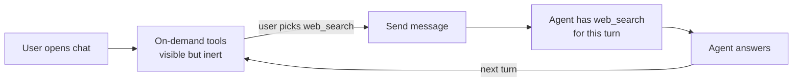

Some tools are useful but you don't want the agent reaching for them on its own — expensive searches, side-effect actions, anything you'd rather decide about turn by turn. **User-first activation** lets an administrator flag those tools so the agent has nothing usable for them until **the user picks them from the chat input**. After the user summons one, the agent has access to it for that single message and goes back to being blind to it on the next turn.

It pairs with [tool approval (HITL)](./tool-permissions). The two compose:

|                       | `activation: auto`               | `activation: user_first`                                  |
| --------------------- | -------------------------------- | --------------------------------------------------------- |
| **No approval**       | Agent uses freely.               | Agent can't reach the tool until the user summons it.      |
| **Always ask**        | Agent picks → user approves.     | User summons → user approves.                             |

<Note>
Works for **function tools** and **MCP servers**. Locking an MCP applies to every tool the server exposes — see [Locking a whole MCP](#locking-a-whole-mcp). File search, skills, and guardrails always behave as `auto`.
</Note>

## For end users

### What you see in chat

User-first tools sit in their own section of the tools dropdown, labelled **On demand** (or *Sur invocation* in French) — separate from the *Available* / *Connected* / *Requires connection* groups. Hovering the section header surfaces the reminder *"Select to make this tool available for this message."*

<Frame>
  
</Frame>

### Summon a tool for one message

<Steps>
  <Step title="Open the tools dropdown" />
  <Step title="Click a tool under On demand">
    A chip appears next to the input.
  </Step>
  <Step title="Send your message">
    The agent now has the tool and is strongly nudged to use it. On the next turn the tool goes back to **On demand** automatically.
  </Step>
</Steps>

You can pick several on-demand tools at once before sending.

### What if I don't summon it?

The agent answers normally but doesn't use the tool — even if you ask explicitly ("please search the web"). If the agent tries to call it anyway, the platform blocks the call silently. You are not asked to approve anything.

The agent *can* know the tool exists by name (it appears in its list of available tools, marked as disabled), so it may acknowledge it — *"I have web search available, but it's currently disabled."* What it can't do is call it.

### Which models honor the summon

When you summon a tool, the platform forces the model to use it. This is honored by most modern models. On older or less capable models the summon is best-effort — the model is *encouraged* but may still ignore your pick. (Note that **Always ask** does not rescue this case: if the model never makes the call, there's nothing to approve.)

## For administrators

### When to use user-first

| Scenario                                              | Why it helps                                                                      |
| ----------------------------------------------------- | --------------------------------------------------------------------------------- |
| Expensive search (web search, paid API)               | Don't run on every casual question; the user opts in when they want fresh sources. |
| Side-effect tools (post to Slack, send email)         | Prevent the agent from acting unprompted.                                         |
| Heavy-context tools (large knowledge query, ETL)      | Reduce token usage and latency on simple turns.                                   |
| Tools the agent over-uses                             | Stop the agent's reflex of always picking a particular tool.                      |

<Tip>
For tools that should never run without explicit human review, pair `user_first` with `tool_permissions: always_ask`. The user picks the tool **and** then approves the call.
</Tip>

### Configure from the agent builder

Open the agent in **Agent Creator** → **Settings** → **Permissions** → **Tool activation**. Set the default to **Auto** or **User-summoned only**, then add per-tool overrides if some tools need a different behavior from the default.

Function tools and MCP servers appear in the override dropdown; file search, skills, and guardrails are intentionally excluded.

<Frame>
  
</Frame>

Click **Save changes**. The change applies to the draft; publishing pushes it live.

### Locking a whole MCP

A rule on an MCP server applies to **every tool that server exposes** — you gate the integration as a whole rather than enumerating each tool it might add.

- The MCP appears as a single row under **On demand** in the chat dropdown. Clicking it gives the agent access to the whole integration for that turn.
- After the summon, the agent sees all of the MCP's tools and the platform nudges it to pick *one* of them. Which one is up to the agent — phrase your request so the right pick is obvious.
- If the MCP requires OAuth, the row stays under **Requires connection** until the user connects it, then moves to **On demand**.
- Approval rules cascade too. A `tool_permissions` rule on the MCP parent fires on every tool the server exposes; a child-specific rule wins over the parent rule on conflict.

<Note>
You can't user-first a *single tool inside* an MCP — locking applies at the integration level. If you need to expose only part of an MCP, register two MCP entries with different scopes and lock them separately.
</Note>

### Configure from `AGENTS.md` or the API

```yaml
---
id: agt_research_assistant
name: Research Assistant
model: claude-sonnet-4-6
tool_activation:
  default: auto              # omit, or set to "auto" for the usual behavior
  tools:
    - tool: web_search
      activation: user_first
    - tool: slack_notify
      activation: user_first
---
```

The API rejects (`400 VALIDATION_ERROR`) any rule that:

- Targets a tool name that doesn't exist on the agent. MCP child names are resolved at runtime — only the persisted MCP **parent** name is a valid target.
- Targets an exempt tool type (`file_search`, `skill`, `guardrail`, `system`).
- Sets an activation value other than `auto` or `user_first`.
- Duplicates a tool entry.

The block round-trips through `GET /v1/agents/{id}/export` and `POST /v1/agents/import` so an exported `AGENTS.md` re-imports identically.

## Behavior reference



The summon does **not** persist across turns — each new message resets the on-demand tools to inert.

**Approval composition.** If a summoned tool also has **Always ask**, the call pauses for approval. The summon context is preserved with the pending approval, so the agent can run the call on the user's approval without re-summoning.

**Sub-agents.** Activation rules are per agent. A sub-agent has its own configuration — the parent's summon does **not** propagate.

### Which tool types are eligible

| Type          | Eligible? | Notes                                                                            |
| ------------- | --------- | -------------------------------------------------------------------------------- |
| `function`    | ✅        | Custom HTTP tools, web search, etc.                                              |
| `mcp`         | ✅        | Locks the whole integration.                                                      |
| `file_search` | ✗         | Schema-less; the agent needs persistent visibility for retrieval.                  |
| `skill`       | ✗         | Skills live in the system prompt, not the tool list.                              |
| `guardrail`   | ✗         | Run out-of-band.                                                                  |
| `system`      | ✗         | Platform-internal tools the user never sees.                                       |

## Known limitations

<Warning>
Intentional v1 limitations — keep them in mind when explaining the feature to your users.
</Warning>

1. **User-first hides functionality, not the name.** The agent still sees the tool name in its list (marked disabled), and past calls can leave traces in conversation history. Don't use user-first to keep a tool's *existence* secret.
2. **Best-effort summon on some models.** Older or open-weight models may ignore the forced choice. Pair with **Always ask** for any action with side effects.
3. **MCP granularity is coarse.** Locking an MCP locks every tool it exposes; no per-child toggle.

## FAQ

<AccordionGroup>
  <Accordion title="Does locking a tool save tokens?">
    Yes. On locked turns the tool's full schema is replaced by a minimal stub — usually 200–1000 tokens per tool, per turn.
  </Accordion>
  <Accordion title="Can I lock all tools by default and unlock a few?">
    Set the default to **User-summoned only** and add per-tool overrides with `activation: auto` for the few you always want available.
  </Accordion>
  <Accordion title="Can I lock a specific tool inside an MCP server?">
    No — locking is per-MCP. For finer control, register two MCP entries with different scopes and lock them independently.
  </Accordion>
  <Accordion title="What happens if I rename a tool?">
    The activation rule is keyed by the tool's name. Update the matching `tool_activation.tools[].tool` entry or the API will reject the change.
  </Accordion>
  <Accordion title="Do starters / prompt suggestions auto-summon tools?">
    No. If a starter relies on an on-demand tool, summon it from the starter handler or set the tool back to `auto`.
  </Accordion>
</AccordionGroup>

## Related

- [Tool Permissions](./tool-permissions) — gate *whether a tool runs*. Pairs with user-first to gate *whether the agent sees it*.
- [Custom Tools](./custom-tools) — the function tools you'll most often want to gate.
- [Capabilities](./capabilities) — overview of all tool types.
- [Playground](./playground) — test summoning end-to-end before publishing.
