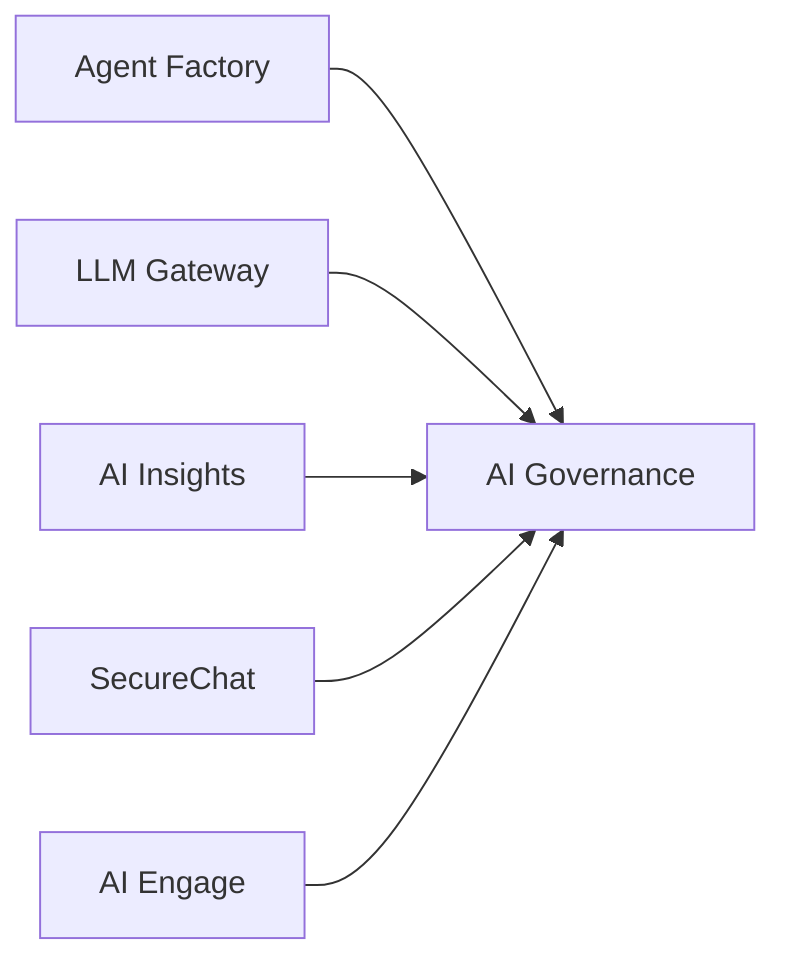

AI Governance is the authority workspace for the entire platform. It manages organizations, members, roles, API keys, SSO, subscriptions, and platform-wide observability. Every other workspace depends on it for authentication and authorization context.

**Workspace:** `ai-governance-v2` (118 automations)
**Frontend:** `builtin-apps/ai-governance`

## Core Responsibilities

<CardGroup cols={2}>
  <Card title="Organizations" icon="building" href="/products/ai-governance/organizations">
    Multi-tenant organization management — members, roles, groups, invites
  </Card>
  <Card title="API Keys" icon="key" href="/products/ai-governance/api-keys">
    API key lifecycle — creation, rotation, revocation, permission scoping
  </Card>
  <Card title="SSO" icon="lock" href="/products/ai-governance/sso">
    Single Sign-On configuration for organizations
  </Card>
  <Card title="Observability" icon="chart-mixed" href="/products/ai-governance/observability">
    Platform metrics, workspace health, cost tracking, error monitoring
  </Card>
  <Card title="Notifications" icon="bell" href="/products/ai-governance/notifications">
    Platform-wide announcements and per-user notifications
  </Card>
  <Card title="IAM Context" icon="compass" href="/products/ai-governance/iam-context">
    Navigation configuration, branding, onboarding flow
  </Card>
</CardGroup>

## Architecture

AI Governance is a **dependency sink** — it is called by nearly every workspace but makes no outbound cross-workspace calls itself. This makes it the single source of truth for identity and access.

**How workspaces use it:**
- **API key validation** — `POST v1/auth/apikey` validates `iak_*` tokens, returns org context, permissions, and scopes
- **Permission checks** — `POST v1/internal/check-admin`, `check-membership`, `check-group`
- **IAM context** — `GET v1/iam/context` returns navigation, branding, and membership for the frontend shell

## Data Model

| Collection | Table | Purpose |
|-----------|-------|---------|
| `organizations` | `iam_organizations` | Organization metadata |
| `memberships` | `iam_memberships` | User-to-org membership with role |
| `roles` | `iam_roles` | Custom role definitions with permissions |
| `groups` | `iam_groups` | User groups for access control |
| `group_members` | `iam_group_members` | Group membership |
| `invites` | `iam_invites` | Invitation codes |
| `join_rules` | `iam_join_rules` | Auto-join rules (email domain matching) |
| `apikeys` | `iam_apikeys` | API keys (hashed) with permissions and scopes |
| `service_accounts` | `iam_service_accounts` | Service account credentials |
| `subscriptions` | `iam_subscriptions` | Organization subscription plans |
| `usage` | `iam_usage` | Usage tracking for quota enforcement |
| `announcements` | `iam_announcements` | Platform-wide announcements |
| `user_announcement_state` | `iam_user_announcement_state` | Per-user announcement read state |
| `platform_metrics` | `iam_platform_metrics` | Aggregated platform metrics |

## API Surface Overview

AI Governance has the largest API surface in the platform:

| Area | Endpoints | Description |
|------|-----------|-------------|
| Organizations | 10+ | CRUD, active org, org settings |
| Members | 5+ | List, add, update, remove, invite |
| Roles | 4 | CRUD custom roles |
| Groups | 7+ | CRUD groups and manage membership |
| API Keys | 6+ | CRUD, revoke, rotate |
| SSO | 3 | Configure and retrieve SSO settings |
| Subscriptions | 4 | Manage subscription plans |
| Service Accounts | 4 | CRUD service accounts |
| IAM Context | 3 | Context, memberships, org switch |
| Notifications | 5+ | CRUD, dismiss, unread count |
| Announcements | 4 | CRUD platform announcements |
| Observability | 10+ | Metrics, costs, usage, errors, health, traces |
| Usage | 2 | Check and increment usage counters |
| Users | 3 | List, get, update user profiles |
| Internal | 4 | Cross-workspace validation endpoints |
| Admin | 1 | Refresh platform metrics |

## Authentication

AI Governance supports:

| Mode | Detection | Notes |
|------|-----------|-------|
| API key (`iak_*`) | `Authorization` header prefix | Validated via `internal/auth-apikey` built-in |
| User session | `user.id` present | Standard OIDC session |
| Workspace JWT | `run.authenticatedWorkspaceId` | Trusted service call |

A special `platform_admins` list in the workspace config grants the `root` role to specific user IDs, giving them full platform administration access.

## Events

| Event | When |
|-------|------|
| `iam.cache.invalidate` | Membership or role changes (consumed by other workspaces) |
| `joinrules.sync` | Join rules updated |
| `apikeys.*` | API key operations (creation, rotation, revocation) |
