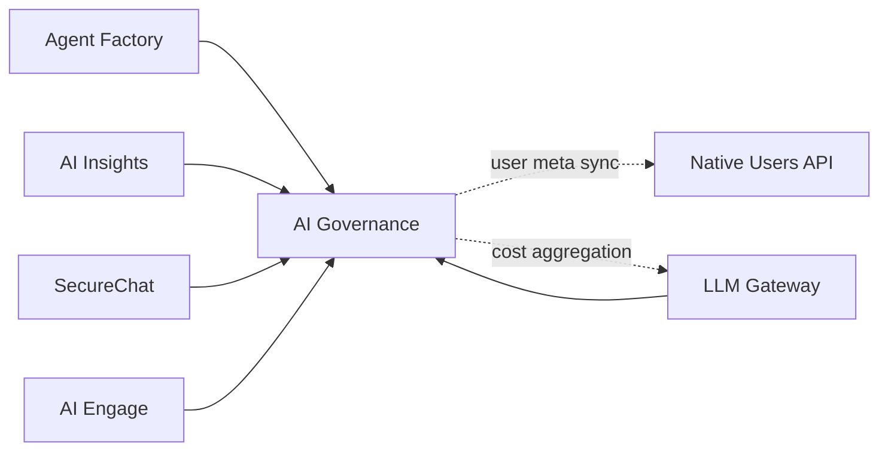

AI Governance is the authority workspace for the entire platform. It manages organizations, members, roles, API keys, SSO, subscriptions, and platform-wide observability. Every other workspace depends on it for authentication and authorization context.

**Workspace:** `ai-governance-v2`

## Core Responsibilities

<CardGroup cols={2}>
  <Card title="Organizations" icon="building" href="/products/ai-governance/organizations">
    Multi-tenant organization management — members, roles, groups, invites
  </Card>
  <Card title="API Keys" icon="key" href="/products/ai-governance/api-keys">
    API key lifecycle — creation, rotation, revocation, permission scoping
  </Card>
  <Card title="SSO" icon="lock" href="/products/ai-governance/sso">
    Single Sign-On configuration for organizations
  </Card>
  <Card title="Observability" icon="chart-mixed" href="/products/ai-governance/observability">
    Platform metrics, workspace health, cost tracking, error monitoring
  </Card>
  <Card title="Notifications" icon="bell" href="/products/ai-governance/notifications">
    Platform-wide announcements and per-user notifications
  </Card>
  <Card title="IAM Context" icon="compass" href="/products/ai-governance/iam-context">
    Navigation configuration, branding, onboarding flow
  </Card>
</CardGroup>

## Architecture

AI Governance is the **central authority** — it is called by nearly every workspace for identity and access. It also makes limited outbound calls: to the native Users API (for user meta sync and contact enrichment) and to the LLM Gateway events index (for cost/usage aggregation).

**How workspaces use it:**
- **API key validation** — `POST v1/auth/apikey` validates `iak_*` tokens, returns org context, permissions, and scopes
- **Permission checks** — `POST v1/internal/check-admin`, `check-membership`, `check-group`
- **IAM context** — `GET v1/iam/context` returns navigation, branding, and membership for the frontend shell

## Data Model

| Collection | Purpose |
|-----------|---------|
| `organizations` | Organization metadata, branding, navigation, SSO config |
| `memberships` | User-to-org membership with role and subscription |
| `roles` | Role definitions with permission strings |
| `groups` | User groups for access control |
| `group_members` | Group membership |
| `invites` | Shareable invitation codes |
| `join_rules` | Auto-join rules (generic field matching, not just email) |
| `apikeys` | API keys (hashed) with permissions and scopes |
| `service_accounts` | Service account identities for agents |
| `subscriptions` | Organization subscription plans with limits |
| `usage` | Usage tracking for quota enforcement |
| `announcements` | Platform-wide announcements with targeting |
| `user_announcement_state` | Per-user announcement read/dismiss state |
| `platform_metrics` | Pre-aggregated observability metrics |

## API Surface Overview

AI Governance has the largest API surface in the platform:

| Area | Description |
|------|-------------|
| Organizations | CRUD, active org, org settings |
| Members | List, update, remove, invite |
| Roles | CRUD custom roles, override system roles per org |
| Groups | CRUD groups and manage membership |
| API Keys | CRUD, revoke, rotate |
| SSO | Configure and retrieve SSO settings |
| Subscriptions | Manage subscription plans |
| Service Accounts | CRUD service accounts |
| IAM Context | Context, memberships, org switch |
| Notifications | List, dismiss, unread count |
| Announcements | CRUD platform announcements |
| Observability | Metrics, costs, usage, errors, health, traces |
| Usage | Check and increment usage counters |
| Users | List, update user profiles |
| Internal | Cross-workspace validation endpoints |
| Admin | Refresh platform metrics |

## Authentication

AI Governance supports:

| Mode | Detection | Notes |
|------|-----------|-------|
| API key (`iak_*`) | `Authorization` header prefix | Validated via `internal/auth-apikey` built-in |
| User session | `user.id` present | Standard OIDC session |
| Workspace JWT | `run.authenticatedWorkspaceId` | Trusted service call |

A special `platform_admins` list in the workspace config grants the `root` role to specific user IDs, giving them full platform administration access.

## Events

### IAM Lifecycle Events

| Event | When |
|-------|------|
| `iam.member.added` | Member added to an organization |
| `iam.member.invited` | Invitation email sent |
| `iam.member.joined` | User accepted invite or joined via code |
| `iam.member.auto-joined` | User auto-joined via join rules |
| `iam.member.updated` | Member role or subscription changed |
| `iam.member.removed` | Member removed from organization |
| `iam.role.created` | Custom role created |
| `iam.role.updated` | Role permissions modified |
| `iam.role.deleted` | Role deleted |
| `iam.organization.created` | Organization created |
| `iam.organization.updated` | Organization settings, branding, navigation, or join rules updated |
| `iam.organization.deleted` | Organization deleted (cascade info included) |
| `iam.group.created` | Group created |
| `iam.group.updated` | Group metadata updated |
| `iam.group.deleted` | Group deleted (Agent Factory cleans up agent bindings) |
| `iam.group.member.added` | Users added to a group |
| `iam.group.member.removed` | User removed from a group |
| `iam.user.updated` | Platform user status changed |
| `iam.user.deleted` | Platform user deleted (cascades membership + group cleanup) |

### System Events

| Event | When |
|-------|------|
| `iam.audit` | All governance actions (compliance trail with actor, target, changes) |
| `iam.cache.invalidated` | After cache invalidation runs for affected users |
| `iam.joinrules.synced` | After join rules synced to the inverted index |
| `iam.warning` | Non-fatal warnings (e.g., missing default subscription during service account creation) |
| `internal.apikey.used` | API key authenticated (async — triggers `lastUsedAt` / `usageCount` update) |

The `events/iam-cache-invalidate` listener subscribes to all `iam.member.*`, `iam.role.*`, `iam.organization.updated`, `iam.group.*`, and `iam.user.*` events. It determines affected users and sets `user.meta._iamVersion = "invalidated"`, forcing a fresh context rebuild on the next `v1/iam/context` call.
