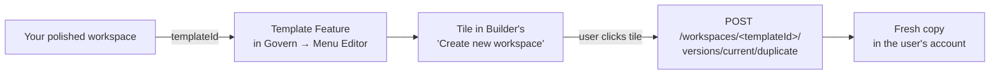

A **workspace template** is a workspace that appears as a "Start from template" tile when a user creates a new workspace in [Builder](/products/ai-builder/overview). Picking it duplicates the source workspace — automations, imports, pages, configuration — into a fresh workspace owned by the user.

Templates are declared at the organization level via the **Menu Editor**, so publishing one is an admin task. The source workspace itself is built and maintained in [Builder](/products/ai-builder/workspaces).

Use templates to:

- Standardize a starting point for new use cases (e.g. "Custom RAG", "Webhook gateway", "OAuth-enabled connector")
- Share a polished demo with colleagues without giving them write access to your workspace
- Bootstrap reference architectures your team can fork and adapt

## How templating works

Templates are declared in **AI Governance** as **Template Features** on a navigation menu item. The Builder reads the platform navigation to populate its "Create new workspace" screen — every Template Feature shows up as a tile.



When the user picks a template, the Builder calls `POST /workspaces/<templateId>/versions/current/duplicate`. The duplicate inherits all content but gets a new id, a `- Copie` suffix in its name (which the user can rename in the next step), and is owned by the cloning user.

## Step 1 — Polish your source workspace

Before publishing, treat your source as a product:

- **Name & description** — both are surfaced to the user during template selection. Be concrete: `RAG agent over a public website` beats `My template`.
- **Photo / icon** — set one in workspace settings. It's the visual users see in the gallery.
- **Configuration schema** — if your template needs the cloning user to provide values (an API base URL, a brand name, etc.), declare them in `config.schema`. The Builder will render a form when they instantiate the template.
- **Secrets schema** — for sensitive values (API keys), declare them in `secrets.schema`. The user is prompted at instantiation and the values land in their workspace's Secrets.
- **No personal data** — clear out test users, real tokens, hard-coded customer ids. Anything that would embarrass you in someone else's workspace shouldn't be in the template.

Note the **workspace id** (visible in the URL when you open the workspace, e.g. `kFoNvfX`) — you'll need it in step 2.


## Step 2 — Declare it as a Template Feature in AI Governance

Templates are managed at the **organization** level via the **Menu Editor**. Anyone with admin access to the org navigation can publish a template.

1. Open the **Govern** product (AI Governance) from the sidebar.
2. Go to **Menu Editor**.
3. Open (or create) a menu item where the template should be discoverable. Templates are attached as *features* of menu items — typically you'd attach them under a "Builder" or "Workspaces" entry.
4. Click **Add Feature → Template Feature**.
5. Fill in the four fields:

| Field | Description |
|---|---|
| **Slug** | Short identifier used in URLs and translations (e.g. `custom-rag-template`). Lowercase, hyphens. |
| **Template ID** | The workspace id of the source template (the one from step 1). |
| **Label** | The display name shown on the tile in Builder. |
| **Permissions** | Optional. Restricts visibility to roles holding any of the listed permissions. Leave empty to make the template visible to everyone with platform access. |

6. **Save Changes**.

Equivalent YAML if you edit the navigation via the API:

```yaml
menu:
  - type: item
    label: Builder
    icon: hammer
    href: /builder
    features:
      - type: template
        slug: custom-rag-template
        templateId: kFoNvfX
        label: Custom RAG Template
        permissions:
          - builder:workspaces:create
```


<Tip>
Adding the Template Feature is reflected immediately in Builder's "Create new workspace" screen — no rebuild or cache flush.
</Tip>

## Step 3 — (Optional) Add a configuration form

If your template needs inputs at instantiation, declare them in the source workspace's `config.schema`. The Builder renders a form, and the values become accessible inside the cloned workspace as `{{config.<field>}}`.

```yaml
# In the source workspace (config tab)
config:
  schema:
    sourceUrl:
      type: string
      title: Website to crawl
      description: The starting URL the RAG agent will index
      required: true
    brand:
      type: string
      title: Brand name
      description: Used in the agent's greeting and prompts
secrets:
  schema:
    OPENAI_API_KEY:
      type: string
      title: OpenAI API Key
      description: Required to call the embedding model
      required: true
      secret: true
```

After filling the form, the user lands in a fully wired workspace where every `{{config.sourceUrl}}` reference resolves to their value.

{/* Screenshot to add: screenshot of the "Create new workspace" wizard in Builder showing the configuration form rendered from the schema above — Website to crawl input, Brand name input, OpenAI API Key field with a key icon. */}

## Step 4 — Verify the template

1. Open Builder → click **New workspace**.
2. The first step lets users pick a starting point. Your template should appear alongside **From scratch** and **Import ZIP**.
3. Click your template tile, fill the configuration form (if any), and complete the wizard.
4. The new workspace opens in your account — verify it has the expected automations, imports, and config.


<Note>
**Visibility & permissions.** Template Features inherit the standard menu-item permission model: if you set `permissions`, the tile is visible only to users holding any of the listed permissions. Leave it empty to expose the template to everyone with access to the parent menu item. See [Permission-Based Visibility](/products/ai-governance/platform-customization#permission-based-visibility) for the full rules.
</Note>

## Maintaining a template

A template is just a workspace, so:

- **Update it** like any other workspace — changes are picked up by future "Create new workspace" clicks (existing copies are not modified).
- **Use [versioning](/products/ai-builder/versioning)** to mark stable releases. Builder always duplicates the `current` version, so pinning your changes through `current` lets you keep iterating on a separate branch.
- **Retire a template** by removing the corresponding Template Feature from the Menu Editor. The source workspace stays intact.

## Templates vs publishing as an app

Don't confuse a **template** with **publishing a workspace as a platform app**:

| | Workspace template | Published app |
|---|---|---|
| **Purpose** | Starting point users clone and modify | Live application users open and use |
| **Where it's declared** | Govern → Menu Editor → Template Feature | "Add to Platform" modal (bundles + route) |
| **What user gets** | A new workspace in their account | A new entry in the platform navigation |
| **Where users find it** | "Create new workspace" → tiles | Sidebar / app launcher |

You can do both: a template that users clone for customization *and* a published app that users open as-is.

## Related

<CardGroup cols="2">
  <Card title="Workspaces" icon="briefcase" href="/products/ai-builder/workspaces">
    Workspace anatomy: configuration, secrets, sharing.
  </Card>
  <Card title="Menu Editor" icon="bars" href="./platform-customization#menu-editor">
    Where Template Features live, plus the wider menu/navigation model.
  </Card>
  <Card title="Versioning" icon="code-branch" href="/products/ai-builder/versioning">
    Pin a template to a stable version while you iterate.
  </Card>
  <Card title="Identity & Access" icon="user-shield" href="./identity-access">
    Permissions model used by the Menu Editor's visibility filters.
  </Card>
</CardGroup>
