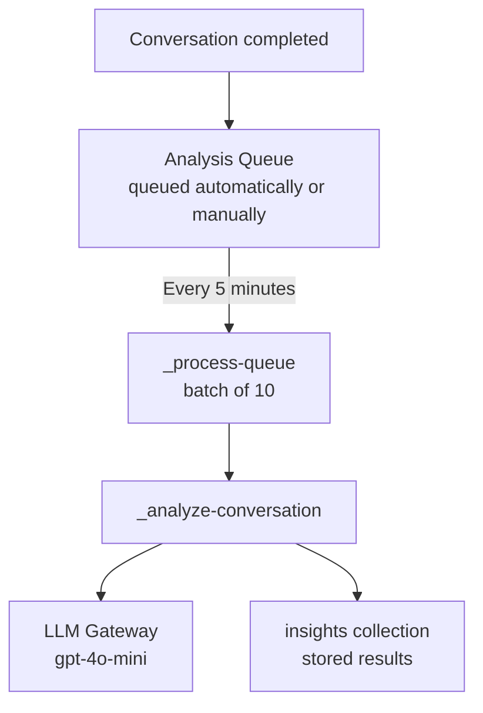

AI Insights can automatically analyze conversations for quality, resolution, and other criteria using an LLM judge. Analysis runs asynchronously via a processing queue.

## How It Works



## Trigger Analysis

### Manual

```
POST v1/agents/:agent_id/analyze
```

```json
{
  "conversation_ids": ["conv_abc", "conv_def"]
}
```

Queues specific conversations for analysis.

### Automatic

Conversations are automatically queued for analysis based on:
- Conversation completion events
- Inactive conversation detection (hourly batch: `0 * * * *`)

The batch analyzer (`_batch-analyze-inactive`) finds conversations that have been inactive for a configurable period and queues them for analysis.

## Evaluation Criteria

Each analysis evaluates the conversation against a set of criteria. Default criteria:

| Criterion | Type | Description |
|-----------|------|-------------|
| `resolution` | boolean | Was the user's question/issue resolved? |
| `clarity` | score (1-5) | How clear and understandable were responses? |
| `accuracy` | score (1-5) | How accurate was the information provided? |
| `sentiment` | category | User sentiment: `positive`, `neutral`, `negative` |

### Custom Criteria

Organizations can define custom evaluation criteria per agent:

```
GET    v1/agents/:agent_id/evaluation-criteria
PUT    v1/agents/:agent_id/evaluation-criteria
DELETE v1/agents/:agent_id/evaluation-criteria
```

```json
{
  "criteria": [
    {
      "name": "compliance",
      "type": "boolean",
      "description": "Did the agent follow compliance guidelines?"
    },
    {
      "name": "empathy",
      "type": "score",
      "min": 1,
      "max": 5,
      "description": "How empathetic was the agent's tone?"
    },
    {
      "name": "escalation_needed",
      "type": "boolean",
      "description": "Should this conversation have been escalated to a human?"
    }
  ]
}
```

Custom criteria are stored in the `evaluation_templates` collection and merged with defaults during analysis.

## Analysis Output

Each analyzed conversation produces an insight record:

```json
{
  "conversation_id": "conv_abc",
  "agent_id": "agent_xyz",
  "analyzed_at": "2026-03-01T10:15:00Z",
  "criteria_results": {
    "resolution": { "value": true, "confidence": 0.92 },
    "clarity": { "value": 4, "confidence": 0.85 },
    "accuracy": { "value": 5, "confidence": 0.88 },
    "sentiment": { "value": "positive", "confidence": 0.91 }
  },
  "summary": "User asked about Q3 revenue trends. Agent provided accurate data from the knowledge base...",
  "topics": ["revenue", "Q3", "trends"],
  "message_count": 6,
  "duration_seconds": 180
}
```

## Retrieving Insights

```
GET v1/insights
```

| Param | Type | Description |
|-------|------|-------------|
| `agent_id` | string | Filter by agent |
| `period` | string | Time range |
| `resolution` | boolean | Filter by resolution status |
| `min_clarity` | integer | Minimum clarity score |
| `sentiment` | string | Filter by sentiment |

```
POST v1/insights
```

Create insight records manually (for imported or external analysis results).

## Analysis Model

The analysis uses:
- **Primary model:** `gpt-4o-mini` (cost-effective for analysis)
- **Fallback model:** `gpt-3.5-turbo`
- **Temperature:** Low (deterministic analysis)

The LLM receives the full conversation transcript with a structured analysis prompt. It returns a JSON object matching the criteria schema. The `_analyze-conversation` automation parses and validates the LLM output before storing.

## Processing Queue

The queue processor (`_process-queue`) runs every 5 minutes:

1. Fetches up to `batch_size` (default: 10) pending items from `analysis_queue`
2. For each: fetches the conversation from Agent Factory via API key
3. Runs `_analyze-conversation`
4. Stores result in `insights`
5. Updates `conversation_status` to `analyzed`
6. Removes from queue

Failed analyses are retried up to 3 times before being marked as `failed`.
