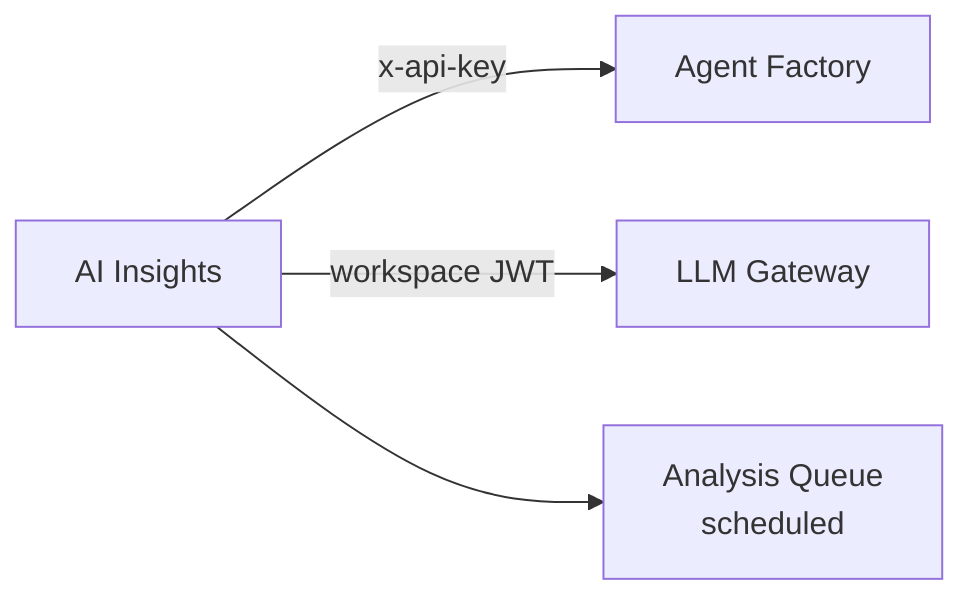

AI Insights is the analytics and intelligence layer for the platform. It provides conversation analysis, usage analytics, agent relationship mapping, memory intelligence, and GDPR compliance tools.

**Workspace:** `ai-insights-v2`

## Capabilities

<CardGroup cols={2}>
  <Card title="Analytics" icon="chart-bar" href="/products/ai-insights/analytics">
    Usage summaries, agent performance, feedback analysis, adoption metrics
  </Card>
  <Card title="Conversation Analysis" icon="comments" href="/products/ai-insights/conversation-analysis">
    LLM-powered quality analysis with configurable evaluation criteria
  </Card>
  <Card title="Agent Graph" icon="diagram-project" href="/products/ai-insights/agent-graph">
    Visual relationship mapping between agents, tools, and knowledge bases
  </Card>
  <Card title="Memories Analytics" icon="brain" href="/products/ai-insights/memories-analytics">
    Memory usage stats, topic clustering, anomaly detection
  </Card>
  <Card title="GDPR Compliance" icon="shield-check" href="/products/ai-insights/gdpr">
    Data deletion requests, user data export, text anonymization
  </Card>
</CardGroup>

## Architecture

AI Insights operates primarily as a **read-heavy analytics layer**. It pulls data from Agent Factory and LLM Gateway, processes it through LLM-powered analysis, and stores results for dashboard consumption.

## Tiered Feature Access

Features are gated by subscription tier:

| Feature | Tier-Gated |
|---------|-----------|
| Extended data retention | Yes |
| Real-time analysis | Yes |
| Custom evaluation criteria | Yes |
| Queue management | Yes |
| Basic analytics, agent graph, GDPR tools, memory analytics | Available at all tiers |

Tier checks are performed by `_check-tier-feature` before gated operations.

## Data Model

| Collection | Purpose |
|-----------|---------|
| `analysis_queue` | Pending conversation analyses |
| `conversation_status` | Analysis state per conversation |
| `insights` | Computed conversation insights |
| `feedbacks` | User feedback records |
| `org_analytics` | Aggregated organization-level analytics |
| `retention_policies` | Data retention configuration |
| `gdpr_requests` | GDPR deletion/export requests |
| `memory_stats_hourly` | Hourly memory usage statistics |
| `memory_stats_daily` | Daily memory usage aggregations |
| `memory_topics` | Clustered memory topics |
| `memory_alerts` | Memory anomaly alerts |
| `agent_graph_nodes` | Agent relationship graph nodes |
| `agent_graph_edges` | Agent relationship graph edges |

## Scheduled Jobs

AI Insights relies heavily on scheduled processing:

| Schedule | Job | Purpose |
|----------|-----|---------|
| `*/5 * * * *` | Process analysis queue | Drain pending analyses |
| `0 * * * *` | Batch analyze inactive | Queue stale conversations |
| `0 * * * *` | Cluster memory topics | Group memories by topic |
| `*/15 * * * *` | Detect memory anomalies | Flag unusual patterns |
| `10 * * * *` | Aggregate org analytics | Hourly org-level aggregation |
| `20 * * * *` | Aggregate memory stats (hourly) | Memory usage metrics |
| `30 2 * * *` | Aggregate memory stats (daily) | Daily memory rollup |
| `0 3 * * *` | Process GDPR deletions | Execute pending deletions |
| `0 4 * * *` | Purge expired data | Remove data past retention |

## Authentication

AI Insights uses **user session authentication only**. It does not support API keys directly — all requests come from the authenticated user in the AI Insights frontend.

Permission checks are performed via `_check-permission` for specific operations.

## Dependencies

| Service | Purpose | Auth Method |
|---------|---------|-------------|
| [Agent Factory](/products/agent-factory/overview) | Agent and conversation data | API key (`x-api-key`) |
| [LLM Gateway](/services/llm-gateway/overview) | Analysis LLM calls | Workspace JWT |
| [AI Governance](/products/ai-governance/overview) | Org context (via config reference) | Config reference |

## Analysis Configuration

| Setting | Default | Description |
|---------|---------|-------------|
| `default_model` | `gpt-4o-mini` | LLM model for analysis |
| `batch_size` | 10 | Conversations processed per batch |

Default evaluation criteria:
- `resolution` — Boolean: was the user's issue resolved?
- `clarity` — Score 1-5: how clear were the agent's responses?
- `accuracy` — Score 1-5: how accurate was the information?
- `sentiment` — Category: user sentiment (positive, neutral, negative)
