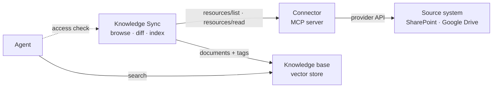

<Frame>
  
</Frame>

Connectors let you automatically sync documents from external platforms, so the knowledge layer stays connected to the systems where your content already lives instead of becoming another silo. Instead of manually uploading files, connect to the source and let Knowledges keep your knowledge base up to date.

## Available Connectors

Connectors are not a fixed list. Any **capability** in your catalog that exposes an MCP
server can become a connector, provided that server publishes a
[Knowledge profile](#the-knowledge-profile) — a small declaration describing how its
content is browsed, versioned and access-checked.

When a capability is saved, Knowledges probes its MCP server and records whether it is
compatible. Only compatible capabilities appear on the Connectors page.

| Connector | Status |
|-----------|--------|
| **SharePoint / OneDrive** | Available — sites, document libraries, folders |
| **Google Drive** | Available — shared drives, My Drive, folders |

<Note>
A capability saved **before** compatibility probing existed shows up nowhere, because it
has never been probed. Opening it and saving it again is enough: the probe runs on every
save. If a connector you expect is missing, this is the first thing to check.
</Note>

<Note>
Other MCP capabilities (Confluence, Jira, Outlook…) are listed in the catalog but do
**not** publish a Knowledge profile yet, so they cannot be used as Knowledge connectors.
They remain usable as agent tools.
</Note>

## The Connectors Page

Open Knowledges and go to **Connectors** to see:

- **Active connections** - Currently configured syncs
- **Available connectors** - Compatible capabilities you can set up
- **Sync status** - When each connection last synced

## Setting Up a Connector

### 1. Choose a Connector

1. Go to **Connectors**
2. Click **Add Connection**
3. Select the connector type

### 2. Authenticate

Most connectors require authentication. Depending on your organization's setup, you'll see one of two modes:

| Mode | Description |
|------|-------------|
| **Your account** | Sign in with your credentials; syncs content you can access |
| **Service account** | Uses admin-configured credentials; syncs organization content |

For personal authentication:
1. Click **Connect**
2. Sign in to the external service
3. Grant permissions when prompted
4. Return to Knowledges

<Tip>
Use an account with read access to the content you want to sync. Connectors only read documents - they never modify external content.
</Tip>

### 3. Select Content

Choose what to sync:

1. Browse available sites, folders, or spaces
2. Select the content you want
3. Choose or create a knowledge base as the destination

### 4. Configure the connection

Once created, the connection's **Configuration** panel holds two switches:

| Setting | Description |
|---------|-------------|
| **Auto-sync** | Runs on a schedule — hourly, every 6 hours, every 12 hours, or daily |
| **Per-user access control** | Checks each reader's own rights in the source at query time (see below) |

<Note>
**Per-user access control is on by default** for connectors that support it — which
both SharePoint and Google Drive do. Each reader is then asked to connect their own
account the first time they query, and only sees what they could open themselves.

Turning it off means every synced document is served to anyone who can query the agent,
whatever their rights in the source. Only do that when the content is readable by the
whole organization. An administrator can also enforce the check organization-wide,
which overrides the per-connection setting.

Connections created before this became the default keep their existing setting — check
it on older connections.
</Note>

The source folder and the destination knowledge base are changed from the same panel,
with **Change source** and **Change knowledge base**.

<Note>
Everything under the selected folder is synced, including nested folders. There is no
filter by file type or by path: narrow the selection instead, or use several connections
pointing at different folders. Which file formats are indexed is decided by the platform,
not per connection.
</Note>

### 5. Start Sync

Click **Sync Now** to begin the initial synchronization. Large sources are spread over
several runs — the panel says how many documents are left for the next ones.

## Managing Connections

### Viewing Status

Each connection shows how much the knowledge base **holds in total**, then what each run
**changed**. The two are deliberately separate: a run that changes nothing on a base of
four hundred documents is a healthy run, not an empty base.

Every run reports three figures:

| Metric | Description |
|--------|-------------|
| **new** | Documents added to the knowledge base |
| **updated** | Documents that changed in the source and were re-indexed |
| **deleted** | Documents removed from the source, and therefore from the base |

Unchanged, failed and still-indexing counts appear alongside when they are not zero.

**Recent runs** lists the last five. Click one to unfold the documents it actually
touched, by name and by category — the list is fetched only when you open it, so the
history stays cheap to display. A run that changed nothing says so plainly.

### Triggering Manual Sync

To sync immediately instead of waiting for the schedule:

1. Find the connection
2. Click **Sync Now**
3. Wait for completion

### Updating Configuration

To change what's synced:

1. Click the connection
2. Modify the selection or settings
3. Save changes
4. Run a sync to apply changes

### Disconnecting

To remove a connection:

1. Click the connection
2. Click **Disconnect**
3. Confirm

<Warning>
Disconnecting removes the connection but keeps synced documents in your knowledge base. To remove the documents too, delete them from the knowledge base.
</Warning>

<Note>
Disconnecting the account **here** affects this connection's synchronization only. The
account you may have connected to *read* a base through an agent is a separate
credential — see [Connected accounts](/products/agent-factory/connector-accounts).
</Note>

## SharePoint Connector

Browse **sites**, then their **document libraries**, then any folder inside them.
SharePoint pages and lists are not synced.

### Permissions Required

Reading site and file content through Microsoft Graph requires permissions your admin
may have to approve in Microsoft Entra. The exact scopes depend on how the connector's
OAuth client is configured — an organization can register its own and narrow them.

<Note>
Synchronization only ever reads. If the consent screen mentions write permissions, they
come from the connector's other uses as an agent tool, not from the sync.
</Note>

### Configuring SharePoint

1. Connect with your Microsoft account
2. Browse to a site, then a document library
3. Open folders to narrow the selection, and confirm with **Use this location**

### Handling Large Libraries

For large SharePoint libraries:

- Select a folder rather than a whole library
- Consider multiple connections for different topics
- The first sync is spread over several runs; let the schedule finish the job

## Google Drive Connector

Browse **shared drives** and **My Drive**, then any folder inside them. Google-native
documents (Docs, Sheets, Slides) are exported to an indexable format on the way in;
files already in a standard format are taken as they are.

### Configuring Google Drive

1. Connect with your Google account
2. Browse to a drive, then a folder
3. Confirm with **Use this location**

Per-user access control works the same way as for SharePoint: each reader's own rights
are checked against Google Drive at query time.

## How Connectors Work

Prisme.ai does not ship one hand-written integration per source. Everything specific to
SharePoint or Google Drive lives in an **MCP server** — the same kind of server an agent
uses as a tool. The synchronization side knows how to browse resources, compare
revisions and hand content to a knowledge base; it never learns what a *site* or a
*shared drive* is.

| Part | Role |
|------|------|
| **Source system** | Holds the documents, and remains the authority on who may read them |
| **Connector** | An MCP server exposing that source as MCP *resources*, and answering "may this user read that resource?" |
| **Knowledge Sync** | Browses, filters, diffs, indexes, schedules — and asks the access question at query time |
| **Knowledge base** | The vector store the agent actually searches |



Nothing in that path is proprietary: browsing is `resources/list`, fetching a document
is `resources/read`, and the access check is a single MCP tool call. A connector that
already exists as an agent tool becomes a knowledge connector by declaring one extra
resource — not by being rewritten.

### The Knowledge profile

Compatibility is **declared, not hard-coded**. A connector publishes a small JSON
document at a fixed address, `<scheme>://profile/knowledge`, stating:

- the **hierarchy** it exposes — `site`, `drive`, `folder`… — and which of those levels
  can be picked as a sync root;
- how a **revision** is identified, so a run can tell a document that changed from one
  that did not;
- how **content** comes back: inline text, or a link to download the bytes;
- its **pagination** limits, and whether it supports incremental listing;
- the **tool** to call to check one user's access to one resource.

That last entry is what makes **per-user access control** offerable on a connection: a
connector that names the tool and the action can answer the question live, and the
setting becomes available. A connector that stays silent about it is still perfectly
syncable — the setting simply isn't offered.

### Compatibility probing

When a capability is created or saved in the catalog, the platform opens its MCP server
and reads that profile: `initialize` — does this server serve resources at all? — then
`resources/templates/list` to find the profile, then `resources/read`. The verdict is
recorded on the catalog entry, and the Connectors page lists nothing but entries that
passed.

The probe runs **anonymously**, on purpose: the profile is public metadata about a
server's shape, never content. For the same reason, servers on loopback or private
addresses are refused outright, and a failed probe never echoes back the server's URL or
its response.

### What a sync run does

1. **Traverse** the selection with `resources/list`, starting from the selected roots and
   descending into every container below them.
2. **Filter** on MIME type against the platform's supported list. This filter lives on the
   Knowledge Sync side and is the authoritative one — connectors describe their content,
   they do not decide what is indexable.
3. **Diff** each file's revision tag against what the base already holds. Unchanged files
   are never re-read and never re-indexed.
4. **Index** the new and changed files, then wait for the knowledge base to confirm
   indexing before recording the new revision. A document is only considered synced once
   it is actually searchable.
5. **Delete** documents that disappeared from the source — but only after a *complete*
   traversal. A listing that failed halfway deletes nothing.

Every indexed document keeps two tags: the connection it came from, and its canonical
resource URI in the source. Those two tags are what the access check operates on later.

Runs are deliberately bounded — a large source is spread over several of them, and the
schedule finishes the job. Nothing is lost between runs: the cursor and the committed
revisions are what a subsequent run resumes from.

### Two credentials, two moments

The same connector is used twice, on behalf of two different people, and this is the
part worth remembering:

| Moment | Acts as | Why |
|--------|---------|-----|
| **Synchronizing** | The person who created the connection | The base's contents must be stable and predictable, not a function of who happened to trigger a run. Scheduled runs reuse that same identity, with no session involved. |
| **Answering a question** | The person asking | Filtering can only be correct if it is evaluated against the reader's own rights in the source. |

This is why an agent asks a reader to connect their account before searching a
connector-backed base: it needs *their* identity, and the connection owner's credential
cannot answer for them. It is also why the two credentials are managed in two different
places — see [Connected accounts](/products/agent-factory/connector-accounts).

<Note>
For the connector side of this picture — how an MCP connector is built, authenticated
and reviewed — see
[Connector architecture](/apps-store/marketplace/connectors/architecture).
</Note>

## Building a Compatible Connector

Any MCP server can become a knowledge connector, including one you write yourself or one
a vendor already ships. There is no Prisme.ai SDK to adopt and no interface to implement:
you serve standard MCP methods, plus **one extra resource** that describes how your
source behaves.

<Steps>
  <Step title="Announce the resources capability">
    Your `initialize` response must include `resources` in `capabilities`. This is the
    single bit discovery keys on — a server that only announces `tools` is never examined
    further.

    ```json
    { "protocolVersion": "2025-06-18",
      "capabilities": { "resources": {}, "tools": {} },
      "serverInfo": { "name": "my-connector", "version": "1.0.0" } }
    ```
  </Step>

  <Step title="Publish the Knowledge profile">
    Declare a resource template whose URI is exactly `<scheme>://profile/knowledge`, with
    `mimeType: application/json`, in your `resources/templates/list` response. Serve it
    from `resources/read` as JSON text. See the full descriptor below.
  </Step>

  <Step title="Browse with resources/list">
    Return the direct children of a container, so the setup wizard can walk your hierarchy
    and a sync run can traverse it.
  </Step>

  <Step title="Serve content with resources/read">
    Give back either a download link or the text itself — see the rule below, it is the
    one place where a plausible-looking implementation silently indexes the wrong thing.
  </Step>

  <Step title="Answer the access question (optional)">
    Expose a tool that rules on what one named user may read. Without it your connector
    still syncs perfectly; it simply cannot offer per-user access control.
  </Step>
</Steps>

### The profile descriptor

```json
{
  "knowledge_compatible": true,
  "provider": "my-connector",
  "canonical_uri": "myapp://drive/{driveId}/item/{itemId}",
  "hierarchy": ["drive", "folder", "item"],
  "tools": ["documents"],
  "required_tools": ["documents"],
  "authentication": {
    "modes": ["oauth", "oauthCentral"],
    "resource_access": "delegated checkAccess"
  },
  "list": {
    "parent_parameter": "uri",
    "default_page_size": 50,
    "maximum_page_size": 200,
    "delta_on_drive": false
  },
  "read": {
    "binary": "inline_data_url",
    "inline_text_max_characters": 200000,
    "inline_download_max_bytes": 4194304
  },
  "revision": { "primary": "revision", "fallback": "revision" },
  "access": { "tool": "documents", "action": "checkAccess" }
}
```

| Field | What it decides |
|-------|-----------------|
| `knowledge_compatible` | Must be `true`. Anything else, and the server is recorded as not a connector. |
| `hierarchy` | The container levels you expose, from the top down. Drives the wizard's browsing screens and which levels can be picked as a sync root. |
| `authentication.modes` | Containing `oauth` or `oauth2` makes the wizard show a sign-in step. Omit it and the wizard goes straight to browsing, with no token. |
| `list.*` | Pagination limits, and whether you support incremental listing on a drive. |
| `read.*` | Size ceilings for inline content, and how binaries are represented. |
| `revision` | Which field carries your version marker. |
| `access.tool` + `access.action` | The tool call to make for a per-user access check. **Both or neither** — half a mapping is rejected as an invalid profile. |

<Note>
The catalog stores an allowlisted, bounded copy of this document — known fields only,
strings truncated, numbers range-checked. A field you invent is not an error, it is
simply dropped and never reaches anything.
</Note>

### Listing resources

A root listing arrives with **no `uri` parameter at all**: that is how the host asks
"what are your top-level resources?" before anything has been picked. Treat a missing
parent as the root, not as an empty match — filtering `parent == params.uri` against a
missing value is the single most common reason a wizard opens on an empty screen.

Each item in `resources` carries:

| Field | Purpose |
|-------|---------|
| `uri` | Canonical, stable, and the identity of the document forever after |
| `name` | Display name, and the file name shown in run details |
| `mimeType` | Filtered against the platform's supported list |
| `revision` | Version marker — see below |
| `_meta.kind` | `site`, `drive`, `folder` or `file` |
| `_meta.size` | Size in bytes |
| `_meta.deleted` | Announces a removal explicitly |

Traversal descends into anything whose `_meta.kind` is a container level, or whose
`mimeType` is `inode/directory`. **A kind you invent is not traversed** — the engine has
no way to guess that it holds children. Paginate with `nextCursor`; the host hands your
cursor back verbatim and never interprets it.

### Serving content

<Warning>
Return a download URL in `_meta.downloadUrl` **or** inline text in `contents[0].text` —
**never both**. Indexing takes inline content over a URL when it receives the two, so a
server offering both has its text indexed and its link ignored. A connector answering
`resources/read` with a JSON descriptor of the resource in `text` will therefore index
every document as its own metadata sheet — and text files fail *silently* that way,
because a descriptor is perfectly valid text.
</Warning>

Bytes first. Inline text only when there are none to go and fetch — the case it exists
for is a source with no pre-signed link, such as a Google-native document exported on the
fly. If bytes exist but are unreachable, say so in `_meta.unfetchable_reason` rather than
staying silent. `_meta.webUrl` is used as the document's citation link.

### Revisions

The version marker is read from `revision` at the top level of a listed resource, falling
back to `_meta.revision`, `_meta.cTag`, then `_meta.eTag`. Any of them works; what matters
is that the value **changes when the content changes, and only then**. A marker that never
changes leaves a base permanently stale; one that changes on every listing re-indexes the
whole source on every run.

### The access check

If your profile names an access tool, it is called with the reader's id and a batch of
canonical URIs, and its answer is taken as final:

```json
{ "name": "documents",
  "arguments": {
    "action": "checkAccess",
    "targetUserId": "<the reader>",
    "resourceUris": ["myapp://drive/main/item/handbook"] } }
```

Answer in `structuredContent`:

```json
{ "allowed_resource_uris": ["myapp://drive/main/item/handbook"],
  "requires_oauth": false }
```

Return only what the user may read — omission is denial, and everything not named is
dropped from the answer the agent sees. An **empty** `resourceUris` asks about the
credential alone: reply `requires_oauth: true` with a `connect_url` when that reader has
no usable token, and the host raises a connection card instead of failing the search.

<Note>
Report a missing or revoked credential as a JSON-RPC error `-32001` carrying
`data.requiresOAuth: true`. The host turns that into "reconnect your account" rather than
into a generic sync failure — the difference between a user who knows what to do and a
run that looks broken.
</Note>

### Registering the connector

Add your server to the **capabilities catalog** as an MCP capability, with its URL as the
default `server` value. Discovery runs inside that call, so the verdict is immediate.

<Warning>
The probe is **anonymous** and refuses loopback and private addresses. A server running on
your machine, or reachable only inside a private network, cannot be registered — it must
be publicly resolvable over HTTPS. Publish behind a tunnel or a staging host to test.
</Warning>

<AccordionGroup>
  <Accordion title="Checklist before registering">
    - `initialize` announces `resources`.
    - `resources/templates/list` declares `<scheme>://profile/knowledge` as `application/json`.
    - `resources/read` on that URI returns the descriptor as JSON text, with `knowledge_compatible: true`.
    - A root `resources/list` — no `uri` — returns your top-level containers.
    - Containers use `_meta.kind` from your declared hierarchy, or `inode/directory`.
    - Files carry a `revision` that changes with content.
    - `resources/read` returns a download URL **or** inline text, never both.
    - Notifications (`notifications/initialized`) answer HTTP `202` with no body.
    - The server is publicly reachable over HTTPS.
  </Accordion>
  <Accordion title="Start from an existing connector">
    The SharePoint and Google Drive connectors are the reference implementations, and they
    show the two content strategies side by side: SharePoint hands back pre-signed download
    links, Google Drive exports native documents to text inline because Drive offers no
    link a third party can fetch. If your source resembles either, copy that one.
  </Accordion>
</AccordionGroup>

## Sync Behavior

### Incremental Sync

After the initial sync, connectors only process changed files:

- New files are added
- Modified files are updated
- Deleted files are removed (optional)

This makes scheduled syncs fast.

### Handling Deletions

When a file is deleted from the source, it is removed from the knowledge base on the
next synchronization. This is not optional: a base that keeps serving a document its
source has deleted is a base nobody can trust.

## Access Control at Query Time

When a connection has delegated access control enabled, synced documents are not
readable by everyone who can talk to the agent. Every search re-checks, document by
document, what the person asking is allowed to see in the source system — a file you
lost access to in SharePoint stops appearing in answers, without waiting for the next
sync.

That check needs to know who is asking, which means the reader has to have connected
their own account.

### The connection card in chat

The first time an agent reads a connector-backed base in a conversation, it asks the
reader to connect their account — **before** running any search, so the request never
depends on what was asked. Declining does not block anything: the search runs over the
documents that are not restricted.

Readers manage those accounts from the chat itself. See
[Connected accounts](/products/agent-factory/connector-accounts) for what they see and
how the credential differs from the one feeding the base.

<Tip>
An agent never learns that documents it cannot show exist. A search where everything was
filtered out reports exactly what a search that matched nothing reports.
</Tip>

## Troubleshooting

### The agent finds nothing in a connector-backed base

Check whether you connected your account when the agent asked. Without it, only
unrestricted documents are searched. Start a new conversation to get the card again,
or connect the account from the Connectors page.

### No Connector Appears

The Connectors page only lists capabilities whose MCP server was probed **and** found
compatible. A capability saved before probing existed has never been probed, so it stays
invisible.

Open the capability and save it again — the probe runs on every save. If it still does
not appear, its MCP server does not publish a Knowledge profile and cannot be used as a
connector.

### Connection Errors

| Issue | Solution |
|-------|----------|
| **Capabilities catalog is not available** | Knowledges could not reach the capability catalog. Retry; if it persists, report it — this is not something you can fix from the interface. |
| **Authentication failed** | Re-authenticate the connection |
| **Access denied** | Check your permissions in the external system |
| **Service unavailable** | The external service may be down - try later |

### Sync Errors

| Issue | Solution |
|-------|----------|
| **File not found** | File may have been deleted or moved |
| **Permission denied** | Your account lost access to this file |
| **Unsupported format** | File type isn't supported for indexing |
| **File too large** | File exceeds size limits |

Open **Synchronization errors** on the connection to see which files failed and why.

### Stuck Syncs

A run that dies mid-flight leaves the connection marked as syncing. It unblocks itself:
after an hour, the run is treated as abandoned and **Sync Now** works again, as does the
schedule. There is nothing to cancel by hand.

## Best Practices

<AccordionGroup>
  <Accordion title="Use filters strategically">
    Don't sync everything. Focus on high-value content that's relevant to your use case.
  </Accordion>
  <Accordion title="Organize by topic">
    Create separate knowledge bases for different departments or topics, with dedicated connections for each.
  </Accordion>
  <Accordion title="Monitor sync health">
    Check connections regularly. Address errors before they accumulate.
  </Accordion>
  <Accordion title="Consider sync frequency">
    More frequent syncs keep content current but use more resources. Match frequency to how often content changes.
  </Accordion>
</AccordionGroup>

## Next Steps

<CardGroup cols="2">
  <Card title="Configure RAG settings" icon="sliders" href="./rag-settings">
    Optimize retrieval for your synced content
  </Card>
  <Card title="Connect to agents" icon="robot" href="/products/agent-factory/capabilities">
    Use your synced knowledge in AI agents
  </Card>
</CardGroup>
