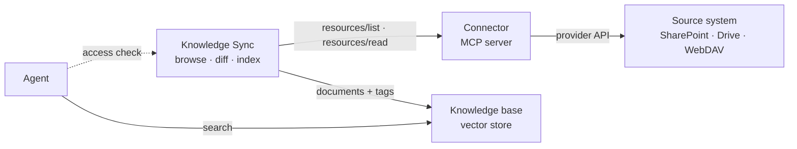

<Frame>
  
</Frame>

Connectors keep a knowledge base attached to the system where your content already
lives, instead of turning it into another silo. Rather than uploading files by hand, you
point Knowledges at a source and let it stay up to date.

There is no hand-written integration per source. Everything a source knows about itself —
how it is browsed, how a version is identified, how content comes back, who may read what
— lives in an **MCP server**, the same kind of server an agent uses as a tool. Knowledges
only knows how to traverse, diff, index and re-check. That is why the list of connectors
is not fixed, and why you can attach one that nobody published for you.

## Two ways to attach a source

| | **From the catalog** | **Your own MCP server** |
|---|---|---|
| Where it comes from | A capability published in your organization's catalog | A URL you paste |
| Who can use it | Everybody in the organization | Only you — nothing is published |
| Credential to the source | Your own account, signed in when you create the connection | Held by the workspace that runs the connector — an application credential, a service account, a token |
| Typical case | SharePoint, Google Drive | WebDAV, an internal server, a connector you wrote |
| Set-up | Pick it from the list | Paste the endpoint, it is checked on the spot |

Both end up in the same place: a **connection**, owned by you, feeding one knowledge
base. Everything after the first screen — browsing, scheduling, run history, access
control — is identical.

## Available providers

Any capability in your catalog that exposes an MCP server can become a connector,
provided that server publishes a [Knowledge profile](#the-knowledge-profile) — a small
declaration describing how its content is browsed, versioned and access-checked.

When a capability is saved, Knowledges probes its MCP server and records whether it is
compatible. Only compatible capabilities appear on the Connectors page.

| Connector | Status |
|-----------|--------|
| **SharePoint / OneDrive** | Available from the catalog — sites, document libraries, folders |
| **Google Drive** | Available from the catalog — shared drives, My Drive, folders |
| **WebDAV** | Available by URL — Nextcloud, ownCloud, any WebDAV server, configured in your own workspace |

<Note>
A capability saved **before** compatibility probing existed shows up nowhere, because it
has never been probed. Opening it and saving it again is enough: the probe runs on every
save. If a connector you expect is missing, this is the first thing to check.
</Note>

<Note>
Other MCP capabilities (Confluence, Jira, Outlook…) are listed in the catalog but do
**not** publish a Knowledge profile yet, so they cannot be used as Knowledge connectors.
They remain usable as agent tools.
</Note>

## The Connectors page

Open Knowledges and go to **Connectors** to see:

- **Active Connections** — currently configured syncs, with their status and what each one feeds
- **Available Providers** — compatible capabilities you can set up, plus *Your own MCP server*

Click an active connection to unfold its configuration, its schedule and its run history.

## Setting up a catalog connector

The wizard has five steps — **Name**, **Authentication**, **Source**, **Access**,
**Knowledge base** — and skips the ones a connector does not need: no access step, for
instance, for a connector that cannot check readers individually.

### 1. Choose a provider

1. Go to **Connectors**
2. Click **New Connection**
3. Pick the provider under **Choose a provider**

{/* SCREENSHOT 02 — provider-picker.png
<Frame>
  
</Frame>
*/}

### 2. Authenticate

A catalog connector always asks you to **sign in with your own account**. The step shows
*Sign in required* and a button; a window opens, you authenticate, you grant the
requested permissions, and you come back. The wizard moves on by itself as soon as the
credential lands.

There is nothing to choose here, and no second mode behind a setting: the account you
sign in with **is** the account the base will be fed from.

<Tip>
Use an account with read access to the content you want to sync. Connectors only read
documents — they never modify external content.
</Tip>

<Note>
**There is no way to feed a catalog connection from a service account.** SharePoint and
Google Drive are published for personal sign-in, and the wizard offers no alternative —
whoever creates the connection is the account the synchronization reads with, from then
on, including on scheduled runs.

If you need a base fed by an application credential rather than by a person, that is what
[connecting your own MCP server](#connecting-your-own-mcp-server) is for: configure the
connector in a workspace of your own, with the credential of your choice, and attach its
endpoint. The credential then belongs to that workspace, not to you.
</Note>

### 3. Select the source

Browsing walks one level at a time, from the connector's own top level down. Each screen
lists what is directly inside the current container:

- **This folder** picks the container you are standing in as the sync root
- **Open** descends into a child
- The breadcrumb, up to **Root**, walks back up
- **Load more** appears on containers with more children than one page holds

Confirm with **Use this location**.

<Frame>
  
</Frame>

### 4. Pick the destination

Choose an existing knowledge base, or create one from the same step.

### 5. Configure the connection

Once created, the connection unfolds a **Configuration** panel:

| Row | What it does |
|---------|-------------|
| **Resource** | The synced folder. The pencil opens **Change source** |
| **Knowledge Base** | The destination. The pencil opens **Change knowledge base** |
| **Authentication** | *Connected*, with a reconnect action. A connection attached by URL shows instead that the sync reads with the connector's own credential — every file that credential can see |
| **Per-user access control** | Checks each reader's own rights in the source at query time (see below) |
| **Auto-sync** | A switch and a frequency: *Hourly*, *Every 6 hours*, *Every 12 hours*, *Daily* |

<Note>
**Per-user access control is on by default** for connectors that support it — which
SharePoint and Google Drive both do. Each reader is then asked to connect their own
account the first time they query, and only sees what they could open themselves.

Turning it off means every synced document is served to anyone who can query the agent,
whatever their rights in the source. Only do that when the content is readable by the
whole organization. An administrator can also enforce the check organization-wide,
which overrides the per-connection setting.

Connections created before this became the default keep their existing setting — check
it on older connections.
</Note>

<Note>
Everything under the selected folder is synced, including nested folders. There is no
filter by file type or by path: narrow the selection instead, or use several connections
pointing at different folders. Which file formats are indexed is decided by the platform,
not per connection.
</Note>

### 6. Start the sync

Click **Sync Now** to begin the initial synchronization. Large sources are spread over
several runs — the panel says how many documents are left for the next ones.

## Connecting your own MCP server

A connection does not have to name a catalog entry. It can carry **its own MCP endpoint**,
pasted as a URL.

This exists for a precise reason. The catalog knows two visibilities, *built-in* and
*organization* — nothing narrower. Publishing a personal connector there would offer it,
and whatever credential it holds, to every colleague. A connection that carries its own
server is private by construction: connections are already scoped to their owner, so
nothing new had to be invented, and nothing is added to the shared catalog.

### Attaching one

<Steps>
  <Step title="Open the picker">
    **Connectors** → **New Connection** → **Your own MCP server**, at the bottom of the list.
  </Step>
  <Step title="Paste the MCP endpoint and click Check">
    The URL is verified **before** the wizard opens, so you never fill a whole form to
    learn the address was wrong.

    ```text
    https://api.<your-instance>/v2/workspaces/slug:<workspace>/webhooks/<app-instance>.mcp
    ```
  </Step>
  <Step title="Read the verdict">
    On success the dialog names the provider and the levels you will be able to browse —
    `folder › file` for WebDAV. Click **Continue**.
  </Step>
  <Step title="Continue like any other connection">
    Browse, pick a folder, pick a knowledge base, sync. From here nothing differs.
  </Step>
</Steps>

{/* SCREENSHOT 04 — custom-server-dialog.png
<Frame>
  
</Frame>
*/}

{/* SCREENSHOT 05 — custom-server-compatible.png
<Frame>
  
</Frame>
*/}

### What the check actually answers

Two different questions, answered separately, because they are fixed by two different
people:

| Message | What it means | Who fixes it |
|---|---|---|
| *The server could not be reached* | The URL is wrong, or nothing answers there | You |
| *This server does not expose a Knowledge profile* | It is an MCP server, but not a Knowledge connector | Whoever wrote the connector |
| *You are not allowed to read it* | It is a Knowledge connector, but you have no role on the workspace holding its configuration | Whoever administers that workspace |
| *It answered, but could not serve its content* | The connector itself is not fully configured — missing credentials, most often | Whoever configured the connector |

The last two look alike and are not. Reporting a broken configuration as a permission
problem sends an administrator hunting for rights they already hold.

### What is different about a self-carried connection

- **No sign-in step.** There is no OAuth dance to run: authorization is your *role on the
  workspace that holds the connector's configuration*, checked when you attach it and
  again every time you browse.
- **Nothing is published.** The endpoint is not listed as a provider, and no colleague
  sees the connection.
- **The verdict is frozen at creation** and re-checked on every call. A connection whose
  server stopped being compatible fails closed rather than reaching an MCP server with an
  empty profile.
- **You cannot name both.** A connection points at a catalog entry *or* carries a server.
  Supplying both is refused rather than silently resolved — two answers to "where do I
  call" is how a base ends up syncing against a server you thought you had replaced.

<Warning>
The role check runs on the **interactive** paths: attaching the connection, browsing,
editing it. A scheduled run carries no session and cannot prove a role, so it is
authorized as the platform's synchronization workspace instead. Consequence to know:
**a right revoked after the connection was created does not stop the scheduled sync**
until someone touches the connection interactively. Delete the connection to stop it for
certain.
</Warning>

## Walkthrough: sync a WebDAV account from your own workspace

This is the complete path for a source nobody published for you — a Nextcloud, an
ownCloud, a bare WebDAV server. You install the connector in **your** workspace, give it
**your** credentials, and attach it to a knowledge base by URL. Nothing is shared with the
organization, and no platform administrator is involved.

<Info>
**What you need first**

- A workspace you administer. The connector answers to that workspace's members and to
  nobody else.
- A reachable WebDAV base URL. On Nextcloud/ownCloud it is
  `https://cloud.example.com/remote.php/dav/files/<username>` — the *folder the account
  lands in*, not the server root.
- A credential for that account: a **username + app password**, or a **bearer token**.

On Nextcloud or ownCloud with two-factor authentication, the account password will be
rejected. Create a dedicated app password — *Settings → Security → Devices & sessions →
Create new app password* — and use that. It is revocable on its own, which is what you
want for a credential a knowledge base reads with.
</Info>

<Steps>
  <Step title="Install the WebDAV app in your workspace">
    Open **Builder**, select your workspace, go to **Apps** and install **WebDAV**.

    On install the connector provisions itself: it computes the MCP endpoint for *this*
    workspace, generates the link to its configuration app, and creates two empty secrets
    in the workspace — `webdavPassword` and `webdavToken` — ready to be filled.

    {/* SCREENSHOT 06 — webdav-install.png */}
  </Step>

  <Step title="Open the configuration app">
    In the app's configuration, the **Configuration app** field holds a generated link.
    Open it. Everything below happens there, with your own session — the page never holds
    a credential of its own, so the platform enforces your rights natively.

    {/* SCREENSHOT 07 — webdav-config-app.png */}
  </Step>

  <Step title="Fill in the credentials">
    In **WebDAV credentials**:

    | Field | What to put |
    |---|---|
    | **Base URL** | The folder the account lands in, e.g. `https://cloud.example.com/remote.php/dav/files/alice` |
    | **Authentication** | *Username + password*, or *Bearer token* |
    | **Username** / **Password** | The account and its app password (Basic mode) |
    | **Bearer token** | The token issued by your provider (token mode) |
    | **Allowed path** | Optional. Restricts everything — browsing, reading and knowledge sync alike — to one subtree |

    Click **Save credentials**. The secret goes to your workspace's own secret store; the
    base URL, the auth type, the username and the allowed path go to the app instance
    configuration, which is what the connector reads at runtime.

    <Tip>
    Set an **allowed path** whenever the account can see more than you want to expose.
    It is enforced by the connector itself, on every single call — not by the selection you
    make later in the wizard.
    </Tip>

    {/* SCREENSHOT 08 — webdav-credentials.png */}
  </Step>

  <Step title="Test the connection">
    Click **Test connection**. It reaches the server with the values that were just saved
    — not the ones the form happens to hold — and probes the allowed path if you set one,
    the account root otherwise.

    | Answer | Meaning |
    |---|---|
    | *Connected — the server answered on `/Documents`* | Done |
    | Refused with **401** | Wrong credentials, or a main password where an app password is required |
    | Refused with **404** | Wrong base URL, or an allowed path that does not exist |

    {/* SCREENSHOT 09 — webdav-test-ok.png */}
  </Step>

  <Step title="Copy the MCP endpoint">
    The **MCP endpoint** card holds the URL that identifies this workspace's connector:

    ```text
    https://api.<your-instance>/v2/workspaces/slug:<your-workspace>/webhooks/<app-instance>.mcp
    ```

    That URL names your workspace, which is what makes the credentials it resolves *yours*.

    {/* SCREENSHOT 10 — webdav-mcp-endpoint.png */}
  </Step>

  <Step title="Attach it in Knowledges">
    Go to **Knowledges → Connectors → New Connection → Your own MCP server**, paste the
    endpoint, click **Check**. You should read *Compatible connector — webdav*, with the
    levels `folder › file`.

    Click **Continue**, browse to the folder you want, pick or create the destination
    knowledge base, and confirm.
  </Step>

  <Step title="Sync, then verify">
    Click **Sync Now**. When the run finishes, open the knowledge base and open one
    document: you should see the file's actual content.

    {/* SCREENSHOT 11 — webdav-connection-synced.png */}
  </Step>
</Steps>

### What the WebDAV connector does and does not do

<AccordionGroup>
  <Accordion title="One service credential, shared by every reader">
    WebDAV has no portable per-user access model: the connector holds a single account for
    the whole workspace. Per-user access control can still be switched on, and it is worth
    it — every query re-checks that the document is still there and still inside the
    allowed path, so a file deleted or moved out of scope stops appearing without waiting
    for the next sync.

    But be clear about what it protects: **freshness and perimeter, not identity**. The
    verdict is the same for every reader. If a folder should not be readable by everyone
    who can query the agent, do not sync it — narrow the allowed path instead.
  </Accordion>

  <Accordion title="The path is the document's identity">
    A document is identified by its path on the server. Renaming or moving a file changes
    that identity: the old document leaves the base and the new one is ingested and
    re-embedded from scratch. On a folder, that applies to the entire subtree.

    This is a cost, not a bug — plan reorganizations accordingly.
  </Accordion>

  <Accordion title="File types are inferred from the name">
    Many WebDAV servers omit the content type, or return `application/octet-stream` for
    everything. The connector infers the type from the file extension instead, because the
    platform filters on it — without that inference, an entire library would be silently
    ignored.

    Give files their real extensions.
  </Accordion>

  <Accordion title="Large files are reported, not truncated">
    Content is carried inline, and the ceiling defaults to about **1.4 MB** per file.
    Above it, the file is reported as unfetchable with a reason and appears in the
    connection's synchronization errors — it is never half-indexed.

    The ceiling is a workspace setting. Raising it does not help beyond what the knowledge
    base itself accepts; oversized files simply fail one step later, with a less useful
    message.
  </Accordion>

  <Accordion title="Deletions are detected by absence">
    The connector reports no explicit deletion events. A file that disappears from a
    complete listing is removed from the base on that run. A listing that failed halfway
    deletes nothing.
  </Accordion>

  <Accordion title="Who may call it">
    Resource calls — browsing and reading — answer to **members of the workspace holding
    the configuration**, and to the platform's synchronization workspace on scheduled runs.
    Anonymous callers are refused, and so are workspace API keys: the check requires a real
    user identity.

    The **Authorized agents** list in the configuration app is a different gate. It
    controls which agents may call the connector *as a tool*; it has no effect on knowledge
    synchronization.
  </Accordion>
</AccordionGroup>

## Managing connections

### Viewing status

Each connection shows how much the knowledge base **holds in total**, then what each run
**changed**. The two are deliberately separate: a run that changes nothing on a base of
four hundred documents is a healthy run, not an empty base.

Every run reports three figures:

| Metric | Description |
|--------|-------------|
| **new** | Documents added to the knowledge base |
| **updated** | Documents that changed in the source and were re-indexed |
| **deleted** | Documents removed from the source, and therefore from the base |

Unchanged, failed and still-indexing counts appear alongside when they are not zero.

**Recent runs** lists the last five. Click one to unfold the documents it actually
touched, by name and by category — the list is fetched only when you open it, so the
history stays cheap to display. A run that changed nothing says so plainly.

<Frame>
  
</Frame>

### Triggering a manual sync

1. Find the connection
2. Click **Sync Now**
3. Wait for completion

### Updating the configuration

1. Click the connection
2. Modify the selection or the settings
3. Save
4. Run a sync to apply the change

### Deleting a connection

1. Click the connection
2. Click **Delete Connection**, at the bottom of the panel
3. Confirm

<Warning>
Deleting the connection stops the synchronization but **keeps the synced documents** in
your knowledge base. To remove them too, delete them from the knowledge base.
</Warning>

<Note>
This affects the synchronization only. The account you may have connected to *read* a
base through an agent is a separate credential — see
[Connected accounts](/products/agent-factory/connector-accounts).
</Note>

## SharePoint connector

Browse **sites**, then their **document libraries**, then any folder inside them.
SharePoint pages and lists are not synced.

### Permissions required

Reading site and file content through Microsoft Graph requires permissions your admin
may have to approve in Microsoft Entra. The exact scopes depend on how the connector's
OAuth client is configured — an organization can register its own and narrow them.

<Note>
Synchronization only ever reads. If the consent screen mentions write permissions, they
come from the connector's other uses as an agent tool, not from the sync.
</Note>

### Configuring SharePoint

1. Connect with your Microsoft account
2. Browse to a site, then a document library
3. Open folders to narrow the selection, and confirm with **Use this location**

### Handling large libraries

- Select a folder rather than a whole library
- Consider multiple connections for different topics
- The first sync is spread over several runs; let the schedule finish the job

## Google Drive connector

Browse **shared drives** and **My Drive**, then any folder inside them. Google-native
documents (Docs, Sheets, Slides) are exported to an indexable format on the way in;
files already in a standard format are taken as they are.

### Configuring Google Drive

1. Connect with your Google account
2. Browse to a drive, then a folder
3. Confirm with **Use this location**

Per-user access control works the same way as for SharePoint: each reader's own rights
are checked against Google Drive at query time.

## How connectors work

Everything specific to SharePoint, Google Drive or WebDAV lives in an **MCP server**. The
synchronization side knows how to browse resources, compare revisions and hand content to
a knowledge base; it never learns what a *site*, a *shared drive* or a *WebDAV collection*
is.

| Part | Role |
|------|------|
| **Source system** | Holds the documents, and remains the authority on who may read them |
| **Connector** | An MCP server exposing that source as MCP *resources*, and answering "may this user read that resource?" |
| **Knowledge Sync** | Browses, filters, diffs, indexes, schedules — and asks the access question at query time |
| **Knowledge base** | The vector store the agent actually searches |



Nothing in that path is proprietary: browsing is `resources/list`, fetching a document
is `resources/read`, and the access check is a single MCP tool call. A connector that
already exists as an agent tool becomes a knowledge connector by declaring one extra
resource — not by being rewritten.

### The Knowledge profile

Compatibility is **declared, not hard-coded**. A connector publishes a small JSON
document at a fixed address, `<scheme>://profile/knowledge`, stating:

- the **hierarchy** it exposes — `site`, `drive`, `folder`… — and which of those levels
  can be picked as a sync root;
- how a **revision** is identified, so a run can tell a document that changed from one
  that did not;
- how **content** comes back: inline text, or a link to download the bytes;
- its **pagination** limits, and whether it supports incremental listing;
- the **tool** to call to check one user's access to one resource.

That last entry is what makes **per-user access control** offerable on a connection: a
connector that names the tool and the action can answer the question live, and the
setting becomes available. A connector that stays silent about it is still perfectly
syncable — the setting simply isn't offered.

### Compatibility probing

Discovery opens the MCP server and reads that profile: `initialize` — does this server
serve resources at all? — then `resources/templates/list` to find the profile, then
`resources/read`.

It runs in two places, through the same implementation:

- when a **capability is created or saved** in the catalog, and the verdict is recorded on
  the entry, so the Connectors page lists nothing but entries that passed;
- when you **check a URL** for a self-carried connection, and the verdict is frozen onto
  the connection.

The probe runs **anonymously**, on purpose: the profile is public metadata about a
server's shape, never content. For the same reason, servers on loopback or private
addresses are refused outright, and a failed probe never echoes back the server's URL or
its response.

Because discovery is anonymous, it says nothing about *you*. That is why attaching a URL
runs a second call, carrying your identity, which the connector answers against your
rights. Anyone may probe a server; only someone allowed to read it may attach it to a
knowledge base.

### What a sync run does

1. **Traverse** the selection with `resources/list`, starting from the selected roots and
   descending into every container below them.
2. **Filter** on MIME type against the platform's supported list. This filter lives on the
   Knowledge Sync side and is the authoritative one — connectors describe their content,
   they do not decide what is indexable.
3. **Diff** each file's revision tag against what the base already holds. Unchanged files
   are never re-read and never re-indexed.
4. **Index** the new and changed files, then wait for the knowledge base to confirm
   indexing before recording the new revision. A document is only considered synced once
   it is actually searchable.
5. **Delete** documents that disappeared from the source — but only after a *complete*
   traversal. A listing that failed halfway deletes nothing.

Every indexed document keeps two tags: the connection it came from, and its canonical
resource URI in the source. Those two tags are what the access check operates on later.

Runs are deliberately bounded — a large source is spread over several of them, and the
schedule finishes the job. Nothing is lost between runs: the cursor and the committed
revisions are what a subsequent run resumes from.

### Two credentials, two moments

The same connector is used twice, on behalf of two different people, and this is the
part worth remembering:

| Moment | Acts as | Why |
|--------|---------|-----|
| **Synchronizing** | The person who created the connection | The base's contents must be stable and predictable, not a function of who happened to trigger a run. Scheduled runs reuse that same identity, with no session involved. |
| **Answering a question** | The person asking | Filtering can only be correct if it is evaluated against the reader's own rights in the source. |

This is why an agent asks a reader to connect their account before searching a
connector-backed base: it needs *their* identity, and the connection owner's credential
cannot answer for them. It is also why the two credentials are managed in two different
places — see [Connected accounts](/products/agent-factory/connector-accounts).

<Note>
A connector holding a single service credential — WebDAV is the reference case — has
nothing to ask the reader for. There is no account card in chat, and the access check
answers the same thing for everyone.
</Note>

<Note>
For the connector side of this picture — how an MCP connector is built, authenticated
and reviewed — see
[Connector architecture](/apps-store/marketplace/connectors/architecture).
</Note>

## Building a compatible connector

Any MCP server can become a knowledge connector, including one you write yourself or one
a vendor already ships. There is no Prisme.ai SDK to adopt and no interface to implement:
you serve standard MCP methods, plus **one extra resource** that describes how your
source behaves.

<Steps>
  <Step title="Announce the resources capability">
    Your `initialize` response must include `resources` in `capabilities`. This is the
    single bit discovery keys on — a server that only announces `tools` is never examined
    further.

    ```json
    { "protocolVersion": "2025-06-18",
      "capabilities": { "resources": {}, "tools": {} },
      "serverInfo": { "name": "my-connector", "version": "1.0.0" } }
    ```
  </Step>

  <Step title="Publish the Knowledge profile">
    Declare a resource template whose URI is exactly `<scheme>://profile/knowledge`, with
    `mimeType: application/json`, in your `resources/templates/list` response. Serve it
    from `resources/read` as JSON text. See the full descriptor below.

    Both must answer **anonymously**, and before anything looks at credentials — that is
    what lets discovery read them.
  </Step>

  <Step title="Browse with resources/list">
    Return the direct children of a container, so the setup wizard can walk your hierarchy
    and a sync run can traverse it.
  </Step>

  <Step title="Serve content with resources/read">
    Give back either a download link or the text itself — see the rule below, it is the
    one place where a plausible-looking implementation silently indexes the wrong thing.
  </Step>

  <Step title="Answer the access question (optional)">
    Expose a tool that rules on what one named user may read. Without it your connector
    still syncs perfectly; it simply cannot offer per-user access control.
  </Step>
</Steps>

### The profile descriptor

```json
{
  "knowledge_compatible": true,
  "provider": "my-connector",
  "canonical_uri": "myapp://drive/{driveId}/item/{itemId}",
  "hierarchy": ["drive", "folder", "item"],
  "tools": ["documents"],
  "required_tools": ["documents"],
  "authentication": {
    "modes": ["oauth", "oauthCentral"],
    "resource_access": "delegated checkAccess"
  },
  "list": {
    "parent_parameter": "uri",
    "default_page_size": 50,
    "maximum_page_size": 200,
    "delta_on_drive": false
  },
  "read": {
    "binary": "inline_data_url",
    "inline_text_max_characters": 200000,
    "inline_download_max_bytes": 4194304
  },
  "revision": { "primary": "revision", "fallback": "revision" },
  "access": { "tool": "documents", "action": "checkAccess" }
}
```

| Field | What it decides |
|-------|-----------------|
| `knowledge_compatible` | Must be `true`. Anything else, and the server is recorded as not a connector. |
| `hierarchy` | The container levels you expose, from the top down. Drives the wizard's browsing screens and which levels can be picked as a sync root. |
| `authentication.modes` | Descriptive: the credential shapes your server can work with. It does **not** drive the wizard — whether a sign-in step appears is read from the catalog entry's own `auth.type`, or is skipped entirely on a connection attached by URL. |
| `authentication.resource_access` | Plain-language description of *what* the access check actually proves. Shown to whoever attaches the connector; say so explicitly when the verdict is identical for every reader. |
| `list.*` | Pagination limits, and whether you support incremental listing on a drive. |
| `read.*` | Size ceilings for inline content, and how binaries are represented. Announce the ceiling you actually enforce, not the one the platform would accept. |
| `revision` | Which field carries your version marker. |
| `access.tool` + `access.action` | The tool call to make for a per-user access check. **Both or neither** — half a mapping is rejected as an invalid profile. |

<Note>
The catalog stores an allowlisted, bounded copy of this document — known fields only,
strings truncated, numbers range-checked. A field you invent is not an error, it is
simply dropped and never reaches anything.
</Note>

### Listing resources

A root listing arrives with **no `uri` parameter at all**: that is how the host asks
"what are your top-level resources?" before anything has been picked. Treat a missing
parent as the root, not as an empty match — filtering `parent == params.uri` against a
missing value is the single most common reason a wizard opens on an empty screen.

Each item in `resources` carries:

| Field | Purpose |
|-------|---------|
| `uri` | Canonical, stable, and the identity of the document forever after |
| `name` | Display name, and the file name shown in run details |
| `mimeType` | Filtered against the platform's supported list |
| `revision` | Version marker — see below |
| `_meta.kind` | `site`, `drive`, `folder` or `file` |
| `_meta.size` | Size in bytes |
| `_meta.deleted` | Announces a removal explicitly |

Traversal descends into anything whose `_meta.kind` is a container level, or whose
`mimeType` is `inode/directory`. **A kind you invent is not traversed** — the engine has
no way to guess that it holds children. Paginate with `nextCursor` at the top level of
`result`; the host hands your cursor back verbatim and never interprets it.

### Serving content

<Warning>
Return a download URL in `_meta.downloadUrl` **or** inline text in `contents[0].text` —
**never both**. Indexing takes inline content over a URL when it receives the two, so a
server offering both has its text indexed and its link ignored. A connector answering
`resources/read` with a JSON descriptor of the resource in `text` will therefore index
every document as its own metadata sheet — and text files fail *silently* that way,
because a descriptor is perfectly valid text.
</Warning>

Bytes first. Inline text only when there are none to go and fetch — the case it exists
for is a source with no pre-signed link, such as a Google-native document exported on the
fly, or a WebDAV server that requires an `Authorization` header on every byte. If bytes
exist but are unreachable, say so in `_meta.unfetchable_reason` rather than staying
silent. `_meta.webUrl` is used as the document's citation link.

### Revisions

The version marker is read from `revision` at the top level of a listed resource, falling
back to `_meta.revision`, `_meta.cTag`, then `_meta.eTag`. Any of them works; what matters
is that the value **changes when the content changes, and only then**. A marker that never
changes leaves a base permanently stale; one that changes on every listing re-indexes the
whole source on every run.

### The access check

If your profile names an access tool, it is called with the reader's id and a batch of
canonical URIs, and its answer is taken as final:

```json
{ "name": "documents",
  "arguments": {
    "action": "checkAccess",
    "targetUserId": "<the reader>",
    "resourceUris": ["myapp://drive/main/item/handbook"] } }
```

Answer in `structuredContent`:

```json
{ "allowed_resource_uris": ["myapp://drive/main/item/handbook"],
  "requires_oauth": false }
```

Return only what the user may read — omission is denial, and everything not named is
dropped from the answer the agent sees. An **empty** `resourceUris` asks about the
credential alone: reply `requires_oauth: true` with a `connect_url` when that reader has
no usable token, and the host raises a connection card instead of failing the search.

<Note>
Report a missing or revoked credential as a JSON-RPC error `-32001` carrying
`data.requiresOAuth: true`. The host turns that into "reconnect your account" rather than
into a generic sync failure — the difference between a user who knows what to do and a
run that looks broken.
</Note>

<Warning>
Never let the access action fall through to a generic "unknown action" error. Knowledge
Sync reads that as a connector it cannot question, and fails closed — the whole knowledge
base goes silent, rather than merely losing a check.
</Warning>

### Making it reachable

Two ways, and they are not equivalent:

| | **Catalog entry** | **By URL** |
|---|---|---|
| How | Add your server to the **capabilities catalog** as an MCP capability, with its URL as the default `server` value | Paste the URL in *Your own MCP server* |
| Who sees it | The whole organization | Only the person who attached it |
| Credential | Each person signs in with their own account | Held by the workspace running the connector |
| Access control | The user's own rights in the source | The caller's role on that workspace |

Discovery runs inside both, so the verdict is immediate either way.

The choice is not only about visibility. A catalog entry means **every connection is fed
by the person who created it** — that is the only shape the catalog supports today. If
the base should be fed by an application credential, a shared account or a token nobody
owns personally, the URL is the way: the connector holds that credential in its own
workspace, and no reader ever signs in.

<Warning>
The probe is **anonymous** and refuses loopback and private addresses. A server running on
your machine, or reachable only inside a private network, cannot be attached — it must
be publicly resolvable over HTTPS. Publish behind a tunnel or a staging host to test.
</Warning>

<AccordionGroup>
  <Accordion title="Checklist before publishing">
    - `initialize` announces `resources`.
    - `resources/templates/list` declares `<scheme>://profile/knowledge` as `application/json`, anonymously.
    - `resources/read` on that URI returns the descriptor as JSON text, with `knowledge_compatible: true`, anonymously, and **before** any credential is resolved.
    - A root `resources/list` — no `uri` — returns your top-level containers.
    - Containers use `_meta.kind` from your declared hierarchy, or `inode/directory`.
    - Files carry a `revision` that changes with content.
    - `resources/read` returns a download URL **or** inline text, never both.
    - The access action is handled before generic tool routing.
    - Notifications (`notifications/initialized`) answer HTTP `202` with no body.
    - The server is publicly reachable over HTTPS.
  </Accordion>
  <Accordion title="Start from an existing connector">
    SharePoint, Google Drive and WebDAV are the reference implementations, and they cover
    the three content strategies: SharePoint hands back pre-signed download links, Google
    Drive exports native documents to text inline because Drive offers no link a third
    party can fetch, and WebDAV inlines the bytes themselves because every byte needs an
    `Authorization` header. If your source resembles one of them, copy that one.
  </Accordion>
</AccordionGroup>

## Sync behavior

### Incremental sync

After the initial sync, connectors only process changed files:

- New files are added
- Modified files are updated
- Deleted files are removed

This makes scheduled syncs fast.

### Handling deletions

When a file is deleted from the source, it is removed from the knowledge base on the
next synchronization. This is not optional: a base that keeps serving a document its
source has deleted is a base nobody can trust.

## Access control at query time

When a connection has per-user access control enabled, synced documents are not readable
by everyone who can talk to the agent. Every search re-checks, document by document, what
the person asking is allowed to see in the source system — a file you lost access to in
SharePoint stops appearing in answers, without waiting for the next sync.

That check needs to know who is asking, which means the reader has to have connected
their own account — for connectors that can tell readers apart. A connector holding one
service credential answers the same for everyone, and asks for nothing.

### The connection card in chat

The first time an agent reads a base backed by a per-user connector in a conversation, it
asks the reader to connect their account — **before** running any search, so the request
never depends on what was asked. Declining does not block anything: the search runs over
the documents that are not restricted.

Readers manage those accounts from the chat itself. See
[Connected accounts](/products/agent-factory/connector-accounts) for what they see and
how the credential differs from the one feeding the base.

<Tip>
An agent never learns that documents it cannot show exist. A search where everything was
filtered out reports exactly what a search that matched nothing reports.
</Tip>

## Troubleshooting

### The agent finds nothing in a connector-backed base

Check whether you connected your account when the agent asked. Without it, only
unrestricted documents are searched. Start a new conversation to get the card again,
or connect the account from the Connectors page.

### No connector appears in the list

The Connectors page only lists capabilities whose MCP server was probed **and** found
compatible. A capability saved before probing existed has never been probed, so it stays
invisible.

Open the capability and save it again — the probe runs on every save. If it still does
not appear, its MCP server does not publish a Knowledge profile and cannot be used as a
connector.

If the connector is yours and personal, you do not need the catalog at all: attach it
with **Your own MCP server**.

### A URL is refused

| Message | What to do |
|---|---|
| **The server could not be reached** | Check the URL, and that it is publicly resolvable over HTTPS. Loopback and private addresses are refused. |
| **Does not expose a Knowledge profile** | The server is not a Knowledge connector. Check it serves `<scheme>://profile/knowledge` anonymously. |
| **You are not allowed to read it** | Ask for a role on the workspace holding the connector's configuration. |
| **Answered, but could not serve its content** | The connector is not fully configured — most often its credentials are missing. Open its configuration app and run its connection test. |

### A browsing column says the source could not be listed

That is a failure, not an empty folder — the two used to look identical. The connector
answered with an error: its credentials are wrong or missing, or you lost access to that
level. Open the connector's configuration and test the connection there.

### Connection errors

| Issue | Solution |
|-------|----------|
| **Capabilities catalog is not available** | Knowledges could not reach the capability catalog. Retry; if it persists, report it — this is not something you can fix from the interface. |
| **Authentication failed** | Re-authenticate the connection |
| **Access denied** | Check your permissions in the external system |
| **Service unavailable** | The external service may be down — try later |

### Sync errors

| Issue | Solution |
|-------|----------|
| **File not found** | File may have been deleted or moved |
| **Permission denied** | Your account lost access to this file |
| **Unsupported format** | File type isn't supported for indexing — check the extension is the real one |
| **File too large** | File exceeds the connector's inline ceiling, or the platform's limit |

Open **Synchronization errors** on the connection to see which files failed and why.

### Stuck syncs

A run that dies mid-flight leaves the connection marked as syncing. It unblocks itself:
after an hour, the run is treated as abandoned and **Sync now** works again, as does the
schedule. There is nothing to cancel by hand.

## Best practices

<AccordionGroup>
  <Accordion title="Narrow at the source, not at the selection">
    A connector's own scope restriction — an allowed path, a service account with limited
    rights — is enforced on every call. A folder you simply did not tick in the wizard is
    one edit away from being synced.
  </Accordion>
  <Accordion title="Don't sync everything">
    Focus on high-value content that is relevant to your use case. Several narrow
    connections beat one broad one.
  </Accordion>
  <Accordion title="Organize by topic">
    Create separate knowledge bases for different departments or topics, with dedicated
    connections for each.
  </Accordion>
  <Accordion title="Monitor sync health">
    Check connections regularly. Address errors before they accumulate.
  </Accordion>
  <Accordion title="Match frequency to change rate">
    More frequent syncs keep content current but use more resources.
  </Accordion>
  <Accordion title="Use a revocable credential">
    App passwords and scoped tokens can be revoked on their own. An account password
    cannot, without locking the person out of everything else.
  </Accordion>
</AccordionGroup>

## Next steps

<CardGroup cols="2">
  <Card title="Configure RAG settings" icon="sliders" href="./rag-settings">
    Optimize retrieval for your synced content
  </Card>
  <Card title="Connect to agents" icon="robot" href="/products/agent-factory/capabilities">
    Use your synced knowledge in AI agents
  </Card>
  <Card title="WebDAV connector" icon="folder-tree" href="/apps-store/marketplace/connectors/webdav">
    The connector's other uses — as an agent tool, and from Builder automations
  </Card>
  <Card title="Connector architecture" icon="cubes" href="/apps-store/marketplace/connectors/architecture">
    How an MCP connector is built, authenticated and reviewed
  </Card>
</CardGroup>
