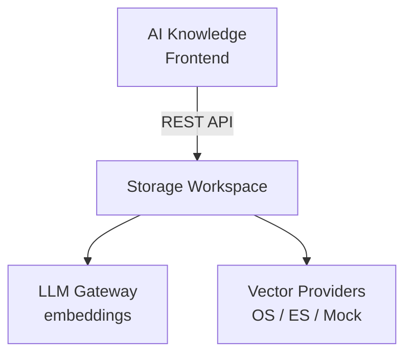

AI Knowledge provides a frontend for managing knowledge bases — uploading documents, configuring RAG parameters, and monitoring retrieval quality. It is the user-facing interface for the [Storage](/services/storage/overview) backend workspace.

**Workspace backend:** `storage` (46 automations)
**Frontend:** `builtin-apps/ai-knowledge`

## What AI Knowledge Does

AI Knowledge allows users to:

- **Upload documents** — PDF, DOCX, TXT, CSV, and other formats
- **Create vector stores** — Collections of indexed documents for RAG
- **Configure RAG parameters** — Chunk size, overlap, embedding model, similarity threshold
- **Monitor indexing** — Track document processing status
- **Test retrieval** — Search knowledge bases and evaluate result quality
- **Manage skills** — Create reusable search configurations

## Relationship to Storage

AI Knowledge is a **frontend-only** product — all backend logic lives in the [Storage workspace](/services/storage/overview). The builtin app makes REST API calls to Storage endpoints:

| AI Knowledge Feature | Storage API |
|----------------------|-------------|
| Upload documents | `POST v1/files` |
| Manage files | `GET/PUT/DELETE v1/files/:file_id` |
| Create knowledge bases | `POST v1/vector_stores` |
| Add files to knowledge base | `POST v1/vector_stores/:id/files` |
| Search knowledge base | `POST v1/vector_stores/:id/search` |
| Manage skills | `GET/POST/PUT/DELETE v1/skills` |

## Key Concepts

### Files

Files are uploaded documents. They are parsed, chunked, and can be indexed into one or more vector stores. Supported formats depend on the [Parsers](/tools/overview) workspace configuration.

### Vector Stores

A vector store is a collection of indexed document chunks. It uses one of the [vector providers](/tools/vector-stores) (OpenSearch, Elasticsearch, or Mock) for storage and similarity search.

### Skills

Skills are reusable search configurations that define how an agent queries a knowledge base:
- Which vector store(s) to search
- Number of results (`top_k`)
- Minimum similarity score
- Filtering rules
- Result formatting

Skills are referenced by Agent Factory when configuring the `knowledge_search` tool on an agent.

## Architecture

For full API documentation, see:
- [Storage Overview](/services/storage/overview)
- [Files API](/services/storage/files)
- [Vector Stores API](/services/storage/vector-stores)
- [Skills API](/services/storage/skills)
