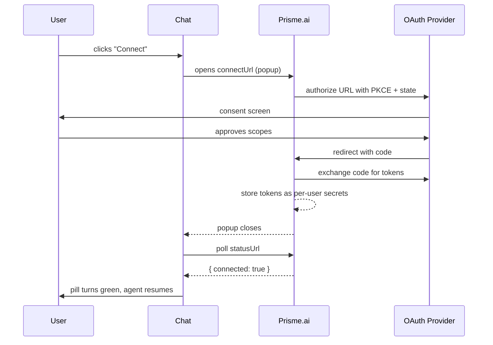

Some agents in Chat call **MCP servers** that need a personal connection — Notion, GitHub, Outlook, Jira, etc. When that happens mid-conversation, the agent pauses and Chat shows a **Connect** button so the user can authorize Prisme.ai to talk to the service on their behalf. This page explains what the user sees, what happens behind the scenes, and what an admin needs to configure once per service.

<Note>
This applies only to MCP servers (or other connectors) that an admin has wired with OAuth. For MCP servers that take a static API key in their configuration, no in-chat consent flow is shown — the agent just calls them.
</Note>

## What the user sees

When the agent invokes a tool that requires an OAuth connection, a **connector card** appears in the conversation flow:

- **Service name + icon** (e.g. "Notion")
- A status pill — **Connection required** (grey), **Verifying connection…** (loading), or **Connected** (green check)
- An optional list of **Required permissions** (the OAuth scopes)
- A **Connect** button (or **Disconnect** once authorized)

<Note>**Screenshot to add:** screenshot of a Chat conversation with a ChatConnectorAuth card inline showing the Notion icon, "Connection required" pill, the requested scopes as small badges, and the blue "Connect" button.</Note>

### The flow

1. The user clicks **Connect**. A popup window opens (600 × 700) on the OAuth provider's consent page.
2. The user signs in (if needed) and grants the requested scopes.
3. The provider redirects back to a Prisme.ai callback. The popup closes.
4. Chat polls the connection status. The pill flips to **Verifying connection…** then to a green **Connected**.
5. The agent automatically resumes — the original tool call now succeeds.

If the user closes the popup without finishing, nothing breaks: the card stays in **Connection required** state and they can retry by clicking **Connect** again.

### Disconnecting

Once connected, the card shows a **Disconnect** button. Clicking it opens a small popup that revokes the stored token. The pill returns to **Connection required**, and the next tool call will trigger the consent flow again.

<Tip>
Connections are **per user**. Each member of your workspace authorizes services with their own account, so a Notion tool always reads/writes pages the *current* user has access to — never another teammate's.
</Tip>

## What happens behind the scenes

The popup talks to a backend OAuth helper that handles the standard authorization-code flow with PKCE:



Concretely:

- **Tokens** are stored as user-scoped secrets in the platform — never in the browser, never visible in the workspace logs.
- **Refresh tokens** are used transparently when an access token expires. The user is only re-prompted if the refresh itself fails (revoked grant, scope changes, etc.).
- **State / PKCE** parameters guard the callback against CSRF and code-interception attacks.

## Configuring an OAuth-enabled MCP server (admin)

To make a Connect button appear, an admin needs to provide the OAuth client credentials and endpoints once per service. The setup lives in the connector's app configuration — typically the `oauth-core` workspace or a wrapper around it.

You'll need to fill the following from the provider's developer console:

| Field | Where to get it |
|---|---|
| `client_id` | Created in the provider's app/integration settings |
| `client_secret` | Same place; treat as a secret |
| `authorize_endpoint` | Provider's OAuth docs (e.g. `https://api.notion.com/v1/oauth/authorize`) |
| `token_endpoint` | Provider's OAuth docs (e.g. `https://api.notion.com/v1/oauth/token`) |
| `scopes` | The minimum set of permissions your tools need, space-separated |
| `redirect_uri` | The Prisme.ai callback URL — paste it into the provider's "Allowed redirect URIs" |
| `namespace` | A short slug that identifies this service (`notion`, `github`, `jira`) |

Example of an OAuth-enabled connector entry:

```yaml
appSlug: oauth-core
config:
  namespace: notion
  oauth:
    clientId: '{{secrets.NOTION_CLIENT_ID}}'
    clientSecret: '{{secrets.NOTION_CLIENT_SECRET}}'
    authorizeEndpoint: https://api.notion.com/v1/oauth/authorize
    tokenEndpoint: https://api.notion.com/v1/oauth/token
    scopes: read_content update_content
```

<Warning>
Always store `client_id` and `client_secret` via the [Secrets module](/products/ai-builder/module-secrets), not as plain text in the YAML. Rotate them on the provider side if a workspace export ever leaks.
</Warning>

The MCP server URL itself is a separate setting on the connector — Prisme.ai injects the freshly fetched access token in the request when the agent invokes a tool from that server.

## Troubleshooting

<AccordionGroup>
  <Accordion title="The Connect button does nothing / popup blocked">
    Most browsers block popups not triggered by a direct click. Make sure the user clicks **Connect** themselves. If they have a popup blocker, allow popups for the Chat domain.
  </Accordion>
  <Accordion title="Authorization succeeds but the pill stays grey">
    The status check polls a `statusUrl` after the popup closes. If that URL isn't reachable from the browser (CORS, SSO redirect loop), the pill never flips. Check the browser console for failed `fetch` calls.
  </Accordion>
  <Accordion title="The agent keeps asking to re-connect every conversation">
    The provider issued a short-lived access token without a refresh token (some providers gate this on a specific scope, like `offline_access`). Add the missing scope to the connector config so refresh tokens are issued.
  </Accordion>
  <Accordion title="A connection works for me but not my colleague">
    Connections are per user. Each user must run through the consent flow on their first invocation — there's no shared workspace token for OAuth connectors.
  </Accordion>
  <Accordion title="The user authorized scopes but a specific call still 403s">
    The provider often grants only the scopes the user *explicitly* approved. Check the provider's console — some surface a per-grant scope diff. Reduce your `scopes` list to only what you need, or escalate by re-prompting the user.
  </Accordion>
</AccordionGroup>

## Related

<CardGroup cols="2">
  <Card title="Agent capabilities" icon="puzzle-piece" href="/products/agent-factory/capabilities">
    How MCP servers fit alongside other tool types on an agent.
  </Card>
  <Card title="Custom tools" icon="wrench" href="/products/agent-factory/custom-tools">
    When you only need one or two endpoints, skip MCP and wire a custom tool directly.
  </Card>
  <Card title="Imports & integrations" icon="plug" href="/products/ai-builder/integrations">
    Manage installed apps, OAuth-based imports, and credential storage.
  </Card>
  <Card title="SecureChat overview" icon="comments" href="./overview">
    Where Chat fits in the broader Prisme.ai ecosystem.
  </Card>
</CardGroup>
