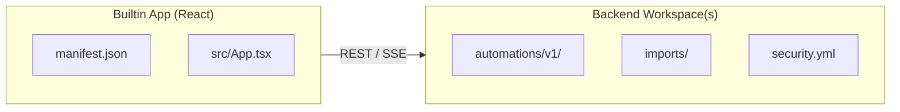

The Prisme.ai platform is organized into **products** (user-facing applications) and **services** (shared backend infrastructure). Each product combines a React frontend (builtin app) with one or more backend workspaces.

## Product Map

<CardGroup cols={2}>
  <Card title="Agent Factory" icon="robot" href="/products/agent-factory/overview">
    Create, configure, and deploy AI agents with graduated capability profiles — from simple Q&A bots to multi-agent orchestrators
  </Card>
  <Card title="AI Governance" icon="shield-check" href="/products/ai-governance/overview">
    Manage organizations, members, roles, API keys, SSO, and platform-wide observability
  </Card>
  <Card title="AI Collection" icon="table" href="/products/ai-collection/overview">
    Store and query structured data via MCP — the database layer for AI agents
  </Card>
  <Card title="AI Insights" icon="chart-line" href="/products/ai-insights/overview">
    Analytics, conversation analysis, agent relationship graphs, memory intelligence, and GDPR compliance
  </Card>
</CardGroup>

## How Products Are Built

Every product follows the same pattern:

- **Frontend**: A React app compiled as a JS bundle, loaded dynamically by the platform shell
- **Backend**: One or more workspaces exposing REST APIs via `endpoint:` automations
- **Data**: Collections (via the Collection app) for persistence
- **Auth**: User sessions (OIDC), API keys (`iak_*`), or workspace JWTs

A single frontend can consume **multiple** backend workspaces. For example, the Agent Factory frontend connects to the Agent Factory, Agent Evaluations, AI Governance, Capabilities, LLM Gateway, and Storage workspaces.

## Product ↔ Workspace Mapping

| Product | Frontend App | Primary Backend | Additional Backends |
|---------|-------------|----------------|---------------------|
| Agent Factory | `agent-factory` | `agent-factory` | agent-evaluations, ai-governance, capabilities, llm-gateway, storage |
| SecureChat | `secure-chat` | `agent-factory` | ai-governance, prompt-library, llm-gateway, ai-insights, storage |
| AI Governance | `ai-governance` | `ai-governance-v2` | llm-gateway, agent-factory |
| AI Collection | `ai-collection` | `ai-collection-v3` | — |
| AI Insights | `ai-insights` | `ai-insights-v2` | agent-factory |
| Engage | `ai-engage` | `ai-governance-v2` | — |
| Builder | `builder` | (platform hooks) | — |

## Shared Services

Products rely on shared backend services that are not user-facing:

| Service | Workspace | Purpose |
|---------|-----------|---------|
| [LLM Gateway](/services/llm-gateway/overview) | `llm-gateway` | Multi-provider LLM routing, quotas, carbon tracking |
| [Storage](/services/storage/overview) | `storage` | Files, vector stores, RAG pipeline |
| [Capabilities](/services/capabilities/overview) | `capabilities` | Tool registry and catalog |
| [Prompt Library](/services/prompt-library/overview) | `prompt-library` | Prompt templates via MCP |

And pluggable tool providers:

| Tool | Workspace(s) | Purpose |
|------|-------------|---------|
| [Vector Stores](/tools/vector-stores) | `vector-opensearch`, `vector-elasticsearch`, `vector-mock` | Swappable vector storage |
| [Guardrails](/tools/guardrails) | `tools-guardrails` | AI safety checks |
| [Memories](/tools/memories) | `tools-memories` | Long-term agent memory |
| [Web Search](/tools/search) | `tools-search-bing` | Bing web search |
| [Evaluations](/tools/evaluations) | `agent-evaluations` | Agent testing with LLM judge |
