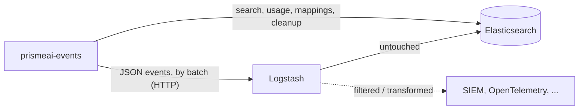

By default, `prismeai-events` writes the platform events directly into [Elasticsearch or OpenSearch](/self-hosting/databases/elasticsearch). It can instead **push them to Logstash**, which forwards them to the same Elasticsearch data streams and can also send them, filtered or transformed, to your own tools: a SIEM that only accepts push ingestion, an OpenTelemetry conversion towards an observability platform, etc.



The two modes are exclusive: in Logstash mode, `prismeai-events` no longer writes events into Elasticsearch itself. It still reads them there (activity, usage, search), and still manages the index templates, lifecycle policies and per-workspace mappings, so it **keeps its Elasticsearch access** (`EVENTS_STORAGE_ES_*`).

## How it works

- Events are pushed by batch (`EVENTS_BUFFER_FLUSH_AT` / `EVENTS_BUFFER_FLUSH_EVERY`, as in direct mode) as a JSON array to the Logstash [http input](https://www.elastic.co/guide/en/logstash/current/plugins-inputs-http.html).
- Each event is the exact Prisme.ai JSON document stored today, after the configured preprocessing rules (redaction), with one extra field, `prismeai_index`, giving the target data stream (one per workspace).
- The provided pipeline writes each event to that data stream with the event id as document id, exactly as the direct mode does. An event pushed twice (e.g. retried after a timeout) is therefore written once, unless the data stream rolled over to a new backing index in between.
- When Logstash is unreachable, times out or answers `408`, `429`, `502`, `503` or `504`, the batch is retried with an exponential backoff (from 1s, ×1.5, capped at 30s), up to `EVENTS_STORAGE_MAX_RETRIES` times (20 by default in this mode: about 7 to 11 minutes, depending on whether Logstash refuses connections or lets them time out). Beyond that, the events of the failing batches are dropped and an error is logged.
- Meanwhile, the platform keeps working and new events wait in `prismeai-events` memory, up to `EVENTS_BUFFER_MAX_PENDING` events (50 000 by default): beyond, the oldest are dropped, logged and counted by the `events_persistence_dropped_total` metric. Size this limit according to your pods' memory and average event size. The `events_persistence_queue_total` metric gives the current number of waiting events.
- Any other error status (`400`, `401`, `413` ...) is logged and the batch is not retried.
- The `prismeai-events` readiness probe checks Elasticsearch, not Logstash: monitor Logstash itself, or the `events_persistence_requests_failed_total` metric.

## Configure prismeai-events

| Setting | Default | Description |
|---------|---------|-------------|
| `EVENTS_STORAGE_WRITE_MODE`<br/>Helm: `prismeai-events.env` | `direct` | `direct` writes events into Elasticsearch/OpenSearch, `logstash` pushes them to Logstash. |
| `EVENTS_STORAGE_LOGSTASH_URL`<br/>Helm: `prismeai-events.env` | - | URL of the Logstash http input, e.g. `http://logstash:8080`. Required in `logstash` mode: `prismeai-events` refuses to start with an explicit configuration error if it is missing, invalid, or contains credentials (use the variables below). |
| `EVENTS_STORAGE_LOGSTASH_USER`<br/>`EVENTS_STORAGE_LOGSTASH_PASSWORD` | - | Basic auth credentials, if enabled on the http input. |
| `EVENTS_STORAGE_LOGSTASH_TIMEOUT` | `10000` ms | Timeout of each push. |
| `EVENTS_STORAGE_MAX_RETRIES` | `5`, `20` in `logstash` mode | Retries of a batch before its events are dropped. Also applies to the direct mode when Elasticsearch rate limits writes. |
| `EVENTS_BUFFER_MAX_PENDING` | `50000` | Maximum number of events waiting to be persisted. Beyond, the oldest are dropped. Also applies to the direct mode. |

```yaml prismeai-core-values.yml
prismeai-events:
  env:
    EVENTS_STORAGE_WRITE_MODE: logstash
    EVENTS_STORAGE_LOGSTASH_URL: http://logstash.logging.svc.cluster.local:8080
```

## Configure Logstash

The provided pipeline requires **Logstash 8.x or later**. Enable the [persistent queue](https://www.elastic.co/guide/en/logstash/current/persistent-queues.html) (`queue.type: persisted`) so that events received by Logstash survive a restart.

The pipeline below forwards events untouched to Elasticsearch. Set `ELASTICSEARCH_HOSTS` to the cluster `prismeai-events` reads from (`EVENTS_STORAGE_ES_HOST`), as a single URL (list several nodes directly in `hosts` otherwise), and uncomment the credentials if needed.

```ruby prismeai-events.conf
input {
  http {
    id => "prismeai_events_http"
    port => "${LOGSTASH_HTTP_PORT:8080}"
    # One event per element of the JSON array sent by the events service, whatever its content type.
    # ECS compatibility disabled, else a request holding a single event gets the raw request copied to [event][original]
    codec => json { ecs_compatibility => disabled }
    additional_codecs => {}
    # Keeps the added request metadata to 'headers' & 'host', removed below
    ecs_compatibility => disabled
    # Uncomment to require the credentials set in EVENTS_STORAGE_LOGSTASH_USER / EVENTS_STORAGE_LOGSTASH_PASSWORD
    # user => "${LOGSTASH_HTTP_USER}"
    # password => "${LOGSTASH_HTTP_PASSWORD}"
  }
}

filter {
  # Target data stream computed by the events service, kept out of the indexed document
  mutate {
    rename => { "prismeai_index" => "[@metadata][index]" }
    # Added by Logstash & its http input, not part of Prisme.ai events
    remove_field => ["@version", "headers", "host"]
  }
}

output {
  if [@metadata][index] {
    elasticsearch {
      id => "prismeai_events_elasticsearch"
      hosts => ["${ELASTICSEARCH_HOSTS:http://elastic:9200}"]
      # Uncomment if Elasticsearch requires authentication (same credentials as EVENTS_STORAGE_ES_USER / _PASSWORD)
      # user => "${ELASTICSEARCH_USER}"
      # password => "${ELASTICSEARCH_PASSWORD}"
      # Same write as the events service direct mode: one data stream per workspace, event id as document id
      index => "%{[@metadata][index]}"
      action => "create"
      document_id => "%{id}"
      # An event already written (e.g. pushed again after a timeout) is rejected by Elasticsearch: nothing to report
      silence_errors_in_log => ["version_conflict_engine_exception"]
      # Templates, lifecycle policies & data streams are managed by the events service
      manage_template => false
      ilm_enabled => false
      data_stream => "false"
      ecs_compatibility => disabled
    }
  }
}
```

<Warning>
  Do not filter or transform events in this pipeline, and keep `manage_template`, `ilm_enabled` and `data_stream` disabled: the platform reads these documents back as is, and relies on the data streams, templates and lifecycle policies created by `prismeai-events`.
</Warning>

<Note>
  With **OpenSearch**, replace the `elasticsearch` output with the [`opensearch` output plugin](https://opensearch.org/docs/latest/tools/logstash/ship-to-opensearch/) using the same `index`, `action` and `document_id` settings, and `manage_template => false`. Remove `silence_errors_in_log`, `ilm_enabled` and `data_stream`, which are specific to the `elasticsearch` output.
</Note>

## Add your own outputs

To send events to other tools without altering what is written to Elasticsearch, use Logstash's [pipeline-to-pipeline](https://www.elastic.co/guide/en/logstash/current/pipeline-to-pipeline.html) "forked path" pattern: the Prisme.ai pipeline sends a copy of each event to your own pipelines, which filter and transform their copy independently.

1. In `prismeai-events.conf`, add a `pipeline` output next to the `elasticsearch` one, inside the `if [@metadata][index]` block:

   ```ruby
   pipeline { send_to => ["siem"] }
   ```

2. Declare your pipeline in `pipelines.yml`:

   ```yaml pipelines.yml
   - pipeline.id: prismeai-events
     path.config: "/usr/share/logstash/pipeline/prismeai-events.conf"
   - pipeline.id: siem
     path.config: "/usr/share/logstash/pipeline/siem.conf"
   ```

3. Write it, for instance to forward only errors to a SIEM:

   ```ruby siem.conf
   input { pipeline { address => "siem" } }
   filter {
     if [type] != "error" { drop {} }
   }
   output {
     http {
       url => "https://siem.example.com/ingest"
       http_method => "post"
       format => "json"
     }
   }
   ```

Each event has the fields shown in the workspace [Activity](/products/ai-builder/activity#known-filter-fields): `id`, `type`, `source` (`workspaceId`, `userId`, `correlationId`, `appSlug` ...), `payload`, `createdAt`, plus `@timestamp` (equal to `createdAt`). The target data stream is available as `[@metadata][index]`.

## Try it locally

The platform `docker-compose.yml` ships an optional Logstash service using this pipeline:

```bash
EVENTS_STORAGE_WRITE_MODE=logstash docker compose --profile logstash up
```
