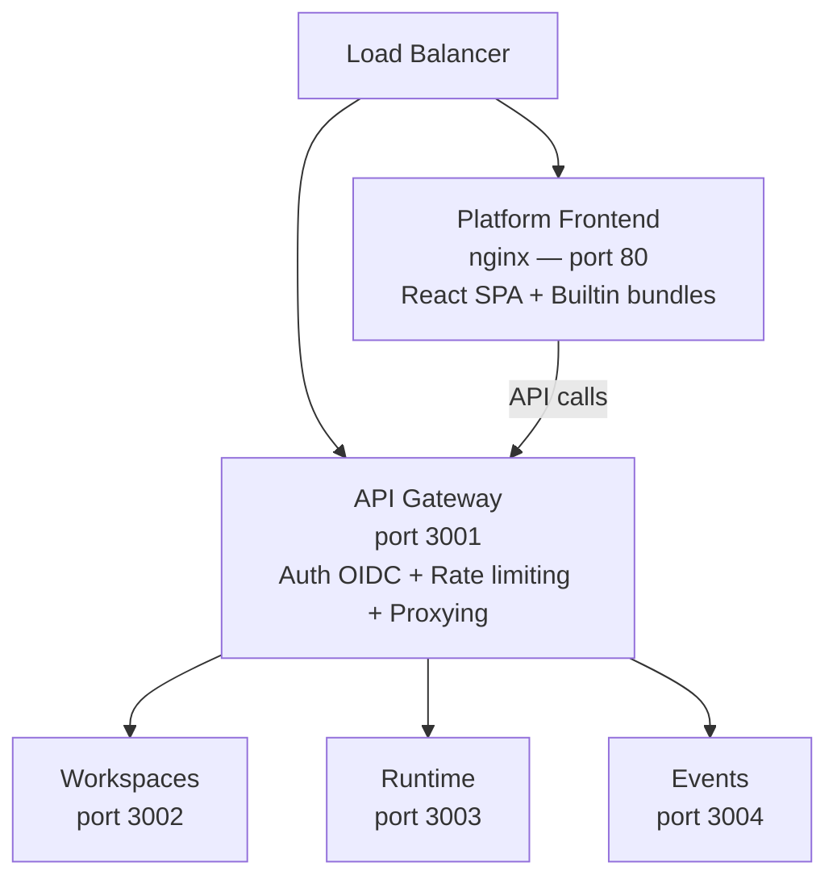

The new Prisme.ai platform builds on the existing infrastructure (API Gateway, Runtime, Workspaces, Events services) and adds:

- **`services/platform`** — A new frontend service (nginx serving a React SPA)
- **Backend workspaces** — 18 workspaces deployed as workspace configurations

## Architecture

## What's New vs. Existing

| Component | Status | Notes |
|-----------|--------|-------|
| API Gateway | **Unchanged** | Same service, same config |
| Workspaces Service | **Unchanged** | Same service |
| Runtime Service | **Unchanged** | Same service |
| Events Service | **Unchanged** | Same service |
| Studio (Next.js) | **Replaced** by Platform | New frontend service |
| Backend Workspaces | **New** | 18 workspaces to deploy |
| External deps | **Same** | Redis, MongoDB/PostgreSQL, Elasticsearch |

## Deployment Steps

<Steps>
  <Step title="Deploy infrastructure services">
    Deploy the existing Prisme.ai services (API Gateway, Workspaces, Runtime, Events) as documented in the [existing self-hosting guide](https://docs.prisme.ai/self-hosting/overview).
  </Step>
  <Step title="Deploy the Platform frontend">
    Build and deploy the `services/platform` Docker image. See [Platform Service](/self-hosting/platform-service).
  </Step>
  <Step title="Deploy backend workspaces">
    Push the 18 backend workspaces to your environment. See [Workspace Deployment](/self-hosting/workspace-deployment).
  </Step>
  <Step title="Configure environment variables">
    Set API URLs, OIDC credentials, and workspace secrets. See [Environment Variables](/self-hosting/environment-variables).
  </Step>
</Steps>

## Existing Documentation

For infrastructure-level deployment (cloud providers, Kubernetes, Docker, HA, monitoring), refer to the [existing self-hosting documentation](https://docs.prisme.ai/self-hosting/overview):

- [Requirements](https://docs.prisme.ai/self-hosting/requirements)
- [Architecture](https://docs.prisme.ai/self-hosting/architecture)
- [Sizing](https://docs.prisme.ai/self-hosting/sizing)
- [Docker](https://docs.prisme.ai/self-hosting/kubernetes/docker)
- [Helm](https://docs.prisme.ai/self-hosting/kubernetes/helm)
- [AWS](https://docs.prisme.ai/self-hosting/cloud/aws) / [Azure](https://docs.prisme.ai/self-hosting/cloud/azure) / [GCP](https://docs.prisme.ai/self-hosting/cloud/gcp)
- [High Availability](https://docs.prisme.ai/self-hosting/kubernetes/high-availability)
- [Operations](https://docs.prisme.ai/self-hosting/operations/testing)
