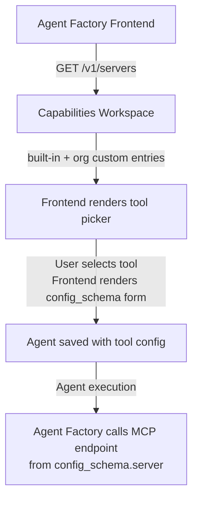

The Capabilities workspace is the centralized registry of all tools, guardrails, and capability templates available on the platform. Agent Factory queries it to know what tools are available for agent configuration.

**Workspace:** `capabilities`
**App slug:** `MCPServers`

## API Endpoints

```
GET    v1/servers              # List catalog entries
POST   v1/servers              # Create custom entry
GET    v1/servers/:server_id   # Get entry
PATCH  v1/servers/:server_id   # Update entry
DELETE v1/servers/:server_id   # Delete entry
```

## Built-In Catalog

The catalog is seeded with built-in entries via `_init-catalog`:

| ID | Name | Type | Category |
|----|------|------|----------|
| `template-file-search` | `knowledge_base` | `file_search` | knowledge |
| `template-custom-mcp` | `custom_mcp_server` | `mcp` | custom |
| `template-custom-function` | `custom_function` | `function` | custom |
| `template-custom-skill` | `custom_automation` | `skill` | custom |
| `mcp-bing-search` | `bing_search` | `mcp` | search |
| `guardrail-injection-detect` | `prompt_injection_detection` | `guardrail` | security |
| `guardrail-toxicity-check` | `toxicity_check` | `guardrail` | quality |
| `guardrail-pii-detect` | `pii_detection` | `guardrail` | compliance |
| `guardrail-hallucination-check` | `hallucination_check` | `guardrail` | quality |
| `guardrail-topic-guard` | `topic_guard` | `guardrail` | compliance |
| `guardrail-action-approval` | `action_approval` | `guardrail` | security |

Built-in entries have `built_in: true` and cannot be modified or deleted.

## Entry Types

| Type | Description |
|------|-------------|
| `mcp` | MCP server (JSON-RPC endpoint) |
| `guardrail` | Safety guardrail |
| `file_search` | Knowledge base search |
| `function` | Custom webhook function |
| `skill` | Prisme.ai automation |
| `memory` | Memory tool |

## Config Schema

Each catalog entry includes a `config_schema` (JSON Schema) that the Agent Factory frontend uses to render configuration forms:

```json
{
  "id": "mcp-bing-search",
  "name": "bing_search",
  "type": "mcp",
  "config_schema": {
    "type": "object",
    "properties": {
      "name": {
        "type": "string",
        "default": "bing_search"
      },
      "server": {
        "type": "string",
        "default": "{{global.apiUrl}}/workspaces/slug:tools-search-bing/webhooks/bing-search/mcp"
      }
    }
  }
}
```

The `server` in the config schema is how the catalog **connects a capability name to its actual MCP endpoint**.

## Multi-Tenant Isolation

| Entry Type | Visibility |
|-----------|------------|
| Built-in (`built_in: true`) | Visible to all organizations |
| Custom | Visible only to the creating organization |

The list query uses:
```
$or: [
  { built_in: true },
  { orgSlug: auth.orgSlug }
]
```

Custom entries cannot modify or delete built-in ones (returns `403`).

## Authentication

Capabilities uses **user session authentication** only. The `_auth` automation reads `user.id` and `session.org.slug`. A `test_mode` config bypass is available for testing.

## Usage Flow


