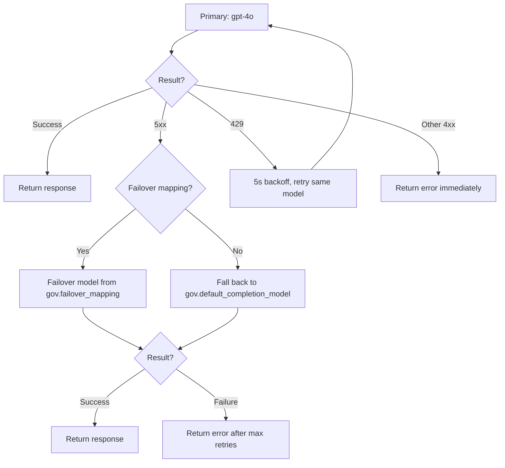

## Endpoint

```
POST v1/chat/completions
```

Base URL: `{API_URL}/workspaces/slug:llm-gateway/webhooks/v1/chat/completions`

## Authentication

This endpoint supports **dual authentication**:

| Mode | How | Flow |
|------|-----|------|
| API key (`iak_*`) | `Authorization: Bearer iak_...` | Validates against AI Governance → checks `llm:completions:use` permission → checks model access via scopes |
| Cross-workspace call | `run.sourceWorkspaceId` present | Trusted directly (no governance checks) |

## Request

```json
{
  "model": "gpt-4o",
  "messages": [
    { "role": "system", "content": "You are a helpful assistant." },
    { "role": "user", "content": "What is the capital of France?" }
  ],
  "temperature": 0.7,
  "max_tokens": 1000,
  "stream": false
}
```

### Parameters

| Param | Type | Default | Description |
|-------|------|---------|-------------|
| `model` | string | `gpt-4o` (from config) | Model identifier. Use `"auto"` for intelligent routing. |
| `messages` | array | (required) | Conversation messages |
| `temperature` | float | 1.0 | Randomness (0-2) |
| `max_tokens` | integer | — | Maximum response tokens |
| `stream` | boolean | false | Enable SSE streaming |
| `top_p` | float | 1.0 | Nucleus sampling |
| `stop` | string/array | — | Stop sequences |
| `tools` | array | — | Tool/function definitions |
| `tool_choice` | string/object | — | Tool selection strategy |
| `response_format` | object | — | Response format (e.g., JSON mode) |

Some parameters are excluded per provider (e.g., `top_p` is excluded for Anthropic).

## Response (Non-Streaming)

```json
{
  "id": "chatcmpl-abc123",
  "object": "chat.completion",
  "model": "gpt-4o",
  "choices": [
    {
      "index": 0,
      "message": {
        "role": "assistant",
        "content": "The capital of France is Paris."
      },
      "finish_reason": "stop"
    }
  ],
  "usage": {
    "prompt_tokens": 25,
    "completion_tokens": 12,
    "total_tokens": 37
  }
}
```

## Streaming (SSE)

When `stream: true`, the response is a Server-Sent Events stream:

```
data: {"id":"chatcmpl-abc","choices":[{"delta":{"role":"assistant"},"index":0}]}

data: {"id":"chatcmpl-abc","choices":[{"delta":{"content":"The"},"index":0}]}

data: {"id":"chatcmpl-abc","choices":[{"delta":{"content":" capital"},"index":0}]}

...

data: {"id":"chatcmpl-abc","choices":[{"delta":{},"index":0,"finish_reason":"stop"}],"usage":{"prompt_tokens":25,"completion_tokens":12,"total_tokens":37}}

data: [DONE]
```

Stream chunks are processed inline within the `v1/chat/completions` automation, which accumulates content and tool call deltas, captures usage from the final chunk (via `stream_options.include_usage`), and sends SSE events in A2A format (`task.output.delta`).

## Failover

If the primary model call fails, LLM Gateway automatically tries a **failover model** from the governance configuration (not the model catalog):



The `_failover-call` automation handles this logic:
- **5xx errors**: switches to the failover model defined in `gov.failover_mapping`, or falls back to `gov.default_completion_model`
- **429 rate limits**: retries the same model after a 5s backoff
- **Other 4xx errors**: returned immediately without retry
- Up to 3 attempts (configurable via `config.max_retries`, hard cap of 10)
- Failover models are validated against governance access controls before use

## Analytics Event

Every completion emits an `analytics.llm.completion` event:

```json
{
  "orgSlug": "acme-corp",
  "agent_id": "agent_xyz",
  "user_id": "user_123",
  "context_id": "ctx_456",
  "model": "gpt-4o",
  "provider": "openai",
  "tokens": { "input": 25, "output": 12, "total": 37 },
  "cost": { "total": 0.000185 },
  "carbon": {
    "energy": { "value": 0.000012, "min": 0.0000096, "max": 0.0000144, "unit": "kWh" },
    "gwp": { "value": 0.0000057, "min": 0.0000046, "max": 0.0000068, "unit": "kgCO2eq" }
  },
  "duration_ms": 850,
  "stream": false,
  "tools_available": 3,
  "tools_called": 1,
  "tool_names": ["search"],
  "timestamp": "2025-01-15T10:30:00Z"
}
```

This powers the [observability](/products/ai-governance/observability) dashboards.
