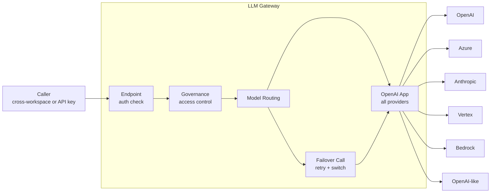

LLM Gateway is the centralized entry point for all LLM operations across the platform. It abstracts multiple providers (OpenAI, Azure OpenAI, Anthropic, Google Vertex, AWS Bedrock) behind a unified API, adds governance controls, and tracks usage and carbon footprint.

**Workspace:** `llm-gateway`

## Key Features

- **Multi-provider routing** — Route requests to the best model based on rules, cost, capabilities, or LLM classification
- **Automatic failover** — Fall back to alternative models when the primary fails
- **Governance** — Enforce model access controls per organization, agent, and API key
- **Usage tracking** — Token consumption, cost, and latency per request
- **Carbon footprint** — Estimate energy and CO2 per LLM call
- **Streaming** — SSE streaming with automatic normalization across providers (Anthropic, Bedrock, Vertex → OpenAI format)

## Architecture



All LLM calls are delegated to the **OpenAI app import**, which handles provider routing, format conversion, and authentication natively. The gateway focuses on governance, routing, analytics, and stream normalization.

## API Endpoints

| Endpoint | Description |
|----------|-------------|
| `POST v1/chat/completions` | Chat completion (sync + streaming) |
| `POST v1/embeddings` | Text embeddings |
| `GET v1/defaults` | Resolved default models with metadata |
| `GET/POST v1/models` | Model catalog CRUD |
| `GET/PATCH/DELETE v1/models/:model_id` | Individual model management |

## Supported Providers

| Provider | Models | Notes |
|----------|--------|-------|
| OpenAI | GPT-5, GPT-4o, o3-mini, embeddings, DALL-E 3 | Direct API |
| Azure OpenAI | GPT-5, GPT-4o, embeddings, Claude (via Azure AI) | Multiple resource configs with per-deployment options |
| OpenAI-compatible | Gemini, DeepSeek, Mistral, Cerebras, OVH, Linagora | Via `openailike` provider type |
| Anthropic | Claude Sonnet 4.5, Claude 3.7 Sonnet, Claude 3.5 Sonnet | Native API |
| Google Vertex AI | Gemini 2.5/3, Imagen 4.0, text-embedding-005 | Via model aliases + service account |
| AWS Bedrock | Claude, Titan, Cohere, Nova, Llama | Multiple region/credential sets |

## Dependencies

| Service | Purpose | How |
|---------|---------|-----|
| [AI Governance](/products/ai-governance/overview) | Governance policies, model allowlists, defaults | Read from `session.org` (no cross-workspace HTTP) |

LLM Gateway is a dependency **sink** for most workspaces — it's called by Agent Factory, Storage, Memories, and other platform workspaces.

## Configuration

Provider credentials and model aliases are configured in `index.yml`:

```yaml
config:
  value:
    providers:
      openai:
        api_key: '{{secret.openaiApiKey}}'
        models:
          - gpt-4o
          - gpt-5-chat-latest
          - text-embedding-3-large
      azure_openai:
        resources:                                  # Array of resource configs
          - resource: prismeai
            api_key: '{{secret.azureOpenaiApiKey}}'
            api_version: '2023-05-15'
            deployments:
              - az-gpt-4o
              - az-text-embedding-3-large
          - resource: my-anthropic-resource         # Anthropic via Azure AI
            api_key: '{{secret.azureAnthropicKey}}'
            api_version: '2023-06-01'
            domain: services.ai.azure.com
            format: anthropic                       # Signals Anthropic format
            deployments:
              - az-claude-opus-4-6
      openailike:                                   # Array of OpenAI-compatible providers
        - api_key: '{{secret.geminiApiKey}}'
          endpoint: https://generativelanguage.googleapis.com/v1beta/openai/
          options:
            excludeParameters:
              - presence_penalty
              - frequency_penalty
          models:
            - gemini-2.0-flash
        - api_key: '{{secret.deepseekApiKey}}'
          endpoint: https://api.deepseek.com/
          models:
            - deepseek-chat
            - deepseek-reasoner
        - api_key: '{{secret.mistralApiKey}}'
          endpoint: https://api.mistral.ai/v1/
          models:
            - mistral-large-latest
      anthropic:
        api_key: '{{secret.anthropicApiKey}}'
        anthropic_version: '2023-06-01'
        options:
          excludeParameters:
            - top_p
        models:
          - claude-sonnet-4-5-20250929
      vertex:
        credentials:
          service_account: '{{secret.vertexServiceAccount}}'
        host: aiplatform.googleapis.com
        models:
          - vertex-text-embedding-005
          - vertex-imagen-4.0
      bedrock:                                      # Array of region/credential sets
        - credentials:
            aws_access_key_id: '{{secret.awsBedrockAccessKey}}'
            aws_secret_access_key: '{{secret.awsBedrockSecretAccessKey}}'
          region: eu-west-3
          models:
            - cohere.embed-multilingual-v3
    model_aliases:
      vertex-text-embedding-005: 'projects/my-project/.../text-embedding-005'
      az-claude-opus-4-6: claude-opus-4-6
    defaults:
      completions: gpt-5-chat-latest
      embeddings: text-embedding-3-large
      image_generation: vertex-imagen-4.0
      file_parsing:
        image: gpt-4o
        audio: gpt-4o
        document: gpt-4o
```
