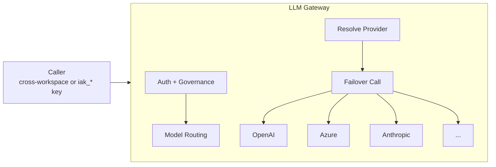

LLM Gateway is the centralized entry point for all LLM operations across the platform. It abstracts multiple providers (OpenAI, Azure OpenAI, Anthropic, Google Vertex, AWS Bedrock) behind a unified API, adds governance controls, and tracks usage and carbon footprint.

**Workspace:** `llm-gateway`

## Key Features

- **Multi-provider routing** — Route requests to the best model based on rules, cost, capabilities, or LLM classification
- **Automatic failover** — Fall back to alternative models when the primary fails
- **Governance** — Enforce model access, quotas, and rate limits per API key
- **Usage tracking** — Token consumption, cost, and latency per request
- **Carbon footprint** — Estimate energy and CO2 per LLM call
- **Streaming** — SSE streaming for chat completions

## Architecture



## API Endpoints

| Endpoint | Description |
|----------|-------------|
| `POST v1/chat/completions` | Chat completion (sync + streaming) |
| `POST v1/embeddings` | Text embeddings |
| `GET/POST v1/models` | Model catalog CRUD |
| `GET/PATCH/DELETE v1/models/:model_id` | Individual model management |

## Supported Providers

| Provider | Models | Notes |
|----------|--------|-------|
| OpenAI | GPT-4o, GPT-4o-mini, GPT-3.5-turbo, etc. | Direct API |
| Azure OpenAI | Same models via Azure endpoints | Multiple credential sets supported |
| OpenAI-compatible | Gemini, local models, any OpenAI-compatible API | Via `openailike` provider type |
| Anthropic | Claude family | Native SDK |
| Google Vertex AI | Gemini, PaLM | Via model aliases |
| AWS Bedrock | Claude, Titan, Mistral | Multiple region/credential sets |

## Dependencies

| Service | Purpose | Auth Method |
|---------|---------|-------------|
| [AI Governance](/products/ai-governance/overview) | API key validation, governance rules | Cross-workspace |

LLM Gateway is a dependency **sink** for most workspaces — it's called by Agent Factory, Storage, Memories, and other platform workspaces.

## Configuration

Provider credentials and model aliases are configured in `index.yml`:

```yaml
config:
  value:
    providers:
      openai:
        api_key: '{{secret.OPENAI_API_KEY}}'
        models:
          - gpt-4o
          - gpt-4o-2024-11-20
          - text-embedding-3-small
      azure_openai:
        prismeai:                                # Named credential sets
          api_key: '{{secret.azureOpenaiApiKey}}'
          api_version: '2023-05-15'
          models:
            - az-gpt-4o
        prismeai_sw:
          api_key: '{{secret.azureOpenaiSWApiKey}}'
          api_version: 2025-04-01-preview
          exclude_params:                        # Per-credential exclusions
            - max_tokens
            - temperature
          models:
            - az-gpt-5-nano
      openailike:                                # Array of OpenAI-compatible providers
        - api_key: '{{secret.geminiApiKey}}'
          endpoint: https://generativelanguage.googleapis.com/v1beta/openai/
          exclude_params:
            - presence_penalty
            - frequency_penalty
          models:
            - gemini-2.0-flash
      anthropic:
        api_key: '{{secret.anthropicApiKey}}'
        api_version: '2023-06-01'
        exclude_params:                          # Provider-level exclusions
          - top_p
        models:
          - claude-sonnet-4-20250514
      vertex:
        credentials:
          service_account: '{{secret.vertexServiceAccount}}'
        host: aiplatform.googleapis.com
        models:
          - vertex-text-embedding-005
      bedrock:                                   # Array of region/credential sets
        - credentials:
            aws_access_key_id: '{{secret.awsBedrockAccessKey}}'
            aws_secret_access_key: '{{secret.awsBedrockSecretAccessKey}}'
          region: eu-west-3
          models:
            - mistral.mistral-large-2402-v1:0
    model_aliases:
      vertex-text-embedding-005: 'projects/my-project/locations/us-central1/publishers/google/models/text-embedding-005'
    defaults:
      completions: gpt-4o
      embeddings: text-embedding-3-small
      image_generation: vertex-imagen-4.0
      file_parsing:
        image: gpt-4o
        audio: gpt-4o
        document: gpt-4o
```
