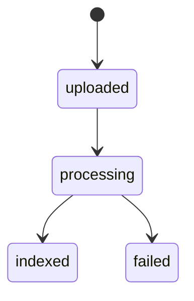
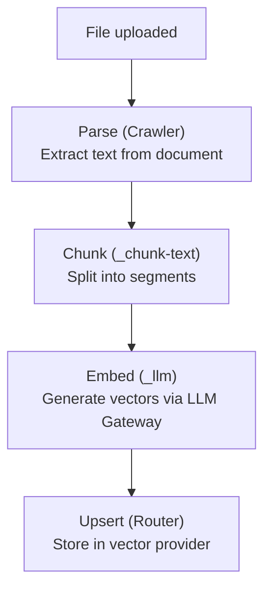

## Endpoints

```
GET    v1/files              # List files
POST   v1/files              # Upload file
GET    v1/files/:file_id     # Get file metadata
PUT    v1/files/:file_id     # Update file metadata
DELETE v1/files/:file_id     # Delete file
GET    v1/files/:file_id/content  # Download file content
```

## Upload File

```
POST v1/files
Content-Type: multipart/form-data
```

| Field | Type | Description |
|-------|------|-------------|
| `file` | binary | File content |
| `name` | string | File name |
| `purpose` | string | `knowledge`, `attachment`, `export` |
| `metadata` | JSON | Custom metadata |
| `ttl` | integer | Time-to-live in seconds (0 = no expiry) |

### Supported Formats

File parsing depends on the Parsers workspace configuration. Common formats:
- **Documents**: PDF, DOCX, DOC, TXT, RTF
- **Spreadsheets**: CSV, XLSX, XLS
- **Web**: HTML, Markdown
- **Code**: Various programming languages

## List Files

```
GET v1/files
```

| Param | Type | Description |
|-------|------|-------------|
| `purpose` | string | Filter by purpose |
| `status` | string | Filter by status (`uploaded`, `processing`, `indexed`, `failed`) |
| `limit` | integer | Results per page |
| `offset` | integer | Pagination offset |

## File Lifecycle



1. **Uploaded** — File received and stored
2. **Processing** — Being parsed and prepared for indexing
3. **Indexed** — Successfully chunked and indexed into vector store(s)
4. **Failed** — Processing or indexing failed

## Indexing

Files are indexed into vector stores through the indexing pipeline:



### Chunking (`_chunk-text`)

Text is split into chunks with configurable parameters:
- **Chunk size** — Target tokens per chunk
- **Overlap** — Token overlap between consecutive chunks
- **Strategy** — Sentence-based, paragraph-based, or fixed-size

Each chunk stores metadata:
```json
{
  "file_id": "file_abc",
  "vector_store_id": "vs_xyz",
  "chunk_index": 3,
  "text": "The quarterly revenue...",
  "page": 2,
  "start_char": 1500,
  "end_char": 2200,
  "scope": "org:acme-corp"
}
```

### Parse Failure Handling

If document parsing fails, `_handle-parse-failure`:
1. Sets file status to `failed`
2. Stores the error message
3. Emits a failure event for monitoring

## Content Retrieval

```
GET v1/files/:file_id/content
```

Returns the raw file content. Useful for:
- Downloading files from the frontend
- Providing full document context to agents
- Exporting files

## Expiry

Files with a `ttl` are automatically cleaned up by the nightly `cleanup-expired-files` job. This is used for temporary files (e.g., conversation attachments) that don't need permanent storage.

The `user_data_expires_after` config (default: 1800 seconds) sets the TTL for user-uploaded temporary data.
