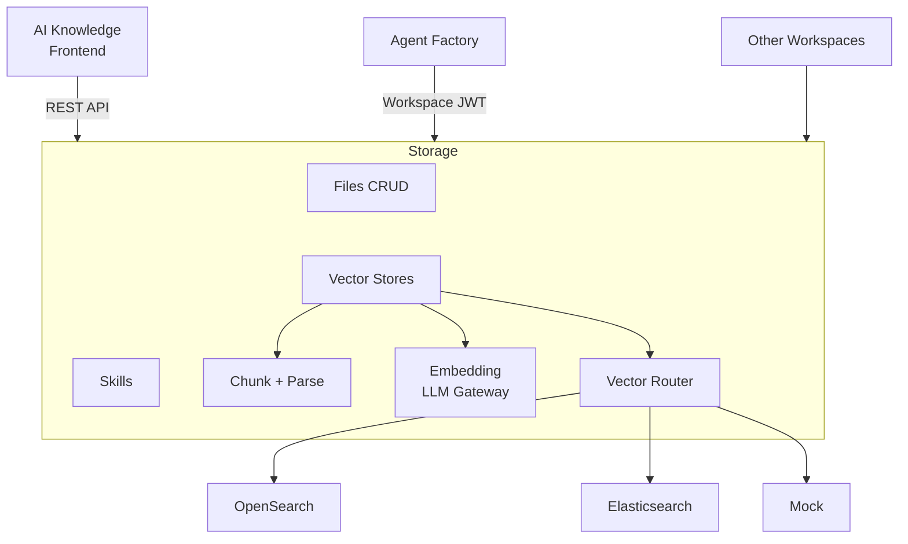

Storage is the backend service for all document and knowledge management operations. It handles file uploads, vector store management, document indexing (chunking + embedding), and skill configuration.

**Workspace:** `storage` (46 automations)
**Frontend:** `builtin-apps/ai-knowledge`

## API Surface

<CardGroup cols={2}>
  <Card title="Files" icon="file" href="/services/storage/files">
    Upload, manage, and retrieve files
  </Card>
  <Card title="Vector Stores" icon="database" href="/services/storage/vector-stores">
    Create vector stores, add files, search with embeddings
  </Card>
  <Card title="Skills" icon="wand-magic-sparkles" href="/services/storage/skills">
    Reusable search configurations for agents
  </Card>
</CardGroup>

## Architecture



## Data Model

| Collection | Table | Purpose |
|-----------|-------|---------|
| `files` | `files` | File metadata (name, type, size, status) |
| `vector_stores` | `vector_stores` | Vector store configuration |
| `vector_store_files` | `vector_store_files` | File-to-vector-store associations |
| `skills` | `skills` | Search skill configurations |

## Installed Providers

Storage imports vector provider workspaces as apps:

| App Slug | Workspace | Purpose |
|----------|-----------|---------|
| `VectorOpensearch` | `vector-opensearch` | OpenSearch k-NN |
| `VectorElasticsearch` | `vector-elasticsearch` | Elasticsearch dense_vector |
| `VectorMock` | `vector-mock` | Testing (fake results) |

The active provider is selected by `config.default_vector_provider` (default: `opensearch`).

## Vector Router

The `_vector-router` dispatches operations to the correct provider:

```yaml
# _vector-router.yml
- conditions:
    '{{provider}}':
      opensearch:
        - VectorOpensearch.{{operation}}: ...
      elasticsearch:
        - VectorElasticsearch.{{operation}}: ...
      mock:
        - VectorMock.{{operation}}: ...
```

All providers implement the same interface ([see Vector Stores](/tools/vector-stores)), making them interchangeable.

## Indexing Pipeline

When a file is added to a vector store:

1. **Parse** — Extract text from the file (PDF, DOCX, etc.) via the Crawler/Parser
2. **Chunk** — Split text into chunks (`_chunk-text`)
3. **Embed** — Generate embeddings via [LLM Gateway](/services/llm-gateway/embeddings)
4. **Upsert** — Store chunks + embeddings in the vector provider

The indexing is triggered by:
- `POST v1/vector_stores/:id/files` — Add a file
- `POST v1/vector_stores/:id/files/:file_id/reindex` — Re-index a file
- Event `file.index_requested` — Automated indexing

## Authentication

Storage supports two auth modes:

| Mode | Use Case |
|------|----------|
| **Workspace JWT** | Called by Agent Factory, other workspaces. Trusts `body.user_id` and `body.orgSlug` |
| **User session** | Direct frontend access from AI Knowledge |

Storage does **not** support `iak_*` API keys — it's an internal service.

## Configuration

| Setting | Default | Description |
|---------|---------|-------------|
| `default_vector_provider` | `opensearch` | Vector backend |
| `default_embedding_model` | `text-embedding-3-small` | Embedding model |
| `default_embedding_dimensions` | 1536 | Embedding dimensions |
| `vector_store_index_prefix` | (env-specific) | Index name prefix |
| `user_data_expires_after` | 1800 | Temp data TTL (seconds) |

## Scheduled Jobs

| Schedule | Job | Purpose |
|----------|-----|---------|
| `0 3 * * *` | `cleanup-expired-vectors` | Remove expired vector data |
| `0 3 * * *` | `cleanup-expired-files` | Remove expired files |
