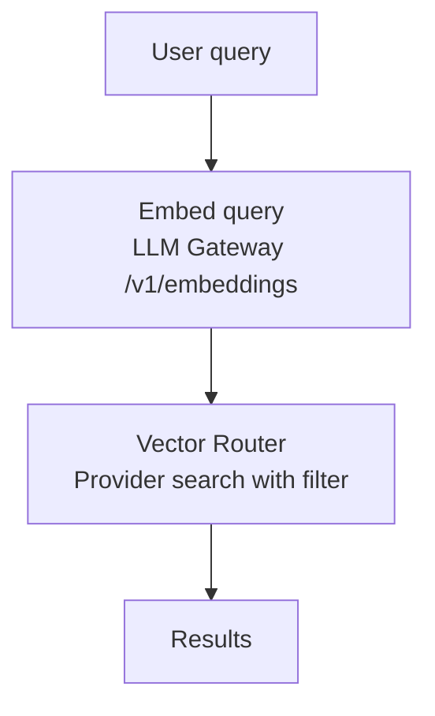

Vector stores are the core of the RAG pipeline. They store document chunks as embeddings and support similarity search for retrieval.

## Endpoints

### Vector Store CRUD

```
GET    v1/vector_stores                    # List vector stores
POST   v1/vector_stores                    # Create vector store
GET    v1/vector_stores/:id                # Get vector store
DELETE v1/vector_stores/:id                # Delete vector store
```

### Vector Store Files

```
GET    v1/vector_stores/:id/files              # List files in store
POST   v1/vector_stores/:id/files              # Add file to store
PATCH  v1/vector_stores/:id/files/:file_id     # Update file tags
DELETE v1/vector_stores/:id/files/:file_id     # Remove file from store
POST   v1/vector_stores/:id/files/:file_id/reindex  # Re-index file
```

### Search

```
POST v1/vector_stores/:id/search
```

## Create Vector Store

```json
{
  "name": "Company Knowledge Base",
  "provider": "elasticsearch",
  "dimensions": 1536,
  "chunking_strategy": { "type": "auto" }
}
```

| Field | Type | Default | Description |
|-------|------|---------|-------------|
| `name` | string | (required) | Display name |
| `provider` | string | `elasticsearch` | Vector provider |
| `dimensions` | integer | 1536 | Embedding dimensions |
| `chunking_strategy` | object | — | Chunking configuration |

Creating a vector store automatically creates the underlying index via the vector provider's `create-index` operation.

## Add File to Store

```json
{
  "file_id": "file_abc",
  "scope": "knowledge",
  "tags": { "department": "engineering" }
}
```

| Field | Type | Description |
|-------|------|-------------|
| `file_id` | string | File to add (required) |
| `scope` | string | `knowledge` or `conversation` |
| `conversation_id` | string | For conversation-scoped files |
| `tags` | object | Custom metadata tags |
| `expires_at` | string | Expiration timestamp |

This triggers the [indexing pipeline](/services/storage/files#indexing):
1. Parse the file
2. Chunk the text
3. Generate embeddings
4. Upsert into the vector provider

## Search

```
POST v1/vector_stores/:id/search
```

```json
{
  "query": "What are the Q3 revenue trends?",
  "max_num_results": 5,
  "ranking_options": {
    "score_threshold": 0.7
  },
  "filters": {
    "scope": "knowledge"
  }
}
```

### Parameters

| Param | Type | Default | Description |
|-------|------|---------|-------------|
| `query` | string | (required) | Search query (will be embedded) |
| `max_num_results` | integer | 10 | Maximum results |
| `ranking_options.score_threshold` | float | 0.0 | Minimum similarity score |
| `filters` | object | — | Metadata filter |
| `conversation_id` | string | — | Filter to a specific conversation |
| `rewrite_query` | boolean | — | Enable query rewriting |

### Search Flow



### Response

```json
{
  "data": [
    {
      "file_id": "file_abc",
      "filename": "quarterly-report.pdf",
      "score": 0.92,
      "content": [
        { "type": "text", "text": "Q3 revenue showed a 15% increase..." }
      ],
      "attributes": {
        "page": 2,
        "chunk_index": 3,
        "scope": "knowledge"
      }
    }
  ],
  "search_query": "What are the Q3 revenue trends?",
  "has_more": false
}
```

## Scopes

Vector store searches support **scope-based filtering** for data isolation:

| Scope | Description |
|-------|-------------|
| `knowledge` | Persistent knowledge base data |
| `conversation` | Temporary conversation-scoped data |

Conversation-scoped data is filtered by `conversation_id` metadata. Scopes are stored as metadata on each chunk and filtered during search.

## Provider Routing

The `_vector-router` dispatches operations to the configured provider. See [Vector Stores (Tools)](/tools/vector-stores) for details on each provider's implementation.

Changing the provider for an existing vector store requires re-indexing all files.

## Deletion

Deleting a vector store:
1. Removes all vectors from the provider (via `delete-index`)
2. Removes all file associations
3. Deletes the associated crawler instance
4. Removes the vector store record

Files themselves are **not** deleted — they may belong to other vector stores.

## Expiry

The nightly `cleanup-expired-vectors` job removes vectors with expired `expires_at` metadata. This is used for conversation-scoped temporary data that should not persist beyond the conversation.
