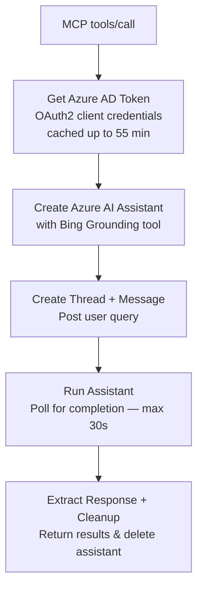

The Bing Web Search workspace provides web search capabilities for AI agents via the Azure AI Foundry Bing Grounding API. It implements the MCP protocol for seamless agent integration.

**Workspace:** `tools-search-bing` (9 automations)

## MCP Endpoint

```
POST {API_URL}/workspaces/slug:tools-search-bing/webhooks/bing-search/mcp
```

**Protocol:** `2025-06-18`
**Capabilities:** `{ tools: {} }`

## Tool Definition

The workspace exposes a single MCP tool:

```json
{
  "name": "bing_search",
  "description": "Search the web using Bing",
  "inputSchema": {
    "type": "object",
    "properties": {
      "query": {
        "type": "string",
        "description": "Search query"
      },
      "num_results": {
        "type": "integer",
        "description": "Number of results (default: 5)"
      },
      "market": {
        "type": "string",
        "description": "Market code (default: en-US)"
      },
      "freshness": {
        "type": "string",
        "description": "Result freshness: Day, Week, Month"
      }
    },
    "required": ["query"]
  }
}
```

## How It Works

The search flow uses Azure AI Foundry's assistant API with Bing Grounding:



## Azure Configuration

The workspace requires Azure AI Foundry credentials:

| Config | Description |
|--------|-------------|
| `tenant_id` | Azure AD tenant ID |
| `client_id` | Azure AD application (client) ID |
| `client_secret` | Azure AD client secret |
| `endpoint` | Azure AI Foundry endpoint URL |
| `api_version` | API version |

Azure AD tokens are cached in the session for up to `token_cache_ttl` seconds (default: 3300s / 55 minutes).

## Security

Bing Search uses a **stricter security model** than most workspaces:
- No user-session-based event access rules
- Only `editor` and `workspace` (API key) roles
- No public page read rules

This is appropriate because the workspace is accessed only via MCP calls from Agent Factory, never directly by end users.

## Integration

The Bing Search tool is registered in the [Capabilities catalog](/services/capabilities/overview) as `mcp-bing-search` with:

```json
{
  "server_url": "{{global.apiUrl}}/workspaces/slug:tools-search-bing/webhooks/bing-search/mcp"
}
```

When an agent has `bing_search` configured, Agent Factory calls this MCP endpoint during tool execution in the [agentic loop](/products/agent-factory/agentic-loop).

## Prompt Library Integration

Several prompts in the [Prompt Library](/services/prompt-library/overview) reference Bing Search:
- `tool_choice: bing_search` — Forces web search for research prompts
- `suggested_tools: [bing_search]` — Recommends web search for exploration prompts
